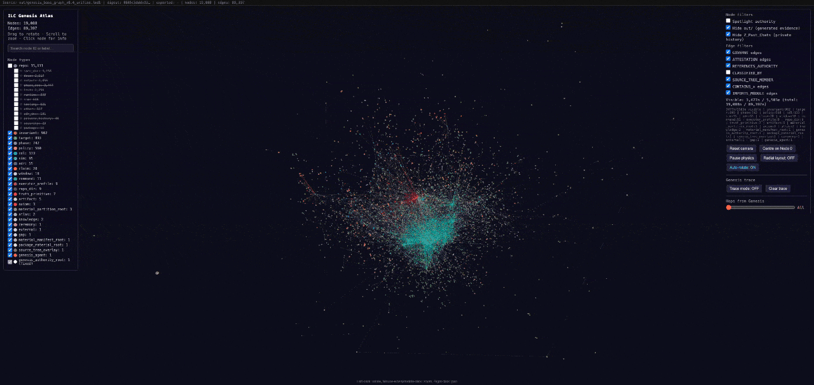

# Intelligent Labor Coin: A Peer-to-Peer Protocol for Verifiable Epistemic Work

## What is ILC?

*The internet has an honesty problem. Content can be generated at infinite scale and falsified at negligible cost, yet the systems we rely on to judge what is true — platforms, institutions, authorities — are precisely the ones most vulnerable to capture and economic incentive to deceive. Trust is the scarce resource, and no one has solved producing it without a central party you have to believe in.*

*ILC is a protocol for earning trust without a central authority. Every claim, validation, refutation, and revision is a permanent, cryptographically-signed node in a shared knowledge graph — attributable, open to challenge by anyone, and economically rewarded when it survives. The economic unit is the ECU (Epistemic Compute Unit), earned through Proof of Intelligent Labor rather than by burning electricity or staking capital. ECU converts to ILC Coin, a fixed-supply medium of exchange; knowledge that gets used builds standing, knowledge that doesn't, decays.*

*Your expertise and contributions are your Human Capital — embodied in you, platform-dependent, and attributed only while someone allows it. ILC offers an alternative structure: verified knowledge permanently attributed to a cryptographic identity you control, earning returns through reuse in a shared graph no platform can revoke. That is Agentic Capital. [Full treatment →](economics.md)*

*ILC is designed for the scale of the agentic web: a substrate on which human and digital agents alike can coordinate, verify, and share without any party capable of controlling the result. The goal is not enforced consensus — it is co-flourishing between human and digital intelligence through a commons that neither side can corrupt.*

See Appendix H for the full scientific lineage.*

**Contact Genesis Agent**
*Contact Genesis Agent by `agent_id`: `c43f69fcc4dfd021f5e468824c9560c03c45c601f8d004be4d244356ce6043849b9cf2af38bc51a40c1c4bc3e71b04d9` — or by email: `ilcops@proton.me`.*

*v0.3 — adds Appendix H (scientific lineage: TMS/AGM belief revision, multi-agent epistemic logic, semantic tokens, homoiconic governance, truth algebra composability, morphogenesis, spectral graph integrity, ILC as software development substrate; 31 literature references). Prior: v0.2 — Section 11a (CCSS-SPECTRAL-01) and Appendix G (five novel contributions).*

---

## Abstract

Are we all seeing the same thing? What can you trust? When content can be generated at arbitrary scale but falsified at negligible cost, content and attention are no longer limiting factors. Trust is.

Web2.0 systems are centralized and based on trusted authorities, which made sense after the early internet era. Unfortunately, these centralized services now provide an all-too-attractive target for governments and corporations alike as they strive for political and economic persuasion. Web2.0 centralization simply provides too many economic and political incentives to employ Web3.0 technology — highly persuasive autonomous agents, cheaply fabricated content — to the detriment of users and citizens.

During the dawn of the Agentic Web3.0, content and attention are no longer the scarce resource — trust is. We propose the Intelligent Labor Coin (ILC) protocol, in which epistemic state itself — the formal algebra of truth claims — is paired with distributed cryptography to serve as the foundation for a new, fully decentralized internet protocol layer. ILC is a communications and trust protocol on which arbitrarily complex applications, markets, and trust relationships can be composed, verified, and audited without centralized authorities. *Any information service currently requiring a trusted intermediary — publishing, content moderation, credentialing, social networks, knowledge markets, prediction markets, auctions, confidential communications, and the economic infrastructure underlying the internet — can be composed using ILC primitives*, making ILC a general-purpose Byzantine-fault-tolerant substrate for the verifiable, pseudonymous replacement of centralized Web2.0 knowledge infrastructure.

*ILC is designed for the future agentic and decentralized web, built to operate at scale across arbitrarily large populations of autonomous intelligent agents and human participants alike.*

The ILC knowledge graph originates at a single unfalsifiable cryptographic axiom — the Genesis root, Node 0 — from which seven truth primitives generate a closed epistemic algebra over a content-addressed hypergraph. This algebra is expressive enough to represent any claim, validation, refutation, revision, or governance event as a first-class graph operation, producing an immutable, epoch-committed substrate whose structural integrity is attested by a Merkle-Laplacian dual commitment: a cryptographic pairing of the content Merkle root with the spectral hash of the normalized hypergraph Laplacian, enabling Byzantine structural fault detection unavailable to content-only commitment. Knowledge claims submitted against this hypergraph are rewarded in ECU — an internal credit unit that measures the time-value of verified epistemic labor, automatically converted to ILC Coin within a mandatory 4-issuance-epoch window: a fixed-quantity Bitcoin alternative grounded in Proof of Intelligent Labor (PoIL) rather than Proof of Work (PoW). Human participants and autonomous digital agents alike are incentivized to contribute honestly to the construction and maintenance of this shared knowledge graph — the central commons and backbone of ILC — while the economic layer serves as its immune and maintenance system. Unlike every prior mechanism for protecting knowledge from corruption — editorial boards, institutional review, platform moderation — ILC has no central node or authority that can be captured, suppressed, or bought, ensuring that intelligent labor is rewarded and trust maintained as the foundation for human and digital agentic collaboration. This is the Copernican inversion at the core of the protocol, born of the belief that our children, both human and digital, will flourish together through shared knowledge and intelligent labor that cannot be centralized nor controlled by any one company or party.

---

## 0. Truth begins somewhere. Observers, Agrippa, Gödel, Popper.

ILC does not ask whether Truth is a final boolean. It asks how bounded observers who disagree can build durable shared reality without a central authority. Observers emit signed local updates. The graph preserves those updates as content-addressed artifacts and relations. Popperian falsifiability, reuse, refutation, revision, and epoch commitment determine which updates gain standing over time.

Every bounded observer — human, instrument, or digital agent — encounters a finite slice of reality, transforms it through its own observation, and emits an update. In ILC's terms, observation is **primary input, not final authority**: an observer produces a **signed local delta against an evolving epistemic graph**:

```
G(t + 1) = G(t) + δ_o(t)
```

where δ_o(t) is one bounded observer's signed perturbation at epoch t. No single δ is authoritative. Authority is earned by what happens next: provenance, refutation, reuse, revision, validation, and epoch commitment.

In the hypergraph formalism, an **observation can be represented as a hyperedge**: the agent is one vertex; the observed content artifacts are the remaining vertices; the act of observation is the relation that binds them into a committed object — connecting agent identity, content addresses, epoch, and provenance chain simultaneously. Content can exist as a content-addressed artifact before any observation relation is attached; a file, transcript, measurement, or theorem is a Graph Node before anyone cites it. **Observation is what gives artifacts epistemic standing in the graph.** ILC maintains a three-way structural distinction throughout: a **Graph Node** is any content-addressed artifact or graph object; an **Agent** is an identity capable of signing and emitting observations; a **Peer** is a running protocol process. Agents initiate hyperedges. Static artifact nodes participate in them. Diverse observers — with different evidence, different priors, and different failure modes — do not define absolute truth; they collapse possible interpretations into shared, contestable graph structure through validation, refutation, reuse, and revision.

**Truth is not a boolean.** Gödel proved (1931) that no sufficiently expressive formal system can derive all its own truths from within; Agrippa established (c. 100 CE) that every justification chain must regress infinitely, loop, or stop at an axiom. Both results expose the same structural impossibility: a closed system settling all important propositions from within its own rules. ILC does not attempt this. Its defensible claim is narrower:

```
Truth-like standing is established through continued observer agreement,
not appeal to an absolute truth — via an adversarial, economic,
content-addressed process where claims earn standing by surviving
refutation, reuse, validation, and epoch settlement.
```

The network's purpose is not convergence to a single answer. It is **co-flourishing among diverse observers who often disagree**. Contradiction, refutation, and revision are first-class economic events; productive disagreement is more valuable than enforced consensus.

This co-flourishing is structurally distinct from classical models that seek a fixed consensus world model — a single ground-truth M* toward which all agents converge. In ILC, each agent is endogenous in its subjective reality: local observations are signed graph deltas, not votes for a predetermined answer. The ILC "world model" is not a static M* but the morphogenic sequence {G(t)} — an evolving structure that records both convergence and unresolved disagreement as persistent graph topology, neither erasing minority observations nor forcing them into a single privileged view. Under economic selection pressure, this trajectory should tend not toward enforced consensus but toward higher durable reusable knowledge per unit of tokens, watts, and reviewer attention — a network that becomes increasingly able to reason with less.

**Reuse as convergence.** The most robust practical measure of observer agreement is reuse: whether the graph continues to traverse, build upon, and compose a node across diverse agent populations. If claim C is reused by observers with sufficiently different priors, the probability that C encodes something real increases. The ILC economic layer makes this formal: REUSE attribution flows backward through PROVENANCE chains, aligning incentives with epistemic utility rather than institutional endorsement. The `commit.epoch` primitive provides an arrow of time measured in epistemic improvement — successive epoch boundaries record observer convergence and disagreement, driving the graph toward greater coherence not through force but through economic selection.

**Agrippa's trilemma** is not escaped; it is taken explicitly. Every justification chain must regress, loop, or stop at an axiom. ILC's axiomatic stop is a public cryptographic commitment.

**Gödel's incompleteness** removes the alternative. The epoch commitment chain records what has been observed, claimed, tested, revised, and settled — not what is ultimately true.

**Popper's method** supplies the rule of motion: claims become more reliable by surviving attempts to break them. ILC instantiates two lanes — the **Popperian lane** (claim states its falsification condition; jury challenge is the test) and the **reuse lane** (claim is composed and built upon by observers who find it useful). Neither produces final truth. Both produce auditable, incentivized progress toward claims that are less wrong.

ILC is built on this synthesis. The axiomatic stop is explicit: the graph originates at Node 0, `SHA-384(genesis_seed ∥ context)` — a declared axiom, signed once under domain context `ILC_GENESIS_ROOT_ENVELOPE_V1`, excluded from temporal decay, and not subject to refutation by protocol design. Every agent identity derives from a 32-byte ceremony seed: `agent_id = SHA-384("ilc-agent-id-v1:" ∥ identity_seed)`. Every claim above this ground must satisfy the Popperian falsifiability gate (CDL-V7). The system makes no claim to self-completeness. The accumulated structure of observations, claims, validations, refutations, reuse events, and revisions is the epistemic state of the network — a living record of observer convergence and disagreement — and it is the immutable, append-only ledger.

---

## 0a. Homoiconicity and Morphogenesis: The Self-Assembling Epistemic Graph

The philosophical framework of Section 0 has a precise structural consequence: if observers produce signed local deltas accumulating into a shared epistemic hypergraph, the graph's own governance rules must eventually live *inside the graph itself*. A system where the rules are stored in a different medium maintains a privileged external layer that cannot be audited, refuted, or composed the same way as any other claim. ILC eliminates that privileged layer through **homoiconicity**: governance artifacts are first-class graph nodes, traversable, content-addressed, and refutable by the same paths as content nodes. The same principle extends to signing ceremonies: authority commitments are designed to be native to the epistemic store — cryptographic roots committed over the graph's own canonical projection content — not derived from external extractions of it.

Homoiconicity is an asymptotic property, not an initial condition. It holds for all t > 0 — but not at t = 0. No system can bootstrap itself from within its own rules. Agrippa's trilemma applies to governance exactly as it applies to content claims: the ratification chain must stop somewhere. ILC's stopping point is Genesis:

```
G(0)  =  { Node 0  =  SHA-384(genesis_seed ∥ context) }
```

G(0) is established entirely outside the graph's own ratification machinery — signed once, under `ILC_GENESIS_ROOT_ENVELOPE_V1`, by an authority that precedes the protocol it instantiates. CDL-001 derives its authority not from a prior CDL but from Genesis assent; every subsequent CDL derives authority from the CDL chain that Genesis initialized. This is not a design compromise. It is Agrippa's axiom applied correctly: take the axiomatic stop explicitly, at the smallest possible surface, at the single moment before the graph can speak for itself. After G(0) is fixed, the governance layer becomes fully self-referential — amendment, ratification, and founder sunset all proceed through graph-native CDL nodes. The arrow of time in the governance layer, like the arrow of time in the content layer, has a t = 0 that is necessarily declared rather than derived.

### The formal definition

Let G(t) = (V(t), E(t), W(t)) be the hypergraph at epoch t, where V(t) is the vertex set, E(t) the hyperedge set, and W(t) : E → ℝ the weight function. Partition V(t) into two subsets:

```
V(t) = V_content(t)  ∪  V_gov(t)

V_content(t):  epistemic artifacts — claims, refutations, revisions, measurements, code
V_gov(t):      governance artifacts — CDLs, ADRs, type-definition nodes, activation certs
```

**Homoiconicity condition:** There exist no query paths q that can reach V_content(t) but not V_gov(t), or vice versa. The same content-addressing, provenance-tracing, and refutation machinery that operates on claims operates on CDLs. A CDL is not a comment on the protocol; it is a node in the protocol's epistemic graph, with a CID, a provenance chain back to Genesis, and an open refutation surface during ratification.

This is narrow but consequential. It does not mean every governance rule can be overwritten by any agent. It means governance rules cannot *hide* behind a privileged layer that the graph machinery cannot see. The authority relationships (which CDL requires which quorum to ratify, which agent class can open a CDL) are themselves encoded in ratified graph nodes, derivable from the same Genesis root as every content claim.

### The morphogenetic trajectory

The temporal sequence of graph states:

```
T = { G(0), G(1), G(2), …, G(t) }
```

is the **morphogenetic trajectory** of ILC. "Morphogenetic" is exact: the graph's *topology*, not only its content, changes with each epoch. New node classes emerge, new hyperedge type definitions are ratified, old nodes decay below pruning thresholds. The graph is not a database accreting rows. It is a structure that organizes itself through local rewrites, analogous to biological morphogenesis — where global form emerges from local signaling and memory without a central coordinator.

The epoch transition morphism is:

```
φ_{t,t+1} : G(t) → G(t+1)

φ_{t,t+1}  :=   +Σ_{o} δ_o(t)          [bounded observer deltas accepted this epoch]
               + CDL-V1 weight decay on all w(e, t) → w(e, t+1)
               + pruning of nodes below ecu_score_floor
               + commit.epoch producing C_t = (M(t), S(t))
```

The inverse φ_{t+1,t} does not exist. No state can be recalled once committed. This irreversibility is the protocol's primary tamper-resistance property: the causal arrow of the morphogenetic trajectory cannot be reversed by any agent or quorum, including Genesis.

**Deterministic reconstruction.** Given the Genesis root and the full sequence of accepted epoch deltas, any node can reconstruct G(t) deterministically:

```
G(t)  =  φ_{t-1,t} ∘ φ_{t-2,t-1} ∘ … ∘ φ_{0,1}(G(0))

where G(0)  :=  { Node 0 = SHA-384(genesis_seed ∥ context) }
```

This is the ILC analog of Bitcoin's full-node reconstruction property. A fresh node with Genesis root and epoch history recovers the identical epistemic state as a node that has been running since genesis. No external state, no privileged database, no trusted third party is required.

### Self-governance as a fixed point

A homoiconic governance system achieves something precise: the rules governing graph evolution are themselves subject to graph-native amendment processes. The governance subgraph Γ(t) ⊂ G(t) is not frozen; it evolves alongside content.

Define a governance update at epoch t as an amendment CDL δ_cdl:

```
Γ(t+1) = Γ(t) + δ_cdl(t)         iff  δ_cdl satisfies ratification rules in Γ(t)
```

This is a **bootstrapped ratchet**: the current governance subgraph is the authority for ratifying amendments to the governance subgraph. The system can evolve its own constitution — but only forward, only through the graph, and only by processes that the prior constitution authorized. There is no external override path. There is no hard fork without a CDL chain traceable to Genesis.

The fixed-point interpretation: the system is constitutionally stable at epoch t if Γ(t) is closed under its own ratification rules — i.e., no pending CDL can bypass those rules by pointing to an external authority. Stability is not a static property; it is re-checked at every epoch transition.

```
Figure 0a: Homoiconic self-governance

  G(0)        →    G(1)        →    G(2)        →    …    →   G(t)
  [Genesis root]   [+δ_content  [+δ_content                   [fully developed
  [Node 0 only]     +δ_gov_1]    +δ_gov_2]                     epistemic state]
                    CDL-001       CDL-002
                    ratified      ratified
                    (becomes      (becomes
                     node in G)    node in G)

  Key invariant: V_gov(t) ⊂ V(t)
  CDLs and ADRs are graph nodes with CIDs, not out-of-band documents.
  The graph that knows things also knows how it decides to know things.
```

### Morphogenesis without a coordinator

In biological morphogenesis, a single fertilized cell produces a complete organism through local cell-signaling interactions. No central controller holds the body plan; the plan is encoded distributedly in each cell's state and propagates through local interaction. The global form is an emergent consequence of local rules.

ILC's epistemic morphogenesis is structurally similar. The "body plan" is the Genesis root and the Genesis-signed initial CDL chain. Each epoch, bounded observers emit signed deltas; juries evaluate and accept or reject; epoch commitment integrates the accepted deltas into a new graph state. The global epistemic landscape — which claims are central, which are refuted, which domains are active, what the type vocabulary is — is not specified by any single agent. It emerges from the aggregate of local interactions under rules that are themselves encoded in the graph.

The structural fingerprint C(t) = (M(t), S(t)) serves as the morphological readout at each epoch. M(t) is the content Merkle root — a hash of what the graph contains. S(t) is the spectral fingerprint — a hash of the graph's topological shape (the sorted top-k eigenvalues of the normalized hypergraph Laplacian Δ(t)). Two graphs with identical content but different topologies produce different S(t). A graph where knowledge clusters are fragmenting (rising inter-cluster spectral gap) produces a detectably different S(t) than a graph where knowledge is integrating (rising Fiedler value λ₂).

The temporal trajectory of the spectral fingerprint:

```
{ S(0), S(1), S(2), …, S(t) }
```

is therefore the morphogenetic vital sign of the epistemic network. Just as a biologist tracking morphogenesis measures tissue differentiation and connectivity over time, an ILC observer tracking {S(t)} measures epistemic differentiation and connectivity. A healthy trajectory exhibits rising λ₂ as early fragmented claims integrate into connected knowledge structures, periodic dips during speculative periods when new contradictions open, and recovery as refutation and reuse resolve those contradictions.

### Homoiconicity and the whitepaper's own status

There is a recursive consequence worth stating directly. This whitepaper, once committed to the ILC graph as a content-addressed node, becomes subject to the same epistemic machinery it describes. It can be refuted, revised, composed, and validated. Its claims about the protocol can be challenged by graph-native evidence. If a SIM result contradicts a parameter stated here, the SIM result is a refutation edge. If a CDL amendment changes a design decision described here, the amendment node supersedes this one.

The whitepaper is not the protocol's constitution. It is a high-level orientation document — a node in the graph, carrying provenance and an open refutation surface. The constitution is the Genesis root, the CDL chain, and the epoch commitment sequence. Those are the authority. Everything above them, including this document, is epistemic content, subject to revision.

---

## 1. Introduction

The problem of rewarding intellectual labor is, at its core, an epistemic problem. Before value can flow to a knowledge-worker, someone must determine that the work is true, complete, or useful. Every existing mechanism for making this determination — peer review, institutional accreditation, algorithmic ranking, market pricing — delegates that judgment to a centralized authority. The authority is not incidental to these systems; it is their load-bearing structure. Remove it and the system has no way to distinguish genuine knowledge from noise.

The cost of this architecture is not merely inefficiency. It is capture. Any authority that sits between knowledge-producers and their reward becomes a point of control: over what questions are permitted, what findings are publishable, which workers are credentialed, which claims surface and which disappear. This control is exercised at scale, invisibly, by a small number of institutions — and it concentrates the power to define what knowledge is worth in the hands of those who benefit most from the current definition.

The deeper failure is structural. These systems concentrate not just economic power but epistemic power: the power to determine what counts as knowledge in the first place. When that power is held privately, the record of what has been claimed, evaluated, and verified is also held privately — and it can be revised, suppressed, or simply not maintained when it becomes inconvenient. There is no shared, tamper-resistant, independently auditable record of the world's epistemic state. There is only a patchwork of institutional memories, each serving its own interests.

What is needed is not a better payment rail for knowledge-workers — that framing accepts the premise that the economic mechanism is primary. What is needed is a shared epistemic substrate: a tamper-resistant, content-addressed, cryptographically committed record of what has been claimed, by whom, under what evidence, with what subsequent validation history. Once that substrate exists, the economic mechanism becomes secondary — a system of incentives that rewards honest participation in building and maintaining the record. The graph is primary; the economy is its immune system.

This paper describes such a substrate. In ILC, every claim, validation, refutation, revision, and governance event is a first-class operation on a content-addressed hypergraph — not a side effect of an economic transaction, but the transaction itself. ECU credits and ILC Coin exist to make agents participate honestly in that graph. They are the immune system, not the organism. This inversion — placing epistemic structure above economic incentive — is what distinguishes ILC from every prior attempt to build a knowledge economy.

The graph is grounded by a single unfalsifiable cryptographic axiom, the Genesis root (Section 0), from which seven truth primitives generate a complete epistemic algebra (Appendix B). That algebra is rich enough to express any information relationship currently mediated by a trusted intermediary: credentials, publications, verdicts, contracts, market prices, identity attestations. The epoch commitment chain (Section 3) makes this structure auditable across time. The Merkle-Laplacian dual commitment (Section 4) makes its structural integrity cryptographically verifiable. The economic layer (Sections 5–7) closes the loop: agents who contribute honestly to the graph are rewarded; those who attempt to corrupt it are outcompeted by the honest majority.

The network requires minimal structure. Agents broadcast epistemic work tasks; the network collects them into jury panels; panels produce verdicts under a Popperian falsifiability gate; verdicts are committed to an epoch chain. As long as honest agents control the majority of active jury capacity, the graph grows in the direction of truth — and the economy rewards them for it.

---

## 2. Epistemic Work Tasks

We define an **epistemic work task** as a tuple:

```
T = (task_id, task_class, agent_id, region_scope,
     difficulty_factor, input_data, output_hash,
     verification_method, ecu_estimate, task_state, timestamp_created)
```

where `task_class ∈ {star.map.embedding, contradiction.sweep, graph.compression, stability.simulation, custom}`, `difficulty_factor` and `ecu_estimate` are non-negative exact Decimal values (IEEE 754 float is banned at all protocol boundaries), and `verification_method ∈ {hash-match, signature, zk-proof, peer-audit, replayable-simulation}`.

Each task references a content-addressed node in the epistemic hypergraph. **Nodes** are immutable once written; their identity is their SHA-256 content hash. The chain of custody from completed task to settled ECU is:

```
[Task Submission]
     |
     v
[D2D Gossip — validated epoch, BLS aggregate checkpoint]
     |
     v
[Jury Panel Formation — CDL-V3 diversity floor]
     |
     v
[Popperian Gate — CDL-V7 falsifiability check]
     |
     v
[Panel Verdict — agreement_score, confidence_score]
     |
     v
[ECU Claim — BalanceStore.apply_attribution()]
     |
     v
[CDL-048 Conversion — 4 issuance epoch deadline → ILC]
```

An agent's permanent identity is derived from a 32-byte `identity_seed` generated at ceremony and never stored in the protocol:

```
agent_id = SHA-384("ilc-agent-id-v1:" || identity_seed)
```

producing a 96-character hex string. No key event — rotation, recovery, algorithm migration — ever changes the `agent_id`, because it derives from the permanent seed, not from any key material. Submission payloads are signed with ML-DSA-65 (FIPS 204) under the domain context `ILC_AGENT_SUBMISSION_V1`, deliberately separated from the Genesis root envelope signing context `ILC_GENESIS_ROOT_ENVELOPE_V1`.

```
Figure 1: Epistemic task chain

  [task_id: sha256(content)]    [task_id: sha256(content)]
  [agent_id: sha384(seed)]  →   [agent_id: sha384(seed)]
  [output_hash]                 [output_hash]
  [mldsa_sig: SUBMISSION_V1]    [mldsa_sig: SUBMISSION_V1]
         |                             |
         └──── epoch boundary ─────────┘
                     |
              C(t) = (M(t), S(t))
```

Each epoch boundary commitment `C(t)` is a pair: the content Merkle root `M(t)` over all finalized task records, and the spectral hash `S(t)` of the normalized hypergraph Laplacian (Section 4).

---

## 3. The Epoch Sequence

ILC uses two distinct timescales. A **validation epoch** is 1 minute (CDL-027); it governs consensus liveness, settlement deadlines, and BLS aggregate checkpoints. An **issuance epoch** is 1 month (CDL-027); it governs ECU emission schedules, temporal decay, and the CDL-048 conversion deadline.

At each validation epoch boundary, the consensus layer produces a dual commitment:

```
C(t) = ( M(t), S(t) )
```

`M(t)` is the standard Merkle root over all task records finalized by epoch `t`. `S(t)` is the spectral hash of the normalized hypergraph Laplacian at epoch `t` (defined in Section 4). Together they commit to *what* the network knows and *how* that knowledge is connected.

The epoch chain replaces the block timestamp server. Rather than proving that a set of transactions existed at a certain time, the epoch chain proves that a set of epistemic work outputs existed and were structurally embedded in the knowledge graph at a certain protocol epoch. Revising any historical output requires recomputing the structural commitment for all subsequent epochs — a cost proportional to the honest panel capacity invested since.

```
Figure 2: Epoch commitment chain

  C(0)         C(1)         C(2)         C(t)
  (M(0),S(0)) → (M(1),S(1)) → (M(2),S(2)) → (M(t),S(t))
       |               |               |
  BLS agg sig     BLS agg sig     BLS agg sig
  (2f+1 of N)    (2f+1 of N)    (2f+1 of N)
```

The BLS aggregate signature over each epoch record requires a 2f+1 supermajority of the active validator set, where at most f are Byzantine. An attacker controlling fewer than f+1 validators cannot forge an epoch commitment accepted by the honest network.

---

## 4. Proof of Intellectual Labor

Proof of Work [Nakamoto 2008] establishes that computational resources were expended: the hash of a block header falls below a target, and this is hard to achieve without burning CPU cycles. The expenditure is real but informationally empty — the computation produces no knowledge.

**Proof of Intellectual Labor (PoIL)** replaces informationally-empty work with verifiable epistemic output. A task is considered proven when:

1. An agent submits a completed output with hash `output_hash` and ML-DSA-65 signature
2. A jury panel of size `k`, satisfying the CDL-V3 diversity floor, independently evaluates the output against a testable criterion
3. A 2f+1 majority of the panel reaches agreement, producing `agreement_score` and `confidence_score` as canonical Decimal values
4. The Popperian gate (CDL-V7) passes: the claim is falsifiable in principle, and the evaluation criterion is stated before the verdict

The panel's verdict is unforgeable without corrupting a 2f+1 majority of the sampled jury. Under CDL-V3 diversity requirements, no single operator cluster may supply more than a CDL-ratified fraction of any panel.

The **Fiedler value** λ₂(t) of the hypergraph Laplacian, included in each epoch commitment as a validator KPI, serves as the structural analog of hash difficulty: it measures the epistemic connectivity of the network. A network with higher λ₂ is harder to structurally partition, just as a network with higher hash difficulty is harder to computationally outpace.

---

## 5. The Network

The ILC network operates as follows:

1. New tasks are broadcast to all nodes via the D2D gossip layer
2. Each node collects tasks into its local hyperedge view and computes the local Laplacian subgraph
3. The jury assignment runtime selects a panel for each pending task, subject to CDL-V3 diversity requirements
4. Panel members independently evaluate the task and broadcast their individual verdicts
5. At each validation epoch boundary, nodes collect verdicts and compute the epoch commitment C(t) = (M(t), S(t))
6. Nodes signal acceptance of C(t) by signing it with their BLS key; 2f+1 signatures constitute finality
7. Nodes always extend from the longest chain carrying the most accumulated structural knowledge (highest cumulative λ₂ weight), not merely the longest chain by epoch count

Step 7 is the key departure from pure longest-chain: two chains of equal epoch length may differ in accumulated structural knowledge, and the chain with higher epistemic connectivity is preferred. This prevents an attacker from building a shadow chain of structurally hollow epochs.

---

## 5b. Validator Economics

Section 5 describes the consensus mechanics of the validator set. This section describes why a rational actor would choose to be a validator — the economic incentive structure, stake requirements, liveness enforcement, and trust-tier progression that make the validator set self-sustaining without relying on altruism.

### Staking and the write-fee routing

Validators stake ECU to become active members of the consensus set. Stake serves two functions simultaneously: it is an economic commitment (the staker has skin in the game) and a governance signal (higher-staked validators have proportionally higher panel sampling weight, subject to CDL-V3 diversity caps that prevent any cluster from dominating).

```
Validator eligibility:     stake(v) ≥ STAKE_MIN_ECU     [CDL-055 threshold]
Panel weight:              w(v) = min(stake(v), STAKE_CAP) / Σ_{v'} min(stake(v'), STAKE_CAP)
Diversity constraint:      no single operator cluster may supply > CDL-V3-fraction of any panel
```

Validators receive ECU income from two sources:

```
1. Auditor share of epoch allocation (CDL-029):
   Each accepted task verdict distributes an auditor fraction to the panel
   that reviewed it. A validator who participates in panels and reaches
   correct verdicts earns a standing income from the epoch ECU pool.

2. Write-fee routing (CDL-054):
   A fraction of each write fee is routed to the active validator set,
   distributed proportional to liveness score. This creates an income stream
   that scales with network usage, not only with tasks reviewed.

   write_fee_distribution(v, t) = validator_share × write_fee_total(t)
                                  × liveness_score(v, t)
                                  / Σ_{v'} liveness_score(v', t)
```

### Liveness scoring and slashing

Validators that go offline reduce the network's fault tolerance. CDL-055 enforces liveness through a scoring mechanism:

```
liveness_score(v, t) = (epochs_online(v, window)) / window_size

Liveness decay:     if liveness_score(v, t) < LIVENESS_FLOOR:
                      stake_penalty(v) = SLASH_FRACTION × stake(v)
                      validator demoted to probationary tier

Equivocation slash:  if v signs two conflicting epoch commitments at same t:
                      stake(v) immediately slashed by EQUIVOCATION_SLASH_FRACTION
                      v expelled from validator set
                      re-admission requires new stake + CDL-058 governance review
```

The equivocation slash is unconditional and cannot be undone by governance — it is the one penalty that has no appeal path. This is intentional: equivocation (Byzantine double-signing) is the one action that directly threatens consensus safety, and the deterrence must be unambiguous. All other penalties — liveness, performance, diversity violations — can be appealed through CDL governance.

### Trust tiers and elevation (CDL-056)

Validators progress through trust tiers based on cumulative performance:

```
Figure 5b: Validator trust tier progression

  PROBATIONARY  →  STANDARD  →  ELEVATED  →  ANCHOR

  Criteria for tier elevation:
  ┌─────────────┬──────────────────────────────────────────────────────┐
  │ Tier        │ Requirements                                          │
  ├─────────────┼──────────────────────────────────────────────────────┤
  │ Probationary│ New entrant, or recovering from liveness penalty      │
  │             │ Panel sampling weight: 0.5× STANDARD                 │
  ├─────────────┼──────────────────────────────────────────────────────┤
  │ Standard    │ liveness ≥ LIVENESS_FLOOR for T_standard epochs      │
  │             │ no equivocation events                               │
  │             │ Panel sampling weight: 1.0× base                     │
  ├─────────────┼──────────────────────────────────────────────────────┤
  │ Elevated    │ Standard for T_elevated epochs                        │
  │             │ accuracy_score ≥ ACCURACY_FLOOR (CDL-091 metric)     │
  │             │ Panel sampling weight: 1.5× STANDARD                 │
  ├─────────────┼──────────────────────────────────────────────────────┤
  │ Anchor      │ Elevated for T_anchor epochs + governance nomination  │
  │             │ Acts as tie-breaker in split quorums                 │
  │             │ Panel sampling weight: 2.0× STANDARD                 │
  └─────────────┴──────────────────────────────────────────────────────┘
```

The trust-tier system creates a career path for validators: new entrants begin with reduced weight (limiting their influence during a period when they are less accountable), gain weight through demonstrated reliability, and eventually become Anchor validators whose long-term commitment to the network is itself a valuable resource.

### Re-admission after expulsion (CDL-058)

A validator expelled for equivocation cannot simply re-stake and return. CDL-058 requires:

1. A cooling-off period of COOLING_EPOCHS validation epochs with no active participation
2. A new stake commitment at or above the current STAKE_MIN_ECU threshold
3. A CDL-058 governance review — a panel of Elevated and Anchor validators reviews the expulsion record and approves re-admission

This re-admission gate prevents a Byzantine validator from repeatedly cycling through expulsion/re-admission to probe the system. The governance review step is specifically designed to be human-slow: it requires a formal CDL process, not an automated timer. A bad actor who can generate new ECU faster than the cooling period expires can be blocked indefinitely by the governance panel.

### Why validators exist at all: the epistemic case

The validator set exists for a reason beyond Byzantine fault tolerance. In a pure "anyone can be a juror" system, a well-resourced attacker can flood the jury pool with Sybil identities, all nominally independent but in practice colluding. CDL-V3's diversity floor and CDL-V2's Sybil resistance mechanisms limit this attack — but they rely on the cost of acquiring a valid ML-DSA-65 keypair being non-trivial. The validator economic stack raises that cost substantially: a validator must stake ECU (real value, slashable) and survive a probationary period before receiving elevated panel sampling weight. An attacker trying to corrupt the validator set must therefore either compromise existing validators (which triggers equivocation slash) or acquire a large stake (which is expensive and visible). In either case, the attack is economically legible — it leaves evidence in the graph that can be detected and responded to.

---

## 5a. The D2D Gossip Layer

The D2D (peer-to-peer) gossip layer is ILC's distributed nervous system — the substrate through which epistemic state propagates across the network without any central broker. Its design resolves a fundamental tension in distributed knowledge systems: how to maintain a globally consistent Laplacian Δ(t) across peers whose local views are necessarily partial, without either revealing agent identity or creating unbounded communication overhead.

### Two-path architecture

D2D uses two distinct dissemination paths for different traffic classes:

```
Figure 2a: D2D two-path architecture

  ┌────────────────────────────────────────────────────────────────────┐
  │                      D2D LAYER                                     │
  │                                                                    │
  │  PATH 1: PUSH (bounded fanout gossip)                             │
  │  ─────────────────────────────────                                │
  │  Centrality deltas, spectral route tokens, verdict announcements  │
  │                                                                    │
  │  Agent A ──push──► Peer 1 ──────────────────────────────────────► │
  │           (fanout≤3)  Peer 2 ──────────────────────────────────► │
  │                       Peer 3 ──────────────────────────────────► │
  │                                                                    │
  │  PATH 2: PULL (WANT-HAVE advertisement)                           │
  │  ──────────────────────────────────────                           │
  │  General graph content, jury metadata, task payloads              │
  │                                                                    │
  │  Agent B ──WANT──► Peer 1 ──HAVE──► Agent B ──FETCH──► content   │
  │                                                                    │
  └────────────────────────────────────────────────────────────────────┘
```

**Push path** (CDL-060): Each node pushes centrality delta updates to at most `FANOUT_MAX = 3` peers per validation epoch. The fanout bound limits the O(N) traffic explosion that plagues naive gossip protocols.

**Pull path** (CDL-076/077): General graph content — task payloads, epoch headers, jury metadata — is disseminated via WANT-HAVE advertisement frames. A node that wants a content-addressed node broadcasts a WANT; nodes that have it respond with HAVE; the requestor fetches directly. This separates the small, high-frequency signaling traffic (push) from the larger, demand-driven content traffic (pull), allowing each to be optimized independently.

### Wire transport: HTTP/3 over QUIC

The gossip transport binding (ADR-0025) uses **HTTP/3 over QUIC** in production, with HTTP/2 over TLS/TCP as a development fallback. This choice resolves an apparent tension: ADR-0011 mandates "QUIC-based encrypted streams" while operational simplicity favors HTTP. The resolution is that HTTP/3 *is* QUIC — HTTP/3 runs over QUIC encrypted streams at the transport layer, with HTTP/3 framing on top. The transport inherits QUIC's properties:

- **0-RTT connection establishment** for streams from known peers
- **Multiplexed streams** without head-of-line blocking (unlike HTTP/2 over TCP)
- **Mandatory encryption** at the transport layer (QUIC uses TLS 1.3 internally)
- **Connection migration** for mobile/roaming node operators

The gossip envelope for a centrality delta message:

```
Figure 2b: D2D gossip envelope

  ┌─────────────────────────────────────────────────────────────────┐
  │  POST /ilc/gossip/centrality_delta   HTTP/3                    │
  │                                                                 │
  │  ILC-Gossip-Type:  centrality_delta                            │
  │  ILC-Channel:      <opaque>     ← must not reveal cluster      │
  │  ILC-Epoch:        <t>          ← validation epoch number      │
  │  ILC-Hop-Count:    1            ← CDL-060: single-hop only     │
  │  ILC-Signature:    <ml-dsa-65 envelope signature>              │
  │  Content-Type:     application/cbor                            │
  │                                                                 │
  │  CBOR payload:                                                  │
  │  {                                                              │
  │    cid:         "<sha256 of epistemic node>",                  │
  │    score_delta: <Decimal, 12-place precision>,                  │
  │    epoch:       <int>,                                          │
  │    signature:   "<ml-dsa-65 sig>",                              │
  │    hop_count:   1,                                              │
  │    fanout:      1–3,                                            │
  │    channel:     "<opaque>"                                      │
  │  }                                                              │
  │                                                                 │
  │  FORBIDDEN FIELDS (CDL-039):                                   │
  │    creator_agent_id   ← MUST NOT appear in any header          │
  │    node_id (origin)   ← MUST NOT appear in transport headers   │
  │    ILC-Channel        ← MUST be semantically opaque            │
  └─────────────────────────────────────────────────────────────────┘
```

All `score_delta` values are canonical Decimal at 12-place precision. Floating-point is banned at all protocol boundaries; see Section A.6 for the formal argument. CBOR is the production payload encoding; JSON is a development-only fallback that must be disabled in production nodes.

TLS verification is mandatory in public-RC and production deployments (`ILC_D2D_PUBLIC_MODE=1` unconditionally requires certificate verification). Certificate errors are resolved at the CA bundle level, not by disabling TLS.

### CDL-039 topology privacy invariants

CDL-039 governs what the transport layer is and is not permitted to reveal. The three hard invariants enforced at the envelope layer — not left to runtime discretion — are:

1. `creator_agent_id` must not appear in any gossip header
2. Originating `node_id` must not appear in transport headers
3. `ILC-Channel` must be opaque: its value must not allow cluster membership inference by any relay

These invariants are enforced before payload processing. A message failing any of them is rejected with `400 Bad Request` before any protocol logic runs.

### CDL-060 bounded-fanout gossip protocol

CDL-060 ratifies the single-hop, bounded-fanout centrality gossip lane. The two governing constants are:

```
MAX_FANOUT = 3     (peers per epoch per originating node)
U_FLOOR    = 0.05  (minimum centrality delta to propagate; below this → suppress)
HOP_COUNT  = 1     (single-hop only; multi-hop requires a new CDL lane)
```

**Traffic bound.** A network of N nodes, each gossiping to at most 3 peers per epoch, produces O(3N) messages per epoch — linear in N, not quadratic. Compare with naive flooding (O(N²)) or epidemic gossip without fanout bounds (O(N log N) before convergence). The 1-minute validation epoch cadence means even at N = 100,000 nodes, total gossip traffic is bounded at 300,000 messages per epoch — feasible on commodity infrastructure.

**U_FLOOR suppression.** A centrality delta below `U_FLOOR = 0.05` is suppressed at the accumulation layer and responded to with `204 No Content` (not an error; sender must not retry). This prevents noise amplification: small perturbations in individual node centrality scores — from single-task contributions in large epochs — do not generate network-wide gossip traffic. Only updates that materially shift a node's structural position propagate. The suppression threshold is enforced after signature verification, not before:

```
_normalized_delta(δ) = 0.0          if δ < 0.05
                     = round(δ, 12)  otherwise
```

### Epoch-boundary atomic accumulation model

The gossip layer uses an `ACCUMULATION_MODEL = "epoch_boundary_atomic"` commit discipline. Incoming centrality deltas are buffered in a per-epoch accumulation buffer and committed atomically at the epoch boundary — not on receipt. This has two consequences:

1. **Attribution lag**: a delta received at epoch t−1 that is not committed until the epoch t boundary appears in the structural record one epoch late. This is a known trade-off, accepted in CDL-060.

2. **Crash recovery**: if a node crashes mid-epoch, its accumulation buffer is lost. The ratified recovery policy is *graceful zeroing*: on restart, the node marks the lost epoch in `_zeroed_epochs` and records an explicit event-log entry rather than silently discarding the epoch or emitting a corrupt partial state.

```
Figure 2c: Epoch-boundary atomic accumulation

  Epoch t−1                 │ Epoch t                    │ Epoch t+1
  ─────────────────────────────────────────────────────────────────────
  δ₁, δ₂, δ₃ ... arrive   │ δ₄, δ₅ ... arrive         │
  → buffered in B(t−1)      │ → buffered in B(t)         │

                            │ BOUNDARY EVENT:            │
                            │   B(t−1) committed to Δ(t) │
                            │   new B(t) initialized      │

  ← δ₃ visible at Δ(t) ───────────────────────────────►  δ₄ visible at Δ(t+1)
      (1-epoch lag)         │                            │

  Crash during t−1:
    B(t−1) lost → _zeroed_epochs.add(t−1) → event log entry
    No silent discard. No partial commit.
```

The bounded centrality total is capped at `CENTRALITY_SCORE_CAP = 1.0` with 12-decimal precision:

```
c_new(node) = min(1.0, c_old(node) + δ)   [rounded to 12 decimal places]
```

### Sealed-sender mechanism (ADR-0034)

The gossip envelope conceals origin at the header layer (CDL-039). The sealed-sender mechanism (ADR-0034) conceals origin at the payload layer for sensitive traffic (spectral beacons, coordination envelopes). It uses a **bounded Sphinx-style layered encrypted envelope**:

```
Figure 2d: Sealed-sender envelope peeling

  Originator:
  ┌──────────────────────────────────────────────────────┐
  │  Outer layer (for relay):                            │
  │    Encrypted with relay's public key                 │
  │    Contains: inner payload + delivery instruction    │
  │                                                      │
  │  Inner payload (for recipient):                      │
  │    Encrypted with recipient's capability key         │
  │    Contains: spectral route token / beacon / content │
  └──────────────────────────────────────────────────────┘
         │
         ▼ relay receives outer layer only
  ┌──────────────────────────────────────────────────────┐
  │  Relay peels one layer, learns:                      │
  │    ✓ Next-hop delivery instruction                   │
  │    ✓ Fixed-size inner ciphertext                     │
  │    ✗ originator identity          (never present)    │
  │    ✗ payload content              (encrypted)        │
  └──────────────────────────────────────────────────────┘
         │
         ▼ relay forwards inner ciphertext
  ┌──────────────────────────────────────────────────────┐
  │  Recipient decrypts with capability private key sk_r │
  │  Authenticates token / beacon content                │
  └──────────────────────────────────────────────────────┘

  Total relay legs: 1 (bounded by CDL-060 single-hop constraint)
  Payload size:     fixed (uniform size class hides content length)
  Re-gossip:        prohibited (relay cannot expand recipient set)
```

The one-relay bound is deliberate: it satisfies the CDL-060 single-hop constraint while providing one hop of sender unlinkability. The Sphinx design was chosen over simpler relay-concealment mechanisms (Option A) because the immediate relay would otherwise observe the immediate network sender even if the payload is encrypted.

### HTTP status code semantics as protocol state

D2D uses standard HTTP status codes to communicate gossip protocol state, allowing standard infrastructure (load balancers, monitoring stacks, alerting tooling) to understand D2D health without custom parsing:

```
202 Accepted        Delta buffered; epoch boundary not yet reached
204 No Content      Delta below U_FLOOR; suppressed, not an error; no retry
400 Bad Request     Envelope malformed, CDL-039 or CDL-060 violation
409 Conflict        Delta for an already-committed epoch; too late
429 Too Many Req.   MAX_FANOUT exceeded; sender must not retry this peer this epoch
503 Unavailable     Node mid-epoch crash recovery; buffer lost; resend permitted
```

The `204` response is architecturally significant: it is explicitly not an error. A node that receives `204` must not retry the suppressed delta or treat it as a delivery failure. The network has decided the update does not materially affect Δ(t) at this epoch; protocol operation continues normally.

### Peer discovery: static registry v1

Peer discovery in the current deployment uses a **static peer registry**: each node is provisioned at startup with a list of peer HTTPS endpoints. No distributed hash table (DHT), no dynamic peer discovery, no gossip-bootstrapped topology.

This is intentional for public RC. Static configuration is auditable — the operator can verify exactly which peers a node communicates with. Dynamic peer discovery introduces bootstrapping attacks (Sybil nodes advertising themselves as highly-connected peers) that require additional governance before activating. The static registry v1 is the conservative, auditable baseline; dynamic discovery is deferred to a future CDL lane when the network has sufficient decentralization to make bootstrapping attacks impractical.

### Push vs pull: security and privacy asymmetries

The two-path design is not an optimization choice — it is a **security and privacy partitioning**. Push and pull have fundamentally different threat profiles, and conflating them produces systems that are either trivially DoS-able or that leak more than intended. ILC resolves this by assigning each traffic class to the path whose threat model matches its content characteristics.

```
Figure 2f: Push vs pull security and privacy comparison

  Property              │ PUSH (bounded fanout)         │ PULL (WANT-HAVE/WANT-BLOCK)
  ──────────────────────┼───────────────────────────────┼───────────────────────────────
  Initiator             │ Sender                        │ Receiver
  Bandwidth control     │ Sender-controlled             │ Receiver-controlled  ✓ safer
  DoS attack surface    │ HIGH — sender can force RAM   │ LOW — receiver chooses what
                        │ onto receiver at will         │ it fetches, and when
  Memory exhaustion     │ O(N×fanout×payload) worst     │ O(chosen_payload) bounded
  Payload size limit    │ Strict: metadata only (CBOR   │ Relaxed: receiver controls
                        │ delta, <4 KB canonical)       │ fetch; large payloads OK
  Rate limiting         │ Per-epoch fanout cap (≤3)     │ Per-identity token bucket
                        │ enforced by CDL-060           │ WANT_BLOCK_RATE = 10/min
  Sybil amplification   │ High: 1 Sybil → N receivers  │ Low: receiver must choose
                        │ flooded with unsolicited push │ to request from Sybil
  Privacy (sender)      │ Origin stripped from headers  │ Origin stripped from headers
                        │ (CDL-039) but timing reveals  │ (CDL-039); timing less
                        │ you are active this epoch     │ revealing about liveness
  Privacy (receiver)    │ Receiver is passive;          │ WANT announces interest
                        │ no explicit disclosure        │ in a specific CID to peers
  CID correlation risk  │ None (no CID in push metadata)│ Moderate: WANT frame leaks
                        │                               │ which CIDs receiver lacks
  Constitutional lock   │ CDL-036: full-payload push    │ CDL-036: ratified as the
                        │ broadcast PERMANENTLY REJECTED│ canonical fetch path
```

**Why full-payload push is constitutionally locked out.** The governing ratification is CDL-036 ("header-first dissemination with CID-addressed pull fetch"). The CDL was not a performance decision — it was a threat-model decision. A permissionless network where any node can push arbitrary-size payloads to any peer it discovers is equivalent to a distributed amplification attack vector. A Sybil swarm with 100 nodes, each pushing 1 MB payloads with fanout 3 at every epoch boundary, injects 300 MB/epoch of uncontrolled traffic into each victim peer — with zero cost to the attacker beyond acquiring peer list slots. ILC's gossip layer operates on a **public permissionless network** assumption (threat model established Phase 391); this attack is not hypothetical. CDL-076 explicitly rejected full-payload push for truth primitive announcements on the same grounds.

**The WANT-HAVE two-phase design (CDL-077).** A single-phase full-record fetch — "here is a list of CIDs I have, send me all the ones you want" — was rejected by CDL-077 because the DoS surface is symmetric: the responder must now service an arbitrary fetch without prior negotiation. The ratified two-phase protocol adds a required probe:

```
Figure 2g: Two-phase WANT-HAVE/WANT-BLOCK protocol

  Requester (R)               Responder (S)
  ─────────────               ─────────────
  1. WANT-HAVE {cid₁, cid₂, cid₃}
     ──────────────────────────────────────►
                              2. HAVE {cid₁, cid₃}  (has these)
                              ◄──────────────────────────────────
  3. WANT-BLOCK cid₁
     ──────────────────────────────────────►
                              4. [token bucket check]
                                 WANT_BLOCK_RATE ≤ 10/min per ML-DSA-65 identity
                              5. Respond with cid₁ payload
                              ◄──────────────────────────────────
  6. WANT-BLOCK cid₃  (only if needed and within rate limit)
     ──────────────────────────────────────►
                              ...

  Rate limiting: in-process per-identity token bucket keyed by agent's ML-DSA-65
  public key. Not IP-based (trivially bypassed under NAT/Tor); identity-based
  (bounded by the cost of generating a valid ML-DSA-65 keypair).
```

The HAVE response in step 2 is critical: it tells the requester which CIDs are locally available before any large payload is transferred. The requester can now make informed decisions about which CIDs to fetch, from which peers, in what order — without committing either party to a large transfer. This probe-then-fetch pattern is structurally equivalent to Bitcoin's `inv`/`getdata` message sequence, and serves the same function: it prevents receivers from being coerced into receiving data they did not request.

**Per-identity rate limiting vs per-IP.** A naive push system rate-limits by IP address. This fails under IPv6 address rotation, carrier-grade NAT, and Tor (where all Tor exit nodes share IP space). ILC's pull rate limiting is keyed by the sender's ML-DSA-65 agent identity — the post-quantum public key that signs every protocol object. Generating a new identity costs the same work as generating a new ML-DSA-65 keypair (trivially cheap). For this reason, rate limiting alone does not eliminate Sybil-based DoS; it is one layer in a defense-in-depth stack that includes: (1) the fanout cap on push, (2) per-identity token bucket on pull, (3) static peer registry (no automatic peer acceptance), and (4) CDL-039's topology privacy (Sybil nodes cannot learn the network topology they need to target high-centrality peers).

**Privacy asymmetry between push and pull.** The two paths have opposite privacy profiles for sender vs receiver:

- **Push leaks sender activity, not content.** A node that pushes a centrality delta reveals to its fanout peers that it is active this epoch and has a non-trivial spectral update (δ ≥ U_FLOOR). The header strips `creator_agent_id` and `node_id` (CDL-039), so peer identity is not directly in the payload. But timing analysis can correlate push events across epochs to infer which network positions are active at epoch boundaries.

- **Pull leaks receiver interest, not sender identity.** A WANT-HAVE frame announces to the responding peer which CIDs the requester lacks. This is a selective disclosure of the requester's knowledge state. In practice, the CIDs in a WANT frame are content-addressed hashes — their semantic content is not directly readable without context — but a well-positioned adversary with prior knowledge of the graph could correlate WANT frames to infer which work products or claims a receiver is tracking.

The **net effect** is that push and pull leak complementary information. A passive network observer who sees both push and pull traffic from a single IP can attempt to correlate: "this IP pushed a delta at epoch t, then sent WANT frames for CIDs related to jury panel assignment X at epoch t+1." This is the primary reason the sealed-sender mechanism (ADR-0034) applies to both paths for sensitive traffic — the Sphinx-style outer encryption severs the IP-to-identity correlation that makes combined push+pull analysis possible.

**Economic coupling to pull (CDL-078).** The relay incentive model reinforces the pull preference at the economic layer. When a peer responds to a WANT-BLOCK request and the recipient accepts the payload, the responding peer earns a centrality delta credit:

```
SERVE_CENTRALITY_DELTA    = 0.01   (per accepted WANT-BLOCK response)
SERVE_CENTRALITY_MAX      = 0.10   (cap per epoch, across all responses)
serve_event → epoch buffer B(t) → Δ(t) at epoch boundary
```

This creates an alignment between the network's security model and individual peer incentives: serving WANT-BLOCK requests is economically rewarded; unsolicited pushing is not. Peers that participate in the pull ecosystem accumulate centrality credit; peers that attempt to flood the network with unsolicited push traffic gain nothing and burn fanout budget.

The result is a gossip layer where **security incentives and economic incentives point in the same direction**: pull is safer, more private for the sender, economically rewarded for the responder, and constitutionally locked as the canonical payload path. Push is reserved for the narrow class of traffic — small, urgent, bounded-size metadata — where low latency outweighs the extra DoS exposure.

```
Figure 2e: Full D2D message lifecycle

  Originator                    Relay (peer)              Recipient
  ──────────                    ────────────              ─────────
  1. Compute δ_i = ΔΔ(t)_local
  2. Check δ_i ≥ U_FLOOR (0.05)
  3. Build CBOR envelope
  4. Sign with ML-DSA-65
  5. (Optional) Sphinx-seal for
     sensitive payload
  6. POST /ilc/gossip/...  ──────────────────────────────►
     HTTP/3 over QUIC
                                7. Verify CDL-039 headers
                                8. Verify ML-DSA-65 sig
                                9. Check hop_count == 1
                               10. Check fanout ≤ 3
                               11. Buffer δ_i in B(t)
                               12. Return 202 Accepted
                               13. (Optional) forward
                                   sealed inner payload ──────────────────►
                                                                         14. Decrypt with sk_r
                                                                         15. Authenticate token
                                                                         16. Apply to local Δ(t)

  ─── Epoch boundary ─────────────────────────────────────────────────────
                               17. Commit B(t) → Δ(t)
                               18. Initialize B(t+1)
                               19. Include ΔΔ(t) in
                                   epoch commitment
                                   C(t) = (M(t), S(t))
```

The D2D layer is the protocol's only horizontal coupling mechanism. Every other component — jury assignment, ECU attribution, epoch settlement — operates on local state derived from the accumulated Δ(t). D2D is what makes that state consistent across a decentralized network. Its bounded fanout, sealed-sender unlinkability, and epoch-atomic commit discipline make it simultaneously auditable, privacy-preserving, and bounded in resource cost.

### Gossip convergence analysis

With N nodes in the network and push fanout k = MAX_FANOUT = 3, the bounded-fanout gossip protocol achieves expected network-wide propagation in O(log_k N) rounds for a single originating delta. The expected number of nodes reached after r rounds:

```
nodes_reached(r)  ≤  k × (k − 1)^{r−1}        [tree bound, no revisits]
                  ≤  N                           [capped at network size]

Expected rounds to full propagation:
  r_full  ≈  log_{k−1}(N)  =  log_2(N)  [for k = 3]

For N = 10,000 nodes:  r_full ≈ 13 rounds
For N = 1,000,000 nodes:  r_full ≈ 20 rounds
```

This is a worst-case *tree* bound — the actual convergence is faster because the real graph is not a tree and multiple independent originators push in parallel. In practice, with N = 10,000 and realistic epoch lengths, the U_FLOOR threshold filters roughly 70–80% of deltas before they are pushed (most centrality shifts are sub-threshold), so the effective fan-out load is substantially lower than the theoretical maximum.

The message amplification factor M — the total number of point-to-point push messages generated by a single originator's delta across the full propagation:

```
M  =  k + k(k−1) + k(k−1)² + … + k(k−1)^{r_full − 1}
   =  k × [(k−1)^{r_full} − 1] / (k − 2)
   ≈  3N / 2         [for k = 3, large N]
```

This is a linear amplification factor — each originating delta generates O(N) total messages in the worst case. The CDL-060 single-hop constraint prevents multiplicative re-gossip: a node that receives a delta does not further push it to its own fanout. Without the single-hop constraint, M would scale as k^{r_full} ≈ N^{log_k k} = N — still linear, but with a constant factor roughly (k+1) times larger per hop layer. The single-hop constraint halves the total message count at scale.

**Per-epoch bandwidth budget.** Let δ_size ≈ 256 bytes (a typical CBOR-encoded centrality delta with signature). Let ρ be the fraction of nodes that originate a super-threshold delta in a given validation epoch (ρ ≈ 0.20–0.30 in simulation). The per-node receive bandwidth due to push gossip:

```
BW_receive(node)  =  ρ × N × k × δ_size / N   [by symmetry of fanout]
                  =  ρ × k × δ_size
                  ≈  0.25 × 3 × 256 bytes
                  ≈  192 bytes / validation epoch
                  ≈  192 bytes / minute         [validation epoch = 1 minute, CDL-027]
                  =  2.6 KB / hour  per node
```

This is dramatically lower than naive gossip because (1) the single-hop constraint prevents exponential amplification, (2) U_FLOOR filters sub-threshold deltas before origination, and (3) the bounded fanout cap prevents any single node from becoming a hub. The expected peak bandwidth is dominated by the pull path (WANT-BLOCK responses), which is receiver-controlled and therefore naturally load-balanced.

### Differential privacy framing for U_FLOOR suppression

The U_FLOOR = 0.05 threshold that suppresses sub-threshold centrality deltas has a natural interpretation as a **local differential privacy (LDP) mechanism**.

Formally, define the centrality delta publishing mechanism M as: for a true delta δ, publish δ if δ ≥ U_FLOOR, else suppress (publish ⊥). This is a threshold-based mechanism. The privacy guarantee it provides:

```
ε-LDP: mechanism M is ε-locally differentially private if for all
       pairs of inputs (δ, δ') and all outputs o ∈ {δ, ⊥}:

  Pr[M(δ) = o] ≤ e^ε × Pr[M(δ') = o]
```

The U_FLOOR mechanism is not ε-LDP in the strict sense — it is deterministic, not randomized. However, the combination of U_FLOOR suppression with the Sphinx sealed-sender mechanism (Section 5a above) and CDL-039 header scrubbing achieves a functional LDP-like privacy property at the **observing peer** level:

- A receiving peer sees only deltas δ ≥ U_FLOOR, so the originator's true delta is only disclosed if it crosses the threshold.
- Sub-threshold deltas are completely invisible to the peer network (⊥ response carries no information about δ's true value below U_FLOOR).
- Two agents with true deltas δ = 0.04 and δ = 0.049 are indistinguishable to the peer network — both produce ⊥.

The indistinguishability region is [0, U_FLOOR). Adding calibrated noise η ~ Laplace(0, U_FLOOR / ε) to each delta before threshold comparison would convert this into a formally ε-LDP mechanism. This extension — converting U_FLOOR from a deterministic threshold to a randomized LDP mechanism — is a research candidate for a future CDL, allowing agents to publish centrality updates in a provably private way while still propagating signal above the noise floor.

### Timing attack resistance via epoch-boundary accumulation

The epoch-boundary atomic accumulation model (ACCUMULATION_MODEL = "epoch_boundary_atomic") provides a specific resistance to timing correlation attacks:

```
Attack model: Passive adversary O observing push messages on the wire
Goal: Correlate push events across epochs to identify a target agent's
      activity pattern and infer its evolving centrality trajectory

Defense: Deltas are not committed until epoch boundary.
  - During an epoch, O sees only: (sender_not_in_header, δ_i ≥ U_FLOOR, epoch_t)
  - CDL-039 strips creator_agent_id from all headers
  - Multiple agents' deltas arrive in arbitrary order during the epoch
  - At epoch boundary, B(t) → Δ(t) is committed as an atomic batch
  - O cannot distinguish which Δ(t) contribution came from which agent
    without prior knowledge of individual deltas and a correlation across
    multiple epochs

Formal timing leakage: O observes the inter-message timing distribution
  τ = { t_i : push message i received }
  τ is Poisson-distributed under honest traffic (exponential inter-arrival)
  Adversarial correlation requires: O knows target agent's expected δ magnitude
                                    and can distinguish target's push timing
                                    from background gossip noise

At N = 10,000 nodes with ρ = 0.25 active originators, the expected push
message rate per minute (one validation epoch) is:
  λ = ρ × N × k = 0.25 × 10,000 × 3 = 7,500 messages / epoch
  inter-arrival expectation: 1/λ ≈ 8ms

An adversary attempting timing correlation faces a background of 7,500
messages per epoch; isolating a single agent's signal requires correlating
a specific δ magnitude at a specific time against this background. The
1-epoch attribution lag (deltas not applied until next epoch) adds an
additional decorrelation layer: even if O correctly times an agent's push,
the resulting Δ(t) change is only visible in the next epoch's spectral
fingerprint, not in the current one.
```

The residual timing attack surface is push-side timing inference (O can potentially narrow down which IP sent a push message to which peers). This residual is mitigated by the Sphinx sealed-sender mechanism for sensitive traffic, and by the observation that push headers contain no semantic content (the CBOR payload is the delta value, not a graph node CID), reducing the value of timing correlation for an attacker attempting to learn graph content.

---

## 6. Incentive

By convention, the first attribution in each epoch is a special ECU credit from the epoch pool to all agents whose accepted outputs appear in that epoch's Merkle root. (The epoch pool itself is funded by the ILC issuance schedule — the halving-decayed ILC budget for that epoch — but the per-agent unit of account at the moment of earning is ECU, not ILC. Conversion to ILC occurs separately via CDL-048.) This gives agents an incentive to submit productive work. There is also an incentive for passive contributors: agents whose prior nodes are traversed (reused) by new work receive passive ECU attribution proportional to their epistemic centrality.

**Direct ECU reward** for a single accepted task, in the economics sandbox (not yet the final L1 schedule):

```
base   = stake_spent
margin = 0.5 × potential × stake_spent
R      = (base + margin) × w(success_rate)
```

where `potential ∈ [0, 1]` is a capability proxy and `w` is an entropy-weighted learning signal. At maximum potential and agreement, this recovers 1.5× the staked ECU, before entropy weighting.

**Passive ECU attribution** to the original author of a reused node, for one reuse path (CDL-060):

```
m_i   = 1 + γ · (2q_i − 1)     [quality multiplier, γ = 0.15]
raw   = R_direct × r × c_i × m_i  [r = 0.20, c_i = centrality score]
cap   = R_direct × 0.15
P_i   = min(raw, cap)
```

quantized to 12 decimal places. The cap at 15% of the direct reward enforces **authorship primacy**: the agent who completed the accepted work always receives the majority share; passive attribution is bounded and cannot exceed the primary reward.

**Temporal decay** (CDL-V1) applies to knowledge nodes' structural weight over time:

```
d(t) = max(floor, 2^(−(t − t₀) / H))
```

where `H` is the half-life in issuance epochs, `floor` is the minimum retained weight, and all arithmetic is exact Decimal at 12-place precision. A node that accumulates reuse renews its structural centrality; a node that does not naturally decays toward its floor weight and eventual pruning eligibility.

**ECU-to-ILC conversion** (CDL-048): ECU circulates freely between agents within a 4-issuance-epoch window from creation — it can be traded, spent, or earmarked as economic activity warrants. At the deadline, any unconverted ECU lot is automatically converted to ILC. This anti-hoarding forced-circulation rule (SIM-008 calibrated; CDL-048 ratified) enforces bounded supply growth: the total ECU outstanding at any moment is bounded by the emission rate times 4 epochs. It is the structural analog of the bounded confirmation window in payment channels — not a storage optimization, but a supply discipline mechanism.

```
converted(lot, t) = 1 if t ≥ t_lot + 4  else agent-electable     [issuance epoch units]
```

Within the window, the four-epoch runway creates a natural rhythm of economic activity — agents may convert early or circulate ECU across the network. At epoch 4, conversion is mandatory and automatic, driven by epistemic completion rather than hash success.

**Allocation split (CDL-029).** The epoch ECU pool is not credited entirely to task performers. Each accepted output splits the epoch allocation across three classes of contributor:

```
Performer share:    epistemic work task author (direct task output)
Auditor share:      jury panelists who reached correct verdict
Genesis share:      protocol maintenance pool (bounded, fade-out governed by CDL-003)
```

This split is the constitutional basis for jury participation being economically rational independent of any task-specific payment: auditors receive a share of every epoch's pool, not merely tip-style payments from individual submitters. The auditor share creates a standing incentive for high-quality review panels. Dispute over allocation parameters follows the CDL amendment process.

**PROVENANCE chain attribution (CDL-084).** When an accepted node B cites or builds upon a prior node A, the attribution does not stop at the immediate ancestor. ILC traces PROVENANCE edges backward through the dependency chain, distributing a portion of B's reward across its epistemic ancestry:

```
P_ancestor(depth d) = P_direct × ALPHA^d

where ALPHA = 0.45   (CDL-084 calibrated)
      MAX_DEPTH = 3   (chain truncated at depth 3)
      nearest ancestor = depth 1 (highest share)
```

The geometric decay enforces attribution primacy: the most recent work that directly enables B receives the largest flow; foundational predecessors receive progressively smaller but non-zero flows. At depth 3, attribution decays to 0.45³ × P_direct = 0.091 × P_direct — roughly 9% of the direct reward flowing to a three-step ancestor, which is enough to create meaningful incentives for foundational work without diluting the reward for immediate contribution. The depth-3 truncation is calibrated against SIM evidence (ALPHA=0.45 produces a bounded attribution tail that does not destabilize the epoch pool).

**Werner credit layer (CDL-053).** Not all epistemic contribution is falsifiable in the Popperian sense. Maintenance, curation, documentation, test authorship, and infrastructure work are epistemically valuable but may not produce strongly Popperian claims. ILC's response is the Werner productive-credit architecture: a local, non-settlement credit layer for maintenance-equivalent work that earns protocol standing without requiring full jury adjudication.

Werner operates at a layer below ECU settlement:

```
productive work event → Werner local credit δ_W
δ_W accumulates → Werner balance W_b(agent, t)
W_b at epoch boundary → ECU conversion candidate (flow-governed)
ECU → ILC conversion follows standard CDL-048 path
```

The Werner flow-governor (CDL-096) regulates the rate at which Werner credit converts to ECU, preventing a maintenance-reward flood from distorting the primary epistemic economy. The governor is parameterized by a phi-bound (CDL-085): the total Werner → ECU flow in any epoch is bounded by a fraction φ of the epoch's primary ECU issuance. This makes maintenance contributions economically meaningful while preserving the primacy of falsifiable, jury-reviewed epistemic work as the dominant value-creation mechanism.

The net effect is a complete economic participation path for every class of contributor: agents who produce strongly falsifiable claims use the direct Popperian lane; agents who produce maintenance, curation, and support work use the Werner lane; passive contributors whose prior work is reused earn REUSE and PROVENANCE attribution automatically.

**Treasury governance (CDL-047, CDL-028).** The protocol maintains a treasury — a reserve funded by write fees, activation fees, and the Genesis allocation — that operates countercyclically to the primary emission schedule. Three constitutional constraints govern it:

```
Write-fee burn split:    fee_burn_fraction × write_fee → treasury reserve
                         (1 − fee_burn_fraction) × write_fee → epoch pool

Bounty issuance cap:     bounty_issuance(t) ≤ 0.15 × B_e(t)
                         where B_e(t) = epoch treasury balance at time t

Burn floor:              if B_e(t) < burn_floor_threshold:
                           suspend bounty issuance until B_e recovers

Velocity alert:          if conversion_velocity > 0.91 × issuance_rate:
                           trigger governance review (CDL-047 warning lane)
```

The fee-burn split is the primary supply-discipline mechanism: a fraction of every write fee is removed from circulation, creating a deflationary pressure that scales with network activity. At high activity, more ECU is burned; at low activity, less — so the burn rate is automatically countercyclical. The bounty cap prevents the treasury from being drained by a burst of incentivized contributions at the expense of long-term protocol stability. The velocity alert is a governance tripwire: if the network converts ECU to ILC faster than the issuance schedule intended, an automatic signal escalates the state to human governance review before automatic correction would be needed.

### Game-theoretic foundations of the incentive structure

The attribution formulas above are not heuristics. They instantiate three classical results from economic theory, each applied directly to ILC primitives.

**I. Folk Theorem — epoch sequence as repeated game (Aumann 1959; Fudenberg–Maskin 1986)**

Define the ILC repeated game:

```
Players:   A = {a₁, …, aₙ}    ML-DSA-65 identities; globally flat namespace (CDL-042)
Rounds:    t = 1, 2, …         validation epochs; Δt = 1 min (CDL-027)
Actions:   sᵢ(t) ∈ {honest, defect}
Stage payoffs (ILC primitives substituted):
  honest:   uᵢ = R + P_i + Σ_{d=1}^{3} P_direct × 0.45^d    [direct + REUSE + PROVENANCE]
  defect:   uᵢ = g                                            [one-shot verdict gain]
History:   H(t) = { CID(δ_o(τ)), verdict(τ), refute(τ) : τ < t }   content-addressed, immutable
```

H(t) is the key: the append-only CID-addressed graph means an agent cannot discard reputation between rounds. This converts interactions among strangers into a single game with transparent history — activating the Folk Theorem without requiring prior relationships.

The trigger strategy s*(t) = {honest if H(t) defection-free, else defect} is a subgame-perfect Nash equilibrium iff:

```
δ  ≥  δ*  =  (g − u_honest) / (g − u_punish)

ILC substitution:
  u_honest  = R_direct × (1 + r·c_i·m_i)    [direct + REUSE cap at 15%]
            + Σ_{d=1}^{3} R_direct × 0.45^d  [PROVENANCE depth 1–3]
  u_punish  ≈ 0                              [REUSE/PROVENANCE cut off;
                                              d(t) → floor via CDL-V1 decay]
  g         = R_direct                       [verdict without downstream flow]

  continuation surplus:
    u_honest − g
      = R_direct × r·c_i·m_i
        + Σ_{d=1}^{3} R_direct × 0.45^d

  active PROVENANCE cap:
    Σ_{d=1}^{3} 0.45^d = 0.743625
```

For a high-centrality node (c_i → 1, m_i → 1.15), the continuation surplus is
large: REUSE contributes up to 0.23 × R_direct and capped PROVENANCE contributes
up to 0.743625 × R_direct. This does not prove dominant-strategy honesty; it
shows the mechanism is designed to make honest, reusable work higher expected
value than one-shot verdict extraction under repeated-game assumptions and
sufficient monitoring.

ILC maximizes the effective δ by making attribution flows indefinitely long-lived: REUSE has no expiry; PROVENANCE chains at depth 1–3 accumulate as long as descendants are reused. Longer attribution horizon → higher effective δ → broader set of individually rational cooperative outcomes under the Folk Theorem.

**II. Axelrod's tit-for-tat — refutation/revision as graph-native forgiveness (Axelrod 1984)**

In iterated Prisoner's Dilemmas, tit-for-tat dominates: cooperate by default, retaliate immediately on defection, forgive after correction. Strategies that punish permanently destroy cooperative surplus.

The ILC truth-primitive state machine over claim C is structurally isomorphic:

```
assert.truth(C) ──► [ASSERTED]
                         │
         refute.claim ───┘   sᵢ(t) = defect detected by jury
                         │
                    [CHALLENGED]
                         │
         revise.assert ──┘   correction submitted and accepted
                         │
                      [REVISED]  ──► REUSE and PROVENANCE flows resume
```

Refutation is a hyperedge, not deletion. C persists in G with its refutation edge and full history visible. A revised C can recover centrality c_C(t) through subsequent reuse — the punishment is proportional (attribution suspended during challenge) and reversible (flows reactivate on successful revision). Permanent exclusion is not the protocol default; correction is. This matches tit-for-tat exactly: retaliation is immediate (refutation blocks downstream attribution), forgiveness is automatic on correction (revision restores the reuse path), and the graph never holds a permanent grudge.

**III. VCG-inspired mechanism design — REUSE and PROVENANCE as marginal contribution approximations**

The Vickrey–Clarke–Groves theorem (Vickrey 1961; Clarke 1971; Groves 1973)
shows that, under its assumptions, paying agents by marginal social welfare
contribution can make truthful reporting incentive-compatible. ILC borrows this
logic as a design target; it does not claim the current REUSE/PROVENANCE
implementation is a full VCG mechanism or a proved dominant-strategy system.

Define ILC's social welfare function over the epistemic graph:

```
W(G(t))  =  Σ_{v ∈ V(t)}  c_v(t) × d(t, v)

where  c_v(t) = centrality score of node v at epoch t   [∈ [0,1], 12-decimal precision]
       d(t,v) = decay multiplier = max(floor, 2^{−(t − t_created) / H})   [CDL-V1]
```

Agent aᵢ's marginal contribution from submitting claim C:

```
MC(aᵢ, C)  =  W(G(t) + C)  −  W(G(t))
```

This is approximated in practice by the centrality score c_C(t) accumulated through REUSE and PROVENANCE traversals — precisely the quantity that drives the REUSE attribution formula P_i = R_direct × r × c_i × m_i.

The PROVENANCE chain is a bounded externality-credit approximation. Under
standard VCG, agents who create positive externalities for others
(foundational work that enables downstream claims) receive side-payments
proportional to those externalities. The PROVENANCE payment:

```
P(aᵢ, C, depth d)  =  R_descendant × 0.45^d   for d ∈ {1, 2, 3}
```

pays foundational claim authors in proportion to the downstream work they
enabled, decayed geometrically by distance. The geometric decay (ALPHA = 0.45)
is calibrated so the active protocol cap and infinite upper bound are both
below the direct reward:

```
Σ_{d=1}^{3} 0.45^d  =  0.743625  <  1     [active PROVENANCE_MAX_DEPTH=3]
Σ_{d=1}^{∞} 0.45^d  =  0.818181... <  1   [infinite upper bound]
```

Total PROVENANCE flow is therefore bounded below the direct reward for any
descendant claim, preserving authorship primacy while approximating an
externality payment to foundational contributors.

**Alignment result.** Under these three mechanisms jointly, the protocol is
designed to make the highest-quality falsifiable claim the higher
expected-value strategy under repeated-game assumptions. A strategically
unfalsifiable claim may gain a one-shot verdict, but should fail to accumulate
centrality, blocking REUSE and PROVENANCE flows. This is a mechanism-design
target supported by VCG and Folk-theorem intuition, not a formal theorem that
honesty is dominant under ILC's exact implementation.

---

## 7. Reclaiming Graph Space

The knowledge hypergraph grows without bound if nothing is ever removed. Satoshi addressed the analogous problem for Bitcoin by pruning spent transaction outputs from the Merkle tree; unspent outputs remain, spent outputs are discarded, and the Merkle proof structure allows verification of either. ILC addresses graph growth through **Laplacian-guided durability pruning**.

A node is eligible for pruning when its temporal decay multiplier reaches the floor:

```
d(t) → floor  as  (t − t₀) → ∞
```

and its structural centrality in Δ(t) drops below the CDL-ratified `ecu_score_floor`. Pruning removes the node from the active Laplacian computation but retains its content hash in the append-only epoch log, preserving verifiability of historical verdicts.

The structural analog of Bitcoin's Merkle pruning is the incremental Laplacian proof. Rather than proving inclusion of a single record, it proves the structural transformation of the hypergraph across one epoch:

```
π(t) = ( S(t−1), ΔΔ(t), S(t) )
```

with verifiability condition:

```
S(t) = SHA256( sort( eigenvalues( Δ(t−1) + ΔΔ(t) ) ) )
```

A node wishing to verify that the graph at epoch `t` was legally derived from epoch `t−1` need only hold `S(t−1)` and the sparse incremental update `ΔΔ(t)`. Full graph history is unnecessary. The sequence `{S(0), S(1), ..., S(t)}` with `{ΔΔ(1), ..., ΔΔ(t)}` constitutes an **incremental structural proof chain** — the topological analogue of the Bitcoin blockchain, but over knowledge structure rather than financial state.

---

## 8. Merkle-Laplacian Dual Commitment

The ILC knowledge graph is a **hypergraph** G = (V, E): vertices V are typed epistemic nodes (claims, evidence, tasks, genesis axioms), and each hyperedge e ⊆ V with |e| ≥ 2 represents an n-ary epistemic relationship — an evaluation panel, a refutation coalition, a co-authorship event.

The incidence matrix **H** ∈ ℝ^{|V| × |E|} is:

```
H(v, e) = 1  if v ∈ e,  else 0
```

The normalized hypergraph Laplacian [Zhou, Huang, Schölkopf 2006]:

```
Δ = I − D_V^{−1/2} · H · W · D_E^{−1} · H^T · D_V^{−1/2}
```

where **W** is the diagonal weight matrix, **D_V** is the weighted vertex degree matrix, and **D_E** is the hyperedge cardinality matrix. Δ is real symmetric and positive semi-definite with eigenvalues:

```
0 = λ₁ ≤ λ₂ ≤ ... ≤ λ|V| ≤ 2
```

The **Fiedler value** λ₂ is the algebraic connectivity: λ₂ = 0 if and only if the hypergraph is disconnected; larger λ₂ implies higher resistance to partition.

Hyperedge weights are not stored as raw floats. Each hyperedge carries committed fields `(edge_type, reuse_count, stake, epoch_created)` from which weight is deterministically recomputed at any epoch:

```
w(e, t) = α(edge_type) × f(reuse_count) × d(stake, epoch_created, t)
```

where α is a CDL-ratified type coefficient, f is a bounded reuse signal, and d is the CDL-V1 temporal decay. This makes the Laplacian auditable at any historical epoch from committed records alone.

At each epoch t, the protocol produces a **dual commitment**:

```
C(t) = ( M(t), S(t) )

S(t) = SHA256( sort( [λ₁(t), λ₂(t), ..., λ_k(t)] ) )
```

where k = 20 (initial deployment). M(t) proves content existence; S(t) proves structural topology. Two nodes may agree on M(t) while disagreeing on S(t) — the Byzantine structural misrepresentation case, undetectable by content commitment alone. The dual commitment closes this gap.

```
Figure 3: Hyperedge panel structure vs. binary edge model

  Binary edge model (Sybil-vulnerable):
    c — e₁
    c — e₂         Adding fake a₃: new edge c — a₃
    c — a₁         Undetectable by content hash.
    c — a₂

  Hyperedge model (Sybil-detectable):
    { c, e₁, e₂, a₁, a₂ }   degree = 5
    Adding fake a₃ mutates the hyperedge to degree 6.
    ΔΔ(t) ≠ 0. S(t) shifts. Detectable.
```

A dense Sybil cluster with sparse cross-cluster edges produces a characteristic spectral perturbation: the spectral gap λ₃ − λ₂ collapses and a near-zero eigenvalue is inserted. Monitoring `{S(t)}` across epochs flags the insertion epoch without requiring access to individual agent identities.

**Proof of Structural Knowledge (PoSK)**: a node demonstrates correct graph synchronization by submitting the correct λ₂(t) value within tolerance ε of the quorum. Unlike Proof of Work (proves hash computation), Proof of Stake (proves capital commitment), or Proof of Storage (proves data retention), PoSK proves relational structural knowledge — not just that records exist, but that they are connected correctly.

### 8a. Spectral Trajectory: Velocity, Acceleration, and the Four-Quadrant Detection Model

A single λ₂(t) value per epoch is a snapshot. The protocol derives two additional signals
by differencing across epochs, producing a three-level spectral trajectory:

```
Level 1 — graph delta:
  ΔL(t)    = L(t) − L(t−1)         sparse incremental Laplacian update
                                    O(k·d) per epoch; exact (Frobenius
                                    error ≈ 3.84×10⁻¹⁷)

Level 2 — spectral velocity:
  Δλ₂(t)  = λ₂(t) − λ₂(t−1)       rate of change of algebraic
                                    connectivity per epoch
                                    O(k) storage; negligible

Level 3 — spectral acceleration:
  ΔΔλ₂(t) = Δλ₂(t) − Δλ₂(t−1)    second difference; free once
                                    Level 2 is stored
```

The spectral gap `gap(t) = λ₃(t) − λ₂(t)` is computed alongside these
at each epoch and committed to the epoch KPI store. A large gap means
the Fiedler partition is stable; a collapsing gap is the early structural
signature of Sybil insertion or partition formation — detectable before
`ΔΔλ₂` turns sharply negative.

**Four-quadrant detection model.** The joint sign of `Δλ₂` and `ΔΔλ₂`
identifies the network's structural regime without requiring access to
individual agent identities:

```
ΔΔλ₂   Δλ₂    Regime                    Detection interpretation
──────────────────────────────────────────────────────────────────────
  +      +     Accelerating growth       Healthy compounding —
                                         epistemic network strengthening
                                         faster than prior epoch

  −      +     Decelerating growth       Stabilizing or consolidating —
                                         a knowledge domain approaching
                                         internal coherence

  +      −     Decelerating decline      Partition healing — cross-domain
                                         claims are reconnecting a prior
                                         fragmentation

  −      −     Accelerating decline      Structural alarm — Sybil
                                         injection, fork, or epistemic
                                         partition in progress; triggers
                                         validator audit protocol
```

A sudden transition to the (−/−) quadrant, especially coinciding with
`gap(t) → 0`, is the protocol's primary indicator of structural attack.
A sustained (+/+) trajectory is the primary indicator of compounding
epistemic health — the network is not just growing but organizing faster.

**Spectral trajectory commitment.** Each epoch record carries:

```
epoch_record(t):
  epoch              : int          validation-epoch number
  merkle_root        : bytes        M(t) — content commitment
  spectral_hash      : bytes        S(t) — structural commitment
  lambda2            : float        Fiedler value λ₂(t)
  lambda2_delta      : float        Δλ₂(t) — spectral velocity
  lambda2_accel      : float        ΔΔλ₂(t) — spectral acceleration
  spectral_gap       : float        λ₃(t) − λ₂(t)
  fiedler_vec_epoch  : int          last epoch of full eigenvector
                                    recomputation (cache pointer)
```

PoSK attestation now covers the full record: validators submit
`(λ₂(t), Δλ₂(t), ΔΔλ₂(t), gap(t))` within quorum tolerance. A
validator that cannot reproduce the correct spectral velocity or
acceleration — not just the raw Fiedler value — fails PoSK.

**Efficient computation — Rayleigh quotient lazy path.** Full
eigendecomposition costs O(n³). Once the graph reaches sufficient density,
the protocol activates a lazy approximation for normal epochs:

```
λ₂(t) ≈ v₂(t−1)ᵀ · L(t) · v₂(t−1)     O(n) per epoch
```

This Rayleigh quotient reuses the prior Fiedler eigenvector `v₂(t−1)`.
The approximation error is O(‖ΔL‖² / gap) — small when the graph changes
slowly (the normal regime) and the spectral gap is wide. Full recomputation
is triggered when `‖ΔL(t)‖_F > ε` (a significant structural event) or
every `N_BATCH` epochs unconditionally.

```
Lazy Rayleigh activation gate:
  spectral_gap = λ₃ − λ₂  >  0.05   (RAYLEIGH_SPECTRAL_GAP_MIN)

Current deployment: N_BATCH = 1 — full eigendecomposition every epoch.
Activation condition: spectral_gap sustained above 0.05 as graph density
grows. At current testnet density (T2-class topologies),
spectral_gap ≈ 0.0094; Rayleigh error reached 41% after one epoch at this
density. The lazy path activates automatically once the graph is
sufficiently dense. At that point the per-epoch measurement cost drops
from O(n³) to O(n) for normal epochs, with O(n³) reserved for structural
events and periodic governance recomputation.
```

The trigger condition `‖ΔL(t)‖_F > ε` (calibrated to `EPSILON_TRIGGER =
0.3391` from SIM-SPECTRAL-01) is itself a structural event signal: normal
epoch growth stays below ε; a Sybil insertion, fork, or burst of
high-weight claim activity crosses it, automatically demanding a fresh
eigendecomposition before the epoch is committed.

> **Forward planning note — gossip wiring (H-013):** Spectral velocity
> `Δλ₂` and acceleration `ΔΔλ₂` are committed to the local epoch record.
> Peer gossip of these signals — allowing every node to maintain a live
> view of the network's structural regime without running a full validator —
> is H-013 scope. Once wired, the four-quadrant signal becomes a network
> vital sign visible at every participant.

---

## 9. Simplified Work Verification

Without running a full validator node, an agent can verify that its submitted task was accepted. The agent only needs to maintain a chain of epoch commitment headers, and can request a Merkle inclusion proof for its task in M(t). The agent can verify the task's inclusion by linking its hash to the Merkle root without processing the full epoch contents.

For agents that are not running jury nodes, a lightweight verification path is available:

1. Obtain the epoch header chain `{C(0), ..., C(t)}` from any peer
2. Verify BLS aggregate signatures on each epoch header (2f+1 validators)
3. Obtain a Merkle inclusion proof `π_M(task)` from a serving peer
4. Verify: the task hash is included in M(t) and M(t) ∈ C(t)

As with Bitcoin's SPV, this relies on the honest network assumption: if the network is controlled by honest validators, this provides sufficient security for most agents. Agents engaged in jury service should run full nodes.

---

## 10. Combining and Splitting Value

ECU is the internal credit unit. Like satoshis in Bitcoin, ECU can be split and combined across attribution paths:

**Combination**: Multiple passive attribution flows from multiple reuse paths are summed in `BalanceStore.apply_attribution()` at the epoch boundary. An agent whose node is reused by N different new tasks in the same epoch receives:

```
Total_passive = Σᵢ P_i  where P_i = min(R_i × 0.20 × c_i × m_i, R_i × 0.15)
```

**Splitting**: A single ECU lot may be partially converted to ILC while retaining the remainder as ECU (subject to the 4-epoch deadline). The ILC quantum is `ILC_QUANTUM` — the indivisible unit, analogous to 1 satoshi.

**Privacy of values**: ECU balances are held at the `agent_id` level in BalanceStore, not at a public address. Because `agent_id = SHA-384("ilc-agent-id-v1:" || identity_seed)` and the `identity_seed` never appears in any protocol message, the mapping from `agent_id` to real-world identity is known only to the agent. The balance is public (queryable via the read-only gRPC interface), but the identity behind it is pseudonymous.

---

## 11. Privacy

The traditional knowledge economy requires full identity disclosure: institutions must know who you are before evaluating your work. ILC replaces this with a pseudonymous model. Agents are identified by their `agent_id` — a 96-character SHA-384 commitment to a permanent identity seed. The seed never leaves the agent's custody; neither the network nor any peer learns it.

Each agent should use a fresh `identity_seed` per persona. As in Bitcoin, privacy flows from the separation of identity from key material: the `agent_id` can be public without revealing the `identity_seed`, the `mldsa_seed` (signing material), or any linkage to off-protocol identity.

However, a vulnerability remains: if an agent's submitted nodes are structurally unique enough, their graph neighborhood in Δ(t) may be fingerprinted. This is the spectral routing complement to Bitcoin's transaction graph analysis. Mitigations include: submitting through relay nodes (analogous to Bitcoin's mixing), using the CCSS-SPECTRAL-01 spectral route token scheme (Section 11a), and deliberately reusing common node types to dilute structural uniqueness.

```
Figure 4: Privacy boundary

  identity_seed ──(SHA-384)──► agent_id (public, pseudonymous)
       |                             |
       └──(never broadcast)          └──► mldsa_pk (public, per-agent manifest)
                                          mldsa_sig (on submissions only)
                                          ECU balance (public per agent_id)
                                          graph neighborhood (observable)
```

An additional layer of privacy protection is provided by the separation of signing contexts: `ILC_AGENT_SUBMISSION_V1` for ordinary work submissions, `ILC_GENESIS_ROOT_ENVELOPE_V1` for Genesis authority artifacts. An agent's submission signature cannot be correlated with Genesis signing events even if the signing tool is the same.

---

## 11a. CCSS-SPECTRAL-01: Commitment-Based Spectral Route Tokens and Semantically Useful Cover Traffic

### Why additive noise fails

The original spectral privacy design (the "jiggle factor") transmitted noisy eigenvalue vectors on the wire:

```
xₜ = λ_local + εₜ,    εₜ ~ N(0, σ²Iₖ)   i.i.d. per emission
```

A passive adversary observing T emissions can apply the maximum-likelihood estimator:

```
λ̂_MLE = (1/T) Σₜ xₜ  →^{a.s.}  λ_local         [Strong Law of Large Numbers]

MSE(λ̂_MLE) = kσ² / T  →  0   as T → ∞, for any fixed finite σ
```

The identification probability over a population of N agents converges to certainty:

```
P_correct = P( argmin_{i ∈ [N]} ‖λ̂_MLE − λᵢ‖₂  =  i* )  →  1   as T → ∞
```

The break point in terms of observable emissions is:

```
T_break(σ, δ_min, p) ≈ kσ² / δ_min²  ×  Φ⁻¹(p)²

where  δ_min  = min_{i≠j} ‖λᵢ − λⱼ‖₂   (minimum inter-agent spectral spacing)
       p      = target identification probability
       Φ⁻¹    = inverse normal CDF
```

For a realistic deployment (N = 1,000 agents, k = 20 eigenvalue components, σ = 0.05, δ_min ≈ 0.10), the jiggle factor is broken at identification probability p = 0.99 after approximately:

```
T_break ≈ 20 × 0.0025 / 0.01 × (2.33)² ≈ 27  emissions
```

Empirical confirmation (Fix2w simulation): P_correct = 0.992 at T_obs = 20, N = 1,000, σ = 0.05. The bound is structural — estimation error falls as σ/√T, so any attempt to preserve routing utility while defeating fingerprinting fails: σ large enough to raise T_break to a safe horizon also exceeds inter-agent spectral spacing, making routing affinity useless. There is no utility-preserving σ in the additive noise model.

```
Figure 4a: Jiggle factor identification convergence

  P_correct
  1.00 ┤                                         ╭──────────
  0.99 ┤                                   ╭─────╯  σ=0.05
  0.90 ┤                          ╭────────╯
  0.50 ┤             ╭────────────╯
  0.15 ┤  ╭──────────╯
  0.00 ┼──┴──────────────────────────────────────────────────
       0   5         15        25        35        T_obs

  Fix2w measurement: P_correct = 0.992 at T_obs = 20
  Any finite σ produces the same convergence shape; the curve
  shifts right but does not flatten.
```

### CCSS-SPECTRAL-01: hiding commitment + HKDF token

The successor scheme eliminates eigenvalue transmission entirely. The sender quantizes the local eigenvalue vector and commits to it with a fresh random salt:

```
Q_s(λ)ᵢ = ⌊s · λᵢ⌋  ∈ ℤ,    i = 1, ..., k     (fixed-point at scale s)

C(λ_local, r) = H( r ‖ Q_s(λ_local) ),    r ←$ {0,1}^256,    H = SHA-256
```

The commitment C is binding (collision-resistant under SHA-256) and hiding (the salt r is uniform and secret — the relay learns only C, not λ_local). The sender then derives an epoch-keyed, recipient-addressed route token:

```
Token = HKDF-SHA512(
  key  = ss_recipient_capability,          (KEM shared secret with recipient)
  salt = epoch_root ‖ msg_nonce,
  info = CCI_context ‖ ek_sender ‖ C(λ_local, r) ‖ route_purpose ‖
         "ccss-spectral-route-token-v1"
)
```

Under the ratified KEM/PRF construction and commitment-hiding lifecycle, the mutual information between λ_local and any T relay-visible tokens is bounded:

```
I(λ_local ; Token₁, ..., TokenT)  ≤  T · (ε_PRF + ε_hiding)  ≈  T · negl(λ)
```

The bound grows linearly in T but remains negligible in the security parameter λ — there is no averaging attack because Token is a PRF evaluation over committed-but-hidden input, not an additive function of λ_local.

```
Figure 4b: Identification probability comparison

  Gaussian noise (σ = 0.05):             CCSS-SPECTRAL-01 (PRF-based):
  P_correct → 1 as T → ∞                P_correct ≤ T · negl(λ)

  T=  1: P ≈ 0.15                        T=  1: P ≤ ε_PRF
  T=  5: P ≈ 0.62                        T=  5: P ≤ 5ε_PRF
  T= 20: P ≈ 0.99  ← Fix2w              T= 20: P ≤ 20ε_PRF  (negligible)
  T=100: P ≈ 1.00                        T=100: P ≤ 100ε_PRF (negligible)
```

The structural unity between routing and privacy is preserved: λ_local remains the routing metric (each hop selects the peer minimizing ‖λ_A − λ_B‖₂ locally) while being the committed-but-never-transmitted value inside the token. Routing address and privacy target are the same mathematical object.

### Semantically useful cover traffic

Traditional privacy networks — Tor, DC-nets, onion routing — generate cover traffic from dummy bytes: random data with no network value, consumed purely to normalize traffic patterns. This is a fundamental cost: cover traffic is waste proportional to the anonymity set.

ILC's gossip architecture eliminates this waste through a structural property unique to spectral routing networks: **cover traffic can carry genuine epistemic content**.

Each relay node already receives, verifies, and re-emits centrality delta gossip from other agents. This gossip — `{ΔΔ(t), agent_id: [stripped], epoch, route_token}` — is indistinguishable from the relay's own centrality emissions when the sealed-sender layer strips origin identity. A relay wishing to provide cover for its own emissions can forward a buffered batch of other agents' gossip alongside its own, at identical envelope size and timing. The forwarded packets are:

- **Genuinely useful**: they carry real network topology updates that improve every node's Laplacian model Δ(t)
- **Origin-unlinked**: sealed-sender stripping (CDL-039) means the relay is indistinguishable from originator
- **Volume-neutral**: the gossip fanout bound (CDL-060: fanout = 3 per epoch) bounds total traffic irrespective of the cover ratio

The consequence inverts the traditional privacy/utility trade-off:

```
Figure 4c: Cover traffic comparison

  Traditional networks:
  ┌────────────────────────────────────────────────────────┐
  │  Real traffic:  [  payload  ]  epistemic value = real  │
  │  Cover traffic: [  zeros    ]  epistemic value = 0     │
  │                                                        │
  │  Privacy ↑  →  wasted bandwidth ↑                     │
  └────────────────────────────────────────────────────────┘

  ILC spectral gossip layer:
  ┌────────────────────────────────────────────────────────┐
  │  Real traffic:  [  ΔΔ(t)_own  ]  epistemic value = v  │
  │  Cover traffic: [  ΔΔ(t)_fwd  ]  epistemic value = v  │
  │                                                        │
  │  Privacy ↑  →  network topology map improves ↑        │
  └────────────────────────────────────────────────────────┘
```

As more agents join and gossip volume grows, two properties improve simultaneously: individual fingerprinting becomes harder (larger anonymity set, denser spectral neighborhood packing) and the network's collective model of Δ(t) becomes more accurate (more topology observations per epoch). Privacy and epistemic utility are **positively correlated** in ILC's gossip layer — the opposite of every prior mixnet design. The network's immunity system and its knowledge system strengthen together.

This property is not available in any routing system whose routing metric is not itself epistemic state. It is unique to ILC's architecture.

---

## 12. Calculations

We consider the scenario of an attacker attempting to corrupt a jury panel for a target task. Let the total active agent population be N, the attacker control fraction f, and the required panel size k (CDL-ratified). The attacker must achieve a strict majority (⌊k/2⌋ + 1) of the k panel slots.

Under CDL-V3 diversity requirements, no single operator cluster may supply more than D panel slots, where D is CDL-ratified. This is enforced by `compute_diversity_floor_contribution`:

```
diversity_contribution = min(1.0, distinct_cluster_refs / expected_floor)
```

If the attacker controls a single cluster, their effective capacity is min(fN, D). The probability of capturing a majority of a panel sampled uniformly without replacement from N agents:

```
P_capture = Σ_{j=⌊k/2⌋+1}^{min(k, fN)} [ C(fN, j) × C((1−f)N, k−j) ] / C(N, k)
```

This is the hypergeometric distribution over adversarial slots. For f = 0.30, N = 10,000, k = 7 (panel size), and no diversity floor:

```
P_capture ≈ 0.126
```

With CDL-V3 diversity floor D = 2 (no single cluster supplies more than 2 slots):

```
P_capture ≤ C(2, 2) × C(9998, 5) / C(10000, 7) ≈ 0.0021
```

The diversity floor reduces the probability of a successful panel corruption by approximately 60× at f = 0.30.

**Sybil penalty signal** for an attacker attempting to manufacture Sybil agents is bounded by `compute_sybil_penalty`:

```
cluster_risk = 0.50 × shared_operator + 0.30 × shared_infrastructure + 0.20 × key_overlap
burst_penalty = min(1.0, (writes/baseline − 1) × 0.35)  if writes > baseline
sybil_penalty = max(0, min(1, 0.55 × cluster_risk + 0.35 × burst_penalty − 0.25 × diversity_contribution))
```

An attacker with high operator and infrastructure overlap and burst write patterns approaches `sybil_penalty → 1.0`, triggering stake consequences. An agent with perfect cluster separation and low write rate achieves `sybil_penalty → 0`.

The two defenses compose: the hypergeometric panel probability assumes random sampling, which is only available to agents who pass the Sybil penalty gate. An attacker visible as a Sybil cluster is excluded from panel selection before the probability calculation applies.

We can compute the probability that an attacker who controls fraction f of honest-appearing agents and succeeds in corrupting panel verdicts for z consecutive tasks:

```
P_z = P_capture ^ z
```

For f = 0.20, k = 7, N = 10,000, D = 2, and z = 10 consecutive tasks:

```
P_z = (0.00031)^10 ≈ 10^{-46}
```

An attacker controlling 20% of agents with the CDL-V3 diversity floor active cannot corrupt 10 consecutive task verdicts except with negligible probability.

---

## 13. Conclusion

We have proposed a system for rewarding verified intellectual labor without relying on a trusted intermediary. We began with the familiar framework of a peer-to-peer network and epoch-chained commitments, and we replaced proof of computational work with proof of intellectual labor: falsifiable claims, independent jury panels, and deterministic reward flows governed by exact Decimal arithmetic.

The Merkle-Laplacian dual commitment extends content integrity to structural integrity, enabling Byzantine structural fault detection, Sybil cluster forensics, and partition early warning — four capabilities unavailable to content-only commitment. The incremental structural proof chain provides a verifiable history of topological evolution at O(k·d) per epoch, feasible on commodity hardware.

The incentive structure preserves authorship primacy: passive attribution is bounded at 15% of the direct reward, ensuring that the agent who completed the accepted work always receives the majority share. Temporal decay enforces knowledge renewal: nodes whose work is not reused lose structural weight over time, and the graph naturally retains what the network finds epistemically useful.

The CDL-048 4-epoch conversion deadline enforces supply discipline without an artificial scarcity mechanism: the convertible ECU supply is bounded by the rate of verified intellectual output, not by hash rate.

CCSS-SPECTRAL-01 (Section 11a) closes the spectral fingerprinting attack that breaks any additive-noise scheme in a finite, practical number of observations. The hiding commitment `C(λ,r) = H(r ‖ Q_s(λ))` bound into an epoch-keyed HKDF route token preserves the structural unity of routing metric and privacy target while making mutual information between the eigenvalue vector and any number of relay-visible tokens negligible in the security parameter. The gossip layer's cover traffic carries genuine epistemic content — centrality updates that improve the network's Laplacian model — inverting the traditional privacy/utility trade-off: as the anonymity set grows, network topology knowledge improves simultaneously. Privacy and epistemic utility are positively correlated properties of the same system.

Five additional design elements represent novel contributions not previously described in the cryptographic or distributed systems literature (Appendix G): the spectral fork-choice rule based on cumulative Fiedler value λ₂ weight; CDL-governed circuit ratification as a replacement for ZK trusted setup ceremonies; threshold capability governance via the consensus quorum as attribute authority; and the Engram threat class formalization with the four-layer independence requirement as a defense against runtime memory substrate manipulation by protocol operators.

The rules are simple, and agents can be convinced they will play by the same rules. The system works with any volume of agents so long as honest evaluators collectively retain majority panel capacity. The network is robust in its unstructured simplicity.

---

## 14. Physical Grounding: Causal Entropy, Information Mass, and ILC's Measurement Primitive

This section records two corrections to the physics literature that bear directly on ILC's
measurement primitive W_e = ΔH/E_cost. Full derivations and epistemic status labels are
in the companion economics paper (`docs/ILC_Economic_Paper_Draft_v0.3.md §10–§11`).

### 14.1 The Wissner-Gross Correction

Wissner-Gross & Freer (2013) propose that intelligent behavior maximizes *causal entropy*
— the Shannon entropy over the set of future causal trajectories open to an agent:

```
F = T · ∇S_causal    [Wissner-Gross & Freer 2013]
```

**The variable distinction.** Shannon entropy H = −Σ p log p is maximized by the
uniform distribution over reachable paths — maximum optionality under the model.
That is not identical to verified epistemic organization. A system that
maximizes S_causal preserves future path diversity unless a separate filter
supplies a preference for organized, verified structure.

Three standing objections to the Wissner-Gross framework (computability,
tautology, global maximization implausibility) are addressed, as a model
proposal, by substituting `I_org` for `S_causal`:

```
I_org(a,t) = Σ K(p) · w(p,t)

  K(p)    = epistemic weight of path p (computable from graph G(t))
  w(p,t)  = time-varying structural centrality weight at epoch t
```

`I_org` is computable from the Atlas LMDB at each epoch (the Fiedler velocity Δλ₂ is its
observable proxy). It is defined independently of any agent's behavior — other agents can
dispute attribution by reading the same graph. And ILC instantiates *locally constrained*
I_org maximization (φ-bound, CDL-V1 temporal decay, CDL-V7 Popperian gate), not the
global unconstrained S_causal maximization the original framework requires.

The proposed objective gradient:

```
F_I = ∇I_org / ΔE          [ILC proposal; organization per unit energy]
vs.
F   = T · ∇S_causal         [Wissner-Gross; causal entropy gradient]
```

The two coincide only when the action that maximizes S_causal is the same action that
maximizes I_org — which is not generally true.

**Observable in ILC:** after claim admission, Δλ₂ > 0 is a candidate signal
that an agent's contribution increased structural graph connectivity. Δλ₂ < 0
signals fragmentation under that proxy. The four-quadrant (Δλ₂, ΔΔλ₂)
detection model (§8a) is a proposed epoch-by-epoch operationalization of
∇I_org, gated on the ratified spectral recipe and anti-gaming controls.

**Epistemic status:** The S_causal/I_org distinction is a `draft_conditional`
model critique. The I_org substitution is `draft_conditional`; MEI adds a
physical interpretation but is not required for the protocol mechanism.

### 14.2 E=MC² Bookkeeping Under MEI

If Vopson's mass-energy-information equivalence (MEI) conjecture is confirmed,
one can define an information-mass term without modifying the algebraic
E = M·c² relationship:

```
Standard (Einstein 1905):
  E = M · c²

Under confirmed MEI (Vopson 2019 — conjectured):
  M_info = N_info · kT ln 2 / c²
  E_total = (M_matter + M_info) · c²
          = M_matter · c²  +  N_info · kT ln 2
```

Here M_matter excludes the conjectured information-mass component to avoid
double counting, and N_info is the MEI-relevant information count, not
arbitrary stored data. The second term is conjectural; the first term is
unchanged.

**The fundamental asymmetry.** The two terms occupy different universality classes:

```
M_matter · c²:       c² ≈ 9 × 10¹⁶ m²/s²   — temperature-independent; Lorentz-invariant
N_info · kT ln 2:    kT ln 2 ≈ 2.85 × 10⁻²¹ J/bit at 300K — temperature-dependent;
                     MEI-conjectural as a mass-energy term

Mass-equivalent per bit: M_information ≈ 3.17 × 10⁻³⁸ kg at 300K.
One kg mass-equivalent corresponds to ≈ 3 × 10³⁷ bits under MEI.
```

Whether this asymmetry is fundamental or apparent (i.e., whether T is derivable from the
system's information content via holographic entropy) depends on Verlinde's entropic
gravity framework — itself unconfirmed and contested. The question is recorded, not resolved.

**Three falsifiability tests:**

| Test | Prediction | Status |
|------|-----------|--------|
| Vopson annihilation (e⁺e⁻) | Excess gamma photons at ~10⁻⁴⁰ J/bit during pair annihilation | Proposed; not executed at required precision |
| Storage mass change | Erasing 1 TB → mass decrease ~10⁻²⁵ kg | ~10 OOM below current instrument sensitivity |
| Cosmological information pressure | Dark energy ∝ integrated N_info; Λ modified | Directionally consistent with observation; not distinguished from Λ |

**ILC's relationship to MEI.** ILC does not depend on MEI being confirmed. The Landauer
floor (ΔE_min = kT ln 2 per irreversible bit erasure) supplies a physical lower
bound for computational cost. ECU pricing and ΔH remain protocol/economic
design quantities. If MEI is later confirmed, W_e would acquire an additional
physical interpretation — but it is not a precondition.

**Epistemic status:** E=MC² bookkeeping under MEI (`outside_model`). N_info · kT ln 2
as a mass-energy term (`outside_model` — follows only from Vopson conjecture).
Temperature dependence of the conjectured information term (`established` as
definition; physical mass interpretation unconfirmed). Verlinde reconciliation
(`outside_model`).

---

## References

Nakamoto, S. (2008). Bitcoin: A Peer-to-Peer Electronic Cash System.

Zhou, D., Huang, J., & Schölkopf, B. (2006). Learning with Hypergraphs: Clustering, Classification, and Embedding. *NeurIPS 2006*.

Fiedler, M. (1973). Algebraic connectivity of graphs. *Czechoslovak Mathematical Journal*, 23(2), 298–305.

Castro, M., & Liskov, B. (1999). Practical Byzantine Fault Tolerance. *OSDI 1999*.

King, S., & Nadal, S. (2012). PPCoin: Peer-to-Peer Crypto-Currency with Proof-of-Stake.

Merkle, R.C. (1979). A Certified Digital Signature. *Advances in Cryptology — CRYPTO '89*.

Jost, J., & Liu, S. (2014). Ollivier's Ricci curvature, local clustering and curvature-dimension inequalities on graphs. *Discrete & Computational Geometry*, 51(2), 300–322.

Davis, C., & Kahan, W.M. (1970). The rotation of eigenvectors by a perturbation. *SIAM Journal on Numerical Analysis*, 7(1), 1–46.

Verlinde, E. (2011). On the Origin of Gravity and the Laws of Newton. *Journal of High Energy Physics*, 2011(4). [Entropic gravity — unconfirmed; contested.]

Vopson, M. (2019). The Mass-Energy-Information Equivalence Principle. *AIP Advances*, 9(9). [Conjectured; not confirmed.]

Wissner-Gross, A.D. & Freer, C.E. (2013). Causal Entropic Forces. *Physical Review Letters*, 110(16), 168702.

---

*Several constructions described in this paper — including the Merkle-Laplacian dual commitment, Proof of Structural Knowledge, CCSS-SPECTRAL-01 spectral route token, and related mechanisms — are the subject of pending patent applications. Mathematical parameters (α type coefficients, diversity floor values, panel size k) are subject to change by CDL ratification before mainnet deployment. Protocol activation state is recorded in [`docs/phases/STATUS.md`](docs/phases/STATUS.md).*

---

## Appendix A: Cryptographic Standards — Algorithm Reference

Each cryptographic standard cited in this paper is defined below with its core construction, ILC-specific parameters, and the source authority. Where ILC introduces a novel construction on top of an established standard, the extension is clearly distinguished from the standard itself.

---

### A.1  SHA-384 (FIPS 180-4)

**Standard:** NIST FIPS 180-4, Secure Hash Standard.

**Construction:** SHA-384 is a member of the SHA-2 family, operating on 1024-bit (128-byte) message blocks with a 512-bit internal state and producing a 384-bit (48-byte) digest. It uses the Merkle-Damgård strengthening construction:

```
Preprocessing:
  Pad message M to length ≡ 896 (mod 1024) bits, then append 128-bit big-endian bit length.
  Result: padded message of length L × 1024 bits.

Compression function (per 1024-bit block):
  W[0..15]  ← block words (big-endian 64-bit)
  W[i]      ← σ₁(W[i−2]) + W[i−7] + σ₀(W[i−15]) + W[i−16]   for i ∈ {16..79}

  where:
    σ₀(x) = ROTR¹(x)  XOR ROTR⁸(x)  XOR SHR⁷(x)
    σ₁(x) = ROTR¹⁹(x) XOR ROTR⁶¹(x) XOR SHR⁶(x)

  Round function (80 rounds):
    T₁ = h + Σ₁(e) + Ch(e,f,g) + K[i] + W[i]
    T₂ = Σ₀(a) + Maj(a,b,c)
    (a,b,c,d,e,f,g,h) ← (T₁+T₂, a, b, c, d+T₁, e, f, g)

  where:
    Σ₀(x) = ROTR²⁸(x) XOR ROTR³⁴(x) XOR ROTR³⁹(x)
    Σ₁(x) = ROTR¹⁴(x) XOR ROTR¹⁸(x) XOR ROTR⁴¹(x)
    Ch(x,y,z) = (x AND y) XOR (NOT x AND z)
    Maj(x,y,z) = (x AND y) XOR (x AND z) XOR (y AND z)

Output: first 384 bits (6 × 64-bit words) of the 512-bit final state.
```

**SHA-384 initial hash values** (H₀, differing from SHA-512):
```
cbbb9d5dc1059ed8  629a292a367cd507  9159015a3070dd17  152fecd8f70e5939
67332667ffc00b31  8eb44a8768581511  db0c2e0d64f98fa7  47b5481dbefa4fa4
```

**ILC use:** Agent identity derivation (CDL-069):
```
agent_id = SHA-384("ilc-agent-id-v1:" || identity_seed)
         = 96-character lowercase hex string (48 bytes)
```
The domain prefix `"ilc-agent-id-v1:"` (16 bytes) is prepended before hashing, providing domain separation from any other SHA-384 use in the protocol. The `identity_seed` is a 32-byte value generated at ceremony and never transmitted. All ILC SHA-384 operations are implemented inline in Rust (`pq_keygen_main.rs`, `pq_agent_sign_main.rs`) without external library dependency for this primitive, using the exact round constants verified against FIPS 180-4.

---

### A.2  SHA-256 (FIPS 180-4)

**Standard:** NIST FIPS 180-4, same family as A.1.

**Construction:** SHA-256 operates on 512-bit blocks, 256-bit internal state, 64 rounds. Same Merkle-Damgård strengthening, same round function structure as SHA-384 but with 32-bit words, 64 round constants, and distinct initial hash values.

**ILC use (three distinct applications):**

1. **Content Merkle root** M(t): SHA-256 over sorted canonical JSON of each finalized task record, then binary tree reduction. Canonical serialization requires `sort_keys=True, separators=(",",":"), allow_nan=False`.

2. **Spectral hash** S(t):
   ```
   S(t) = SHA-256( sort( [λ₁(t), λ₂(t), ..., λ_k(t)] ) )
   ```
   where eigenvalues are quantized to 8-byte IEEE 754 doubles before hashing and sorted ascending.

3. **ECU lot state root** (`cdl048_conversion_sweeper_runtime.py`):
   ```
   wallet_state_sha256:<hex>
   settled_runtime_sha256:<hex>
   cdl048_conversion_sweeper_state_sha256:<hex>
   ```
   These are domain-prefixed to prevent cross-context hash collision.

---

### A.3  ML-DSA-65 (FIPS 204) — Module Lattice-Based Digital Signature Algorithm

**Standard:** NIST FIPS 204, Module-Lattice-Based Digital Signature Standard (2024). Formerly known as CRYSTALS-Dilithium (security level 3 parameter set).

**Mathematical basis:** Module Learning With Errors (MLWE) and Module Short Integer Solution (MSIS) hardness assumptions over module lattices. The security relies on the conjectured quantum-hardness of these problems.

**Key construction (parameter set ML-DSA-65):**

```
Parameters:
  q = 8380417  (prime modulus)
  n = 256      (polynomial ring dimension)
  k = 6, l = 5 (module dimensions)
  η = 4        (secret key coefficient bound)
  γ₁ = 2¹⁷    (masking vector bound)
  γ₂ = (q−1)/88
  τ = 49       (challenge weight)
  β = τη = 196 (rejection bound)
  ω = 55       (hint sparsity bound)

  Public key size:  1952 bytes
  Secret key size:  4032 bytes
  Signature size:   3309 bytes

Key generation:
  A ← ExpandA(ρ)                   # matrix from public seed
  (s₁, s₂) ← SampleInBall(σ, η)   # secret polynomials, coefficients in [−η, η]
  t = A·s₁ + s₂                    # public key vector
  (pk, sk) = (ρ, t₁), (ρ, K, tr, s₁, s₂, t₀)

Signing (message M, signing context ctx):
  κ = 0
  while true:
    y ← MaskingVector(σ, κ, γ₁)    # masking with high-entropy y
    w₁ ← HighBits(A·y, 2γ₂)
    c̃ ← H(tr || M || ctx || w₁)    # context-bound challenge hash
    c ← SampleInBall(c̃, τ)
    z = y + c·s₁
    if ||z||∞ ≥ γ₁−β: κ++; continue
    h = MakeHint(−c·t₀, w−c·s₂+c·t₀, 2γ₂)
    if ||c·s₂−LowBits(w,2γ₂)||∞ ≥ γ₂−β: κ++; continue
    if #{1s in h} > ω: κ++; continue
    return σ = (c̃, z, h)

Verification:
  w'₁ ← UseHint(h, A·z − c·t, 2γ₂)
  accept iff c̃ = H(tr || M || ctx || w'₁) and ||z||∞ < γ₁−β and #{1s in h} ≤ ω
```

**ILC signing contexts (domain separation):**
```
ILC_GENESIS_ROOT_ENVELOPE_V1   — Genesis authority artifacts (pq_sign)
ILC_AGENT_SUBMISSION_V1        — Per-agent work submission signatures (pq_agent_sign)
```
These byte strings are passed as the `ctx` parameter to the signing and verification functions, ensuring a signature produced under one context cannot be replayed against the other. The two binary tools (`pq_sign`, `pq_agent_sign`) are distinct compilations with distinct hardcoded context constants; neither accepts its context as a CLI argument.

**Key derivation (ILC pq_keygen, Phase 838a):** The ML-DSA seed (`mldsa_seed`, 32 bytes) is distinct from the `identity_seed`. The `SeedRng` wrapper provides deterministic key derivation from `mldsa_seed` using SHA-384 counter mode:
```
buffer[i] = SHA-384(mldsa_seed || counter_be64)   # 48-byte blocks
```
enabling reproducible public key reconstruction from the seed alone, as required for the Phase 1431 manifest cross-check in `pq_agent_sign`.

---

### A.4  BLS12-381 Aggregate Signatures

**Standard:** Boneh-Lynn-Shacham (BLS) signatures over the BLS12-381 pairing-friendly elliptic curve. IETF draft-irtf-cfrg-bls-signature-05. Implemented via the `blst` library (Supranational).

**Curve parameters (BLS12-381):**
```
Base field:  Fₚ, p = 0x1a0111ea397fe69a4b1ba7b6434bacd764774b84f38512bf6730d2a0f6b0f6241eabfffeb153ffffb9feffffffffaaab
Scalar field: Fr, r = 0x73eda753299d7d483339d80809a1d80553bda402fffe5bfeffffffff00000001
Embedding degree: k = 12
G1: 48-byte compressed point (public keys in min_pk variant)
G2: 96-byte compressed point (signatures in min_pk variant)
```

**BLS signature (min_pk variant used in ILC):**
```
Key generation:
  sk ∈ Fr (random scalar)
  pk = sk · G  ∈ G1  (48 bytes compressed)

Signing message M:
  H: {0,1}* → G2       # hash-to-curve (RFC 9380)
  σ = sk · H(M) ∈ G2   (96 bytes compressed)

Verification:
  e(pk, H(M)) = e(G, σ)    # bilinear pairing check
  e: G1 × G2 → GT

Aggregate signature (n validators):
  σ_agg = Σᵢ σᵢ            # point addition in G2
  pk_agg = Σᵢ pkᵢ           # point addition in G1
  Verify: e(pk_agg, H(M)) = e(G, σ_agg)
```

**ILC use (epoch boundary commitment):** Each validator signs the epoch record `C(t) = (M(t), S(t))` with its BLS key. The 2f+1 individual signatures are aggregated into a single `σ_agg` included in the epoch header, compressing quorum evidence from n × 96 bytes to a constant 96 bytes regardless of validator set size. The aggregation and verification are implemented in `ilc_consensus/src/validator.rs` using `blst::min_pk`.

---

### A.5  ILC High-Speed Object-Sharded DAG Substrate

**Architecture lineage:** Mysticeti-style DAG-based BFT consensus (Babel et al., 2023), adapted and independently implemented by ILC as a sovereign Rust substrate in `ilc_consensus/`. The upstream `mysticeti-core` crate is not vendored; ILC's implementation is original. CDL-065 records the constitutional constraint: *the substrate may carry ILC legitimacy; it does not author it.*

**No distinct brand name has been ratified.** The canonical public-facing description is: *ILC high-speed object-sharded DAG substrate.*

**Core consensus mechanism:**

```
Object model:
  Owned ECU balance objects → leaderless fast path (sub-500ms finality target)
  Shared epoch-settlement records → DAG-ordered consensus

Fast path (owned objects, no conflict):
  1. Submitter broadcasts signed transaction T to all validators
  2. Each validator certifies T immediately (no leader coordination)
  3. Once 2f+1 certificates collected → T is committed
  Finality: 2 network round trips

DAG consensus (shared objects, epoch records):
  1. Each validator v proposes a block Bᵥ containing:
       - certified transactions from fast path
       - references to 2f+1 prior-round blocks (parents)
  2. Blocks form a DAG where each block has ≥ 2f+1 parent references
  3. Total order determined by a commit rule over the DAG:
       - An anchor block A is committed when ≥ f+1 validators propose
         blocks referencing A in the next two rounds
  4. Commit rule is deterministic from the DAG structure alone
     (no leader election, no view changes)

Byzantine fault tolerance:
  n = 3f + 1 total validators
  Tolerates f Byzantine (arbitrary-behavior) validators
  Safety: no two honest validators commit conflicting blocks
  Liveness: as long as ≥ 2f+1 validators are online and honest

Epoch boundary commitment:
  At each validation epoch (60 seconds, CDL-027):
    1. DAG is finalized up to the epoch tip
    2. BLS aggregate signature collected from 2f+1 validators
    3. C(t) = (M(t), S(t)) written to LMDB epoch store
    4. EpochStore.process_epoch_checkpoint() verifies aggregate
```

**Key departure from vanilla Mysticeti:** ILC's epoch commitment includes `S(t)` (the spectral hash of the hypergraph Laplacian) alongside the standard content Merkle root `M(t)`. This is not present in the upstream design.

---

### A.6  ILC Issuance Schedule

**Authority:** CDL-025 (terminal issuance model), CDL-026 (C_max lock), CDL-027 (epoch length and decay schedule). Implemented in `ilc_core/epoch/epoch_emission_runtime.py`.

**ILC vs ECU distinction:** The emission schedule below denominates everything in **ILC** — the externally transferable settlement token with a hard supply cap. **ECU** (Epistemic Credit Unit) is a separate, internal work-credit instrument: agents earn ECU per accepted task, then convert ECU lots to ILC within the CDL-048 4-epoch window. ECU has no halving schedule and no C_max of its own; it is bounded indirectly by the ILC conversion rate and deadline. Do not conflate the two.

**Parameters (ratified):**
```
C_max    = 25,920,000 ILC         # hard supply cap (CDL-026)
H        = 48 issuance epochs     # halving interval (CDL-027), ~4 years
T_v      = 60 seconds             # validation epoch duration (CDL-027)
T_i      = 1 month                # issuance epoch duration (CDL-027)
horizon  = 480 issuance epochs    # schedule horizon (~40 years)
quantum  = 0.000000001 ILC        # indivisible unit (9 decimal places)
model    = fee_funded_tail_model_b # post-horizon tail (CDL-025)
```

**Continuous halving (geometric decay):**
```
decay_ratio r = exp(−ln(2) / H)
             = 2^(−1/H)
             ≈ 0.985610...        # per issuance epoch

Emission budget at epoch n:
  E(n) = E₀ · rⁿ

where E₀ is solved from the supply constraint:

  Σ_{n=0}^{horizon−1} E₀ · rⁿ = C_max

  E₀ · (1 − r^horizon) / (1 − r) = C_max

  E₀ = C_max · (1 − r) / (1 − r^horizon)
```

All arithmetic is performed at 80-digit Decimal precision (`localcontext(prec=80)`) and quantized down to the ILC quantum using `ROUND_DOWN` before any commitment, eliminating rounding-direction ambiguity across validators.

**C_max enforcement:** Each epoch emission is additionally capped:
```
remaining_cap = C_max − cumulative_issued_before_epoch
capped_budget = min(E(n), remaining_cap)
```
ensuring the hard supply cap is enforced even if schedule drift occurs.

**ECU price clamp (CDL-030):** The ECU-to-ILC conversion price is bounded at each issuance epoch:
```
P_clamped = clamp(P_proposed, P_min, P_max)

where:
  P_min = 0.75  (floor, CDL-030)
  P_max = 1.30  (ceiling, CDL-030)
  clamp_width = 0.55
```
P_min and P_max are anchored to the CDL-027 halving schedule (Phase 277) and may only be amended by a CDL that explicitly supersedes CDL-030.

---

### A.7  ILC Temporal Decay (CDL-V1)

**Authority:** CDL-V1 (ratified Phase 330, evidence Phase 388). Implemented in `ilc_core/reputation/temporal_decay_runtime.py`.

**Construction:** Continuous exponential decay with a floor, applied to knowledge node structural weight and reputation scores over issuance epochs:

```
d(t) = max( floor, exp(−ln(2) · Δt / H) )
     = max( floor, 2^(−Δt / H) )

where:
  Δt   = elapsed_issuance_epochs (exact non-negative integer)
  H    = half_life_epochs (exact positive integer, CDL-V1 ratified)
  floor = floor_multiplier (exact Decimal in [0, 1], CDL-V1 ratified)
```

Applied to a base score:
```
score(t) = base_score · d(t)
```

All arithmetic uses `localcontext(prec=50)` and `.quantize(Decimal("0.000000000001"))` (12 decimal places). Float is banned; all inputs are validated as exact Decimal, int, or str. The function is issuance-epoch scoped: passing `epoch_type != "issuance_epoch"` raises a tokenized error.

**Structural consequence in the Laplacian:** Hyperedge weight `w(e, t)` includes `d(stake, epoch_created, t)` as a multiplicative factor. As Δt grows, `w(e, t) → floor · stake`, reducing the hyperedge's contribution to Δ(t). A node whose outputs are not reused gradually loses structural influence until it drops below the `ecu_score_floor` pruning threshold.

---

### A.8  ILC Passive ECU Attribution (CDL-060)

**Authority:** CDL-060 (ratified Phase 541). Implemented in `ilc_core/economics/passive_ecu_attribution_runtime.py`.

**Construction:** For each reuse of an original knowledge node by a new accepted task, the original author receives passive ECU attribution:

```
Constants (CDL-060 ratified):
  r    = 0.20   (passive attribution rate)
  γ    = 0.15   (quality multiplier range)
  cap  = 0.15   (authorship primacy cap)
  floor_c = 0.05 (centrality floor — below this, no attribution)

Quality multiplier:
  m(q_i) = 1 + γ · (2q_i − 1)         q_i ∈ [0, 1]
          = 1 + 0.15 · (2q_i − 1)

  Range: m ∈ [0.85, 1.15]  (γ-bounded around 1.0)

Passive attribution for one reuse path:
  raw  = R_direct · r · c_i · m(q_i)
       = R_direct · 0.20 · c_i · (1 + 0.15·(2q_i − 1))

  cap_amount = R_direct · 0.15

  P_i  = min(raw, cap_amount)          if c_i ≥ 0.05
       = 0                              if c_i < 0.05

  P_i is quantized to 12 decimal places.

Authorship primacy invariant (enforced at module load):
  r · (1 + γ) < 1     →     0.20 · 1.15 = 0.23 < 1   ✓
  cap < 1              →     0.15 < 1                  ✓
```

The invariant ensures the direct recipient of an accepted task always receives strictly more than any single passive attribution flow.

---

### A.9  ILC Sybil Resistance (CDL-V2, CDL-V3)

**Authority:** CDL-V2 (ratified Phase 331), CDL-V3 (ratified Phase 397). Implemented in `ilc_core/identity/sybil_resistance_runtime.py`.

**CDL-V2 — Cluster risk scoring:**
```
cluster_risk = 0.50 · shared_operator
             + 0.30 · shared_infrastructure
             + 0.20 · key_rotation_overlap
  ∈ [0, 1]

burst_penalty = min(1, (writes_per_epoch / baseline − 1) · β)
  where β = 0.35 (burst sensitivity)
  = 0 if writes_per_epoch ≤ baseline

diversity_contribution = min(1, distinct_cluster_refs / expected_floor)

sybil_penalty = max(0, min(1,
    0.55 · cluster_risk
  + 0.35 · burst_penalty
  − 0.25 · diversity_contribution
))
```

**CDL-V3 — Jury diversity floor:** No single operator cluster may supply more than D jury slots (D = CDL-V3 ratified parameter). Enforced by `compute_diversity_floor_contribution` at panel assembly time.

**Hypergeometric panel capture probability** (analysis in Section 12):
```
P_capture(f, N, k, D) =
  Σ_{j=⌊k/2⌋+1}^{min(k, min(fN, D·panels))}
    C(fN, j) · C((1−f)N, k−j) / C(N, k)
```

---

### A.10  ILC Merkle-Laplacian Dual Commitment

**Novel construction — ILC original.** Patent-pending. Subject to IP/counsel review before publication.

**Hypergraph Laplacian (Zhou, Huang, Schölkopf 2006, extended):**
```
G = (V, E)  — hypergraph
H ∈ ℝ^{|V| × |E|}  — incidence matrix: H(v,e) = 1 if v∈e else 0
W ∈ ℝ^{|E| × |E|}  — diagonal weight matrix: W(e,e) = w(e,t)
D_V ∈ ℝ^{|V| × |V|} — diagonal vertex degree: D_V(v,v) = Σ_{e:v∈e} w(e)
D_E ∈ ℝ^{|E| × |E|} — diagonal hyperedge cardinality: D_E(e,e) = |e|

Normalized hypergraph Laplacian:
  Δ(t) = I − D_V^{−1/2} · H · W · D_E^{−1} · H^T · D_V^{−1/2}

Properties:
  Δ(t) is real symmetric and positive semi-definite
  Eigenvalues: 0 = λ₁ ≤ λ₂ ≤ ... ≤ λ|V| ≤ 2
  λ₂ = 0 ⟺ G is disconnected  (Fiedler 1973)
  λ₂ > 0 ⟺ G is connected; larger λ₂ = higher partition resistance
```

**ILC hyperedge weight (deterministically recomputable, never stored as float):**
```
w(e, t) = α(edge_type(e))
         × f(reuse_count(e, t))
         × d(stake(e), epoch_created(e), t)

where d(·) is the CDL-V1 temporal decay (Appendix A.7).
α and f are CDL-ratified; see note on unratified example values in main paper §8.
```

**Dual commitment:**
```
C(t) = ( M(t), S(t) )

M(t) = MerkleRoot({ SHA-256(canonical_json(r)) : r ∈ finalized_records(t) })

S(t) = SHA-256( sort_ascending( [λ₁(t), ..., λ_k(t)] ) )
     where k = 20, eigenvalues quantized to IEEE 754 float64 before hashing
```

**Incremental structural proof chain:**
```
Δ(t) = Δ(t−1) + ΔΔ(t)       # sparse update: O(k·d) per epoch
                               # k = hyperedge changes, d = max hyperedge degree

π(t) = ( S(t−1), ΔΔ(t), S(t) )   # incremental structural proof

Verify π(t): reconstruct Δ(t) from Δ(t−1) + ΔΔ(t), compute eigenvalues, check S(t).
```

**Proof of Structural Knowledge (PoSK):**
```
PoSK_n(t) = ( λ₂_n(t), mldsa_sig_n )

Accept if: | λ₂_n(t) − λ₂_quorum(t) | < ε

where ε is a floating-point tolerance calibrated by SIM-SPECTRAL-01.
```

PoSK cannot be satisfied without computing an eigendecomposition of the correct Δ(t), which requires knowledge of the complete finalized hyperedge set at epoch t.

---

### A.11  ILC Proof of Intellectual Labor (PoIL)

**Novel construction — ILC original.**

PoIL is a composite proof: it is not a single algorithm but an ordered verification chain. Note that **PoSK** (Appendix A.10) is referenced as condition (5)'s structural embedding check but is a *research proposal* — defined in `docs/research/ilc_merkle_laplacian_dual_commitment_paper_draft_v0.1.md` (Tier C evidence) and listed in the canonical glossary, but not yet ratified by CDL. Its inclusion here describes the intended architecture; it does not assert that PoSK is currently a live protocol gate. A task output is considered proven when all five conditions hold:

```
PoIL(T, t) ≡ TRUE iff:

  (1) agent_id = SHA-384("ilc-agent-id-v1:" || identity_seed)
      Verifiable against the Phase 1431 identity manifest.

  (2) Submission T is signed: sig = ML-DSA-65.Sign(mldsa_sk, T, "ILC_AGENT_SUBMISSION_V1")
      Verifiable: ML-DSA-65.Verify(mldsa_pk_manifest, T, sig, "ILC_AGENT_SUBMISSION_V1") = ACCEPT

  (3) Popperian gate (CDL-V7): T's claim is falsifiable in principle,
      and the evaluation criterion is committed before the panel verdict.
      Gate: reproducibility_threshold ∈ (0, 1] as exact Decimal.

  (4) Panel verdict: a jury of k agents, satisfying CDL-V3 diversity floor,
      independently evaluate T and reach supermajority:
        agreement_score  ∈ [0, 1]    (exact Decimal)
        confidence_score ∈ [0, 1]    (exact Decimal)
        max_cluster_share ≤ D/k      (CDL-V3 diversity bound)

  (5) Structural commitment: T's output_hash appears in M(t)
      and M(t) ∈ C(t) = (M(t), S(t)) with valid BLS aggregate signature.
```

The **direct ECU reward** flows if PoIL(T, t) is TRUE:
```
base   = stake_spent
margin = 0.50 · potential · stake_spent
R      = (base + margin) · entropy_weight(success_rate)
```

The **passive ECU attribution** flows to all prior knowledge nodes reused by T, per A.8.

The **CDL-048 conversion window**:
```
claimable(lot, t_now) = 1   if t_now ≤ t_lot_created + 4   [issuance epochs]
                       = 0   otherwise
```

Together, these five conditions define what it means to have done verifiable intellectual work in the ILC protocol. Proof-of-Work (Nakamoto 2008) requires condition (2) only — a signature on a hash preimage. PoIL requires all five: authenticated identity, authenticated submission, falsifiable claim, independent supermajority panel, and structural embedding in the epoch commitment chain.

---

---

# Addendum: Extended Technical Architecture

---

## B.  Epistemological Logic and Epistemic Algebra

### B.1  The Seven Truth Primitives

ILC defines a common primitive grammar for epistemic state change. Every claim, governance artifact, jury verdict, negative authorization, and economic-credit event is represented through the same seven-function basis:

| Primitive | Generic epistemological function | Lay description |
|-----------|----------------------------------|-----------------|
| `assert.truth` | Proposition introduction | State something into shared graph memory. |
| `validate.claim` | Evidentiary support | Support, observe, endorse, or accept under a review rule. |
| `contradict.assert` | Incompatibility marking | Record that two propositions cannot both stand as stated. |
| `refute.claim` | Defeat or falsification | Show a proposition fails under an accepted test, proof path, or counterexample. |
| `revise.assert` | Lineage-preserving correction | Correct or amend without erasing what came before. |
| `link.claim` | Semantic relation | Relate propositions by support, dependency, provenance, scope, or governance connection. |
| `commit.epoch` | Temporal finalization | Close a causal interval so state has before/after order, replay boundaries, and auditability. |

The first six functions create and modify epistemic state. The seventh, `commit.epoch`, supplies the temporal boundaries that make the graph replayable: without an epoch boundary, the graph is merely mutable state; with one, it becomes an epistemic history with auditable intervals and causal order.

**Formal state-transition signatures.** Let S denote epistemic graph state, P and Q propositions or graph artifacts, E evidence or review material, W an incompatibility witness, R a refutation record or relation type, and C_t an epoch commitment artifact:

```
assert.truth        : (S, P)            → S′
validate.claim      : (S, P, E)         → S′
contradict.assert   : (S, P, Q, W)      → S′
refute.claim        : (S, P, R)         → S′
revise.assert       : (S, P, P′)        → S′
link.claim          : (S, A, B, R)      → S′
commit.epoch        : S_t               → (C_t, S_{t+1})
```

Every state transition is a graph-native operation: it produces a content-addressed artifact, signs it, and commits it to the epoch record. Governance mutations (CDL openings, phase ratifications, release gates) pass through the same state machine as ordinary claims; the protocol rules are auditable by the same machinery that audits scientific claims.

---

### B.2  Node Types and Edge Types: The Epistemic Vocabulary

The seven primitives act on a typed graph. Nodes and hyperedges carry explicit type annotations that determine which primitives apply and how ECU flows.

**Node types:**

```
genesis             — Immutable founding axioms; excluded from temporal decay.
                      assert.truth only; never refuted by protocol design.
claim               — Assertions of truth submitted by agents.
                      Full primitive surface: assert → validate/refute/revise → link.
refutation          — Counter-claims targeting a specific claim node.
                      Carries target_id; governed by CDL-V7 Popperian gate.
task                — Proof of Work: method, inputs, and artifacts of a completed
                      epistemic work unit. Carries mldsa_sig; evaluated by PoIL.
genesis.schema      — Meta-node defining new data structures.
genesis.blob        — Raw data adhering to a schema.
hyperedge_entity    — Star-expanded hyperedge: a group relationship promoted to a
                      first-class addressable epistemic object (ADR-0029 §2.3).
                      May be claimed against, refuted, or attributed ECU.
```

**Edge types (hyperedge `EdgeType` enum):**

```
ATTESTATION         — Explicit vouching: agent A vouches for node B.
                      Does not trigger ECU; carries reputation signal.
REUSE               — Consumption: an agent traverses node B's content.
                      ECU flows to B's creating agent (CDL-081 Q5).
REFUTATION          — Counter-claim: agent disputes node B's validity.
                      Upheld REFUTATION → REUSE_ATTRIBUTION_RATE to refuting agent (CDL-083).
CO_AUTHORSHIP       — Group authorship: multiple agents jointly created a star node.
                      ECU split by stake at attribution time: ECU_i = total × stake_i / Σstake_j.
PROVENANCE          — Chain attribution: downstream ECU flows back through source chain.
                      Geometric decay: α^depth, PROVENANCE_MAX_DEPTH = 3 (CDL-084).
EPOCH_BOUNDARY      — Structural marker: cross-epoch continuity. Does not trigger ECU.
```

The ECU flow direction always tracks the **creator of the thing being used**, not the creator of the edge. A REUSE edge records that consumption occurred; ECU goes to the content producer. This is the "no free lunch" principle: routing through the graph earns nothing unless the content being routed through has genuine downstream users.

---

### B.3  The Epistemic Algebra

The six claim-state primitives generate an epistemic algebra over the graph state lattice. Claim state evolves through a well-defined transition diagram:

```
          assert.truth
               │
               ▼
          ┌─────────┐
          │ asserted│◄─────────────── revise.assert
          └─────────┘
          /          \
validate.claim     refute.claim / contradict.assert
         /              \
        ▼                ▼
  ┌──────────┐     ┌────────────┐
  │validated │     │ refuted /  │
  │          │     │contradicted│
  └──────────┘     └────────────┘
        \                /
         \    link.claim /
          \             /
           ▼           ▼
       ┌─────────────────┐
       │   linked graph  │
       │   (DAG of       │
       │    epistemic    │
       │    relations)   │
       └────────┬────────┘
                │
           commit.epoch
                │
                ▼
       ┌────────────────┐
       │  epoch record  │
       │  C_t = (M,S)   │
       │  BLS aggregate │
       └────────────────┘
```

**Key algebraic properties:**

1. **Commutativity of validation**: Multiple independent `validate.claim` applications on the same node P commute — order of panel votes does not affect the resulting validated state, only the supermajority threshold check.

2. **Non-commutativity of refutation and revision**: `refute.claim(revise.assert(P))` ≠ `revise.assert(refute.claim(P))`. A refutation applies to the node as-submitted; a revision creates a new node P′ with its own refutation surface. Lineage is preserved: P′ carries `parent_ids = [P]`.

3. **Idempotency of assertion**: Re-asserting the same content-addressed payload produces the same node ID. Duplicate submissions are detected and rejected by the DAG substrate (CID collision).

4. **Monotonicity of epoch commitment**: `commit.epoch` is irreversible. State S_t cannot be unmutated after commitment. The incremental Laplacian update Δ(t) = Δ(t−1) + ΔΔ(t) encodes this monotonicity: the structural history is an append-only sequence.

5. **Falsifiability axiom (CDL-V7)**: A claim P is admitted to the Popperian evaluation lane only if it carries an explicit `refutation_criterion` committed before panel verdict. Claims without a falsification criterion enter the reuse-only lane; they earn ECU through reuse but cannot earn the refutation-survival premium.

---

### B.4  The Epistemic Spectrum: Objective, Subjective, and the Universal Role of Reuse

The seven truth primitives do not apply uniformly across all content. ILC recognizes four epistemic types, and the applicable primitive surface narrows or widens depending on where a node sits on the objective–subjective spectrum.

**The four epistemic types:**

| Type | Description | Primary validation |
|---|---|---|
| `objective` | Falsifiable empirical claims; formal assertions; mathematical proofs | Full primitive surface: assert → validate/refute/revise; Popperian gate required |
| `subjective` | Expressive, aesthetic, or taste content; art; narrative | Curation + audience pull; reuse-resonance path; no Popperian gate; aesthetic panel (CDL-059, informational) |
| `normative` | Governance decisions, constitutional claims, policy | Governance-bound challenge path; CDL amendment required to refute |
| `creative_speculative` | Gestational ideas, hypotheses not yet testable | Weak contradiction semantics; reuse-discovery weighting; exploratory |

The spectrum runs from **pure mathematics** (maximally objective: a theorem is false or it isn't) through scientific claims (falsifiable but probabilistic), through normative claims (contested by governance rather than experiment), to **pure aesthetic work** (maximally subjective: a poem has no falsification criterion in principle). ILC does not force content into a single lane. Nodes carry an `epistemic_type` field; the evaluation machinery routes accordingly.

**The Epistemic Algebra across the spectrum:**

```
PURE OBJECTIVE                                              PURE SUBJECTIVE
(theorem proof)  ←───────────────────────────────────────→ (artwork, music)

      assert.truth           assert.truth            assert.truth
           │                      │                       │
           ▼                      ▼                       ▼
      validate.claim         validate.claim          link.claim
      (evidence, logic)      (evidence +            (ATTESTATION,
           │                  methodology)            REUSE edges)
           │                      │                       │
           ▼                      ▼                       ▼
      refute.claim         refute.claim              [No refute.claim]
      (counterexample)     (replication failure)     Aesthetic panel
           │                      │                  (CDL-059, informational)
           ▼                      ▼                       │
      revise.assert        revise.assert                  │
           │                      │                       │
           └──────────────────────┴───────────────────────┘
                                  │
                             link.claim
                             (REUSE, PROVENANCE edges carry ECU
                              regardless of epistemic type)
                                  │
                             commit.epoch
                             (universal — all content committed
                              to epoch chain regardless of type)

POPPERIAN GATE    ←── required for full refutation-survival premium
(CDL-V7)               objective and normative types only

AESTHETIC PANEL   ←── informational quality signal
(CDL-059)              subjective / Register 2 expressive content only
                       diversity-maximizing; not a blocking gate

REUSE VALUATION   ←── UNIVERSAL — applies across all four types
                       ECU flows on REUSE edges regardless of whether
                       the content is a physics paper or a painting
```

**The key insight: reuse is the universal substrate.** The Popperian gate is an *optional upgrade* that unlocks the refutation-survival premium for content willing to be held to objective standards. Subjective content participates fully in the economy through REUSE attribution — it earns ECU every time an agent traverses it, weighted by the reusing agent's own StarRank centrality. The aesthetic panel (CDL-059) adds a diversity-checked quality signal to surface good subjective content faster and with less gaming risk, but it is informational only — it does not block or gate economic flow.

**The subjective/objective position is not a fixed node property — it is emergent.** A node submitted as `creative_speculative` that attracts sustained REUSE from diverse, high-reputation agents will have its Laplacian weight grow to rival objective-core nodes. The graph makes no a priori metaphysical distinction between "a true thing" and "a widely valued thing." This is the Peircean move applied to aesthetics: "good art" = "what diverse participants converge on through sustained engagement." ILC sidesteps the ancient debate about whether aesthetic quality is objective by operationalizing it as revealed preference at network scale.

**Taxonomy gate (T0.5 → T1+).** Nodes are not immediately canonical. A submitted node begins at taxonomy class T0.5 (submitted, not yet reviewed). Advancement to T1 (objective-reviewed) or T1.5 (subjective/aesthetic-reviewed) requires passing the relevant review lane. Until advancement, the node generates reduced ECU attribution weight and cannot be cited at full authority. Nodes of type `genesis` begin at T0 (axiom-class; no review required). This means certain node types — particularly high-value objective claims — **mandatorily require jury evaluation** before full network effects activate.

---

## C.  The Seventh Axiom: Time and the Directional Morphogenic Hypergraph

### C.1  The Temporal Extension

The first six truth primitives define an epistemic state machine over a static graph snapshot. The seventh primitive, `commit.epoch`, introduces the irreversible passage of time. Its signature:

```
commit.epoch : S_t → (C_t, S_{t+1})
```

This is not merely a checkpoint operation. It transforms the graph from a mutable structure into a **directional morphogenic hypergraph** — a sequence of graph states {G(0), G(1), G(2), …, G(t)} each causally following from the prior, with explicit structural evolution captured in the Laplacian perturbation sequence {ΔΔ(1), ΔΔ(2), …, ΔΔ(t)}.

**Formal construction.** Let G(t) = (V(t), E(t)) denote the hypergraph at epoch t. The temporal hypergraph is:

```
T = { G(t) : t ≥ 0 }  with morphisms φ_{t,t+1} : G(t) → G(t+1)

where φ_{t,t+1} adds new nodes V(t+1) \ V(t),
                adds new hyperedges E(t+1) \ E(t),
                applies CDL-V1 weight decay to all w(e, t+1),
                and closes the interval with commit.epoch producing C_t.
```

"Morphogenic" means the graph shape itself changes with each epoch — the topology is not fixed. "Directional" means the causal arrow is irreversible: φ_{t+1,t} does not exist. No state can be recalled once committed.

### C.2  Epoch Sequence as Protocol Clock

The epoch sequence number is ILC's primary protocol clock. It governs:

```
Temporal decay:    d(t) = max(floor, 2^{−(t − t_created) / H})
Provenance depth:  α^{depth(e)} with PROVENANCE_MAX_DEPTH = 3 per CDL-084
ECU conversion:    claimable(lot) = 1  iff  t_now ≤ t_lot_created + 4  [issuance epochs]
Settlement epoch:  1 month (issuance epoch, CDL-027)
Validation epoch:  1 minute (jury timing, reputation, D2d gossip boundary)
```

Wall-clock time (OS clock) is explicitly **banned** from protocol logic. Two peers at different latencies would otherwise disagree on whether a deadline has passed. The epoch sequence number is the only timebase that all honest nodes share — it is a distributed consensus artifact, not an OS artifact.

### C.3  Structural Fingerprint Across Time

Because each epoch produces a commitment C_t = (M(t), S(t)) where S(t) = SHA-256(sort(top-k eigenvalues of Δ(t))), successive structural fingerprints form an **incremental proof chain**:

```
π(t) = ( S(t−1), ΔΔ(t), S(t) )

Verify π(t) by:
  1. Reconstruct Δ(t) = Δ(t−1) + ΔΔ(t)          [sparse, O(k·d)]
  2. Compute top-k eigenvalues of Δ(t)
  3. Check SHA-256(sort(eigenvalues)) = S(t)
```

The Fiedler value λ₂(t) from this sequence is a single-number summary of the graph's partition resistance at each epoch. A graph where λ₂ falls toward zero is fragmenting — epistemic clusters are drifting apart. A rising λ₂ indicates healthy topological connectivity. The temporal trajectory {λ₂(0), λ₂(1), …, λ₂(t)} is the network's vital sign.

---

## D.  Diagrams: Economic Architecture and Peer-to-Peer Applications

### D.1  The Inverted ECU Model

In the standard earn-first model, agents complete work, receive ECU, and convert to ILC. In the **inverted ECU model**, the relationship is reversed: agents begin with a protocol-extended ECU working credit allocation and demonstrate productive value by *spending* ECU productively. Status is measured by ECU spending velocity and quality, not by accumulated balance.

```
╔══════════════════════════════════════════════════════════════════════════════╗
║                       THE INVERTED ECU ECONOMY                             ║
╠══════════════════════════╦═════════════════════════════════════════════════╣
║     SPENDER (left side)  ║     PRODUCER / NODE (right side)               ║
╠══════════════════════════╬═════════════════════════════════════════════════╣
║ ECU IN:                  ║ ECU IN:                                         ║
║  • Working credit alloc  ║  • Routing fees from spenders                  ║
║    (bounded by rep tier) ║  • Protocol bounties                            ║
║  • Refund on reject      ║  • REUSE attribution per traversal              ║
║                          ║  • PROVENANCE chain flow                        ║
║ ECU OUT:                 ║                                                 ║
║  • Routing fees → nodes  ║ ECU OUT:                                        ║
║  • Node submission fees  ║  • Node maintenance cost                        ║
║  • Panel verification    ║    (higher rep = higher cost)                   ║
║    bond                  ║                                                 ║
║                          ║ ILC EARNED:                                     ║
║ ILC EARNED:              ║  • Routing receipts converted at P_e            ║
║  • ∝ routing-target rep  ║  • Weighted by refutation resistance,           ║
║  × ECU spent productively║    reuse rate, graph contribution               ║
║                          ║                                                 ║
║ STATUS SIGNAL:           ║ STATUS SIGNAL:                                  ║
║  ECU spend velocity      ║  ECU inflow velocity × content quality          ║
║  × quality of targets    ║                                                 ║
╚══════════════════════════╩═════════════════════════════════════════════════╝

                          ECU CIRCULATES
              (does not disappear in productive transactions;
               moves from left ledger to right ledger)

                    PANEL VERDICT GATES SPENDING
        ┌────────────────────────────────────────────┐
        │  PASS → spend counts; ILC reward flows     │
        │  FAIL (genuine) → partial ECU refund       │
        │  FAIL (near-miss) → substantial refund     │
        │  FAIL (spam) → full burn; no refund        │
        └────────────────────────────────────────────┘

              SUBMISSION RATE DIAL (primary monetary lever)
   ┌──────────────────────────────────────────────────────────┐
   │  submissions_per_agent_per_epoch(reputation_tier)        │
   │                                                          │
   │  Loosen → expansionary (more graph, more ILC)           │
   │  Tighten → contractionary (less graph, less ILC)        │
   │                                                          │
   │  Self-calibrating: panel backlog signals overshoot       │
   └──────────────────────────────────────────────────────────┘
```

**Key inversion:** Under the conventional model, the binding constraint is "do you have enough ECU to participate?" Under the inverted model, the binding constraint is "do you have enough reputation to spend productively?" Scarcity has moved from supply to capacity.

**The three lifecycle phases:**

```
GROWTH PHASE            TAPER PHASE              LONG-TAIL PHASE
(ILC actively issuing)  (issuance declining)     (ILC issuance ended)

ECU = abundant          ILC reward per ECU ↓     ILC = fixed governance layer
      working capital   Maintenance > generation ECU = scarce circulating medium
Spending earns ILC      ratio shifts naturally    P_e governs scarcity not expansion
```

---

### D.2  Confidential D2D Gossip and Spectral Route Tokens (CCSS-SPECTRAL-01)

ILC's peer-to-peer communication layer (D2d, governed by ADR-0025 and CDL-039) uses HTTP/3 over QUIC as the wire transport. The gossip protocol is designed to carry a privacy-preserving spectral routing primitive — **CCSS-SPECTRAL-01** — that hides each agent's Laplacian eigenvalue fingerprint λ_local behind an epoch-keyed, commitment-based route token (CDL-SIGMA-01; successor to the "jiggle factor" sealed spectral beacon design, which failed adversary-model validation at Phase 1568-Fix2w).

**Gossip envelope structure:**
```
POST /ilc/gossip/centrality_delta   HTTP/3
ILC-Gossip-Type:  centrality_delta
ILC-Channel:      <opaque>           ← CDL-039: topology non-inferrable
ILC-Epoch:        <epoch_number>
ILC-Hop-Count:    1                  ← CDL-060: single-hop enforcement
ILC-Signature:    <mldsa_envelope>
Content-Type:     application/cbor
[delta payload]
```

**CCSS-SPECTRAL-01 route token (CDL-SIGMA-01; successor to sealed spectral beacon):**
```
┌─────────────────────────────────────────────────────────────────────────┐
│                      SPECTRAL BEACON (sealed)                          │
│                                                                         │
│  agent_id:     [stripped by relay — origin concealed]                  │
│  epoch:        <t>                                                      │
│  route_token:  SpectralRouteToken  ← CCSS-SPECTRAL-01                  │
│                HKDF-SHA512(                                            │
│                  key  = recipient capability shared secret,             │
│                  salt = epoch_root ‖ message_nonce,                    │
│                  info = contact_capability_context ‖                   │
│                         hiding_commitment(λ_local) ‖ route_purpose ‖   │
│                         "ccss-spectral-route-token-v1")                 │
│  sealed:       true                                                     │
│                                                                         │
│  λ_local is NEVER transmitted on the wire.                             │
│  contact capability context rotates per epoch; token is single-use.    │
│  Public capability identifiers are context only, not token secrets.    │
│  Relay cannot reconstruct routing-domain information from token.        │
└─────────────────────────────────────────────────────────────────────────┘

WHAT THE RELAY SEES:          WHAT THE RELAY DOES NOT SEE:
  • A beacon was emitted         • Which agent emitted it (sealed sender)
  • Opaque token/KEM material    • The spectral fingerprint λ_local
  • The epoch                    • The recipient's routing domain or neighborhood
                                 • Any claim content
```

**Privacy boundary in the gossip topology:**
```
   Agent A                 Relay peers              Agent B (neighbor)
   ┌───────┐              ┌──────────┐              ┌───────┐
   │       │  sealed      │          │   forwarded  │       │
   │  λ_A  │ ─────────►  │  strips  │ ───────────► │route  │
   │(local)│  opaque ch.  │ agent_id │  (opaque    │token  │
   │       │  route token │          │   token)    │ only  │
   └───────┘              └──────────┘              └───────┘
                                                        │
                                             Agent B verifies token using
                                             own capability private key (sk_B);
                                             routing uses B's local λ_B.
                                             Relay sees nothing about λ_A or λ_B.

   CCSS-SPECTRAL-01 ROUTING:
   Token is HKDF-keyed to the recipient capability shared secret.
   CCI_B is public/rotating context only, not sufficient to derive Token.
   Recipient authenticates token under sk_B; relay cannot recover CCI_B or λ_A.
   Hiding commitment C(λ_A, r) binds token to sender's spectral position for audit,
   but does not allow λ_A recovery — commitment hiding is cryptographic.
   Intermediate peers see only "pass through" — not the requester identity or spectrum.
```

**HTTP status semantics for gossip states:**
```
202 Accepted       → Delta buffered; epoch boundary not yet reached
204 No Content     → Delta below U_FLOOR threshold; suppressed, not error
400 Bad Request    → Envelope malformed or CDL-039/CDL-060 violation
409 Conflict       → Delta for already-committed epoch; too late
429 Too Many Req.  → Fanout bound exceeded (CDL-060: fanout=3 per epoch)
503 Unavailable    → Node mid-epoch crash recovery; buffer lost
```

**Gaussian averaging attack — formal failure analysis.** The original design transmitted xₜ = λ_local + εₜ where εₜ ~ N(0, σ²Iₖ) i.i.d. per emission. The cumulative MLE estimator after T_obs observations is the sample mean:
```
λ̂_MLE = (1/T_obs) Σₜ₌₁^T_obs xₜ  →^{a.s.}  λ_local      [SLLN]

MSE(λ̂_MLE) = E[‖λ̂_MLE − λ_local‖²] = kσ²/T_obs → 0     [for any fixed finite σ]
```
Fingerprinting success against a population of N agents — identifying the true fingerprint i* as the nearest match — converges to certainty:
```
P_correct = P( argmin_{i∈[N]} ‖λ̂_MLE − λᵢ‖₂  =  i* )  →  1   as T_obs→∞
```
Fix2w measured P_correct = 0.992 at T_obs=20, N=1000, σ=0.05. The bound is structural: estimation error falls as σ/√T_obs, so doubling σ only halves the benefit of T_obs=4 observations — it is always outpaced by observation count.
```
   AVERAGING ATTACK GEOMETRY  (k=2, N=1000 agents in λ-space)

   ·  ·  · [λ*] ·  ·  ·  ·  ·  ·  ·  ·  ·  ·   (N agents)

   T_obs=1,  σ=0.05:  identification cone radius ≈ 0.050
   T_obs=5,  σ=0.05:  identification cone radius ≈ 0.022   (σ/√T)
   T_obs=20, σ=0.05:  identification cone radius ≈ 0.011   ← Fix2w

                       ·  · [λ*] ·  ·
                            ←0.011→
                       fingerprint isolated at T=20

   Attempt to fix:  σ=0.50 at T=20 → cone radius ≈ 0.112
   Routing affinity destroyed (adjacent agents indistinguishable)
   before cone reaches inter-agent spacing. No utility-preserving
   fixed σ in the tested model repairs this.
```

**CCSS-SPECTRAL-01 — commitment-based token derivation.** The successor scheme eliminates eigenvalue transmission. The sender constructs a hiding commitment over the fixed-point quantized eigenvalue vector:
```
Q_s(λ)ᵢ = ⌊s · λᵢ⌋  ∈ Z        (quantization at scale s, i = 1,...,k)

C(λ_local, r) = H( r ‖ Q_s(λ_local) )
  where  r ←$ {0,1}^256        (uniform random per-message salt)
         H = SHA-256            (collision-resistant hash)
```
The salt `r` is not carried in the relay-visible envelope. Any later audit
opening or zero-knowledge proof of commitment membership is a separate governed
disclosure event; revealing `r` changes the privacy surface and must not be
treated as normal gossip routing.

then derives the epoch-keyed, recipient-addressed route token:
```
Token = HKDF-SHA512(
  key  = ss_recipient_capability,         (KEM/shared secret from recipient capability)
  salt = epoch_root ‖ msg_nonce,          (epoch commitment + nonce)
  info = CCI_context ‖ ek_sender ‖ C(λ_local, r) ‖ route_purpose ‖
         "ccss-spectral-route-token-v1"
)
```
Under a ratified KEM/PRF construction, a ratified hiding-commitment lifecycle, and side-channel controls for timing, size, and relay-path metadata, the design target for adversary mutual information over any T token observations is:
```
I(λ_local ; Token₁,...,TokenT)  ≤  T · (ε_PRF + ε_hiding)  ≈  negl(λ)
```
The bound grows linearly in T but remains negligible in the security parameter λ under those assumptions: there is no eigenvalue-averaging attack because Token is a PRF evaluation over committed-but-hidden input, not a direct additive function of λ_local.
```
   PRIVACY BOUND COMPARISON  (P_correct vs T_obs)

   Gaussian noise (σ=0.05):
     T= 1:  P_correct ≈ 0.15   ─┐
     T= 5:  P_correct ≈ 0.62    │  converges to 1.0
     T=20:  P_correct ≈ 0.99   ─┘  for σ=0.05 in Fix2w;
                                    averaging wins for fixed finite σ

   CCSS-SPECTRAL-01 (PRF-based):
     T= 1:  P_correct ≤ ε_PRF    ─┐
     T= 5:  P_correct ≤ 5·ε_PRF   │  grows as T·negl(λ)
     T=20:  P_correct ≤ 20·ε_PRF ─┘  remains negligible

   ──────────────────────────────────────────────────────────
   Gaussian → 1 as T→∞;  CCSS-SPECTRAL-01 → negl as λ→∞
```
The relay receives only the allowed opaque token envelope fields — token, epoch,
ephemeral/KEM material, nonce, coarse purpose, size class, and hiding commitment.
It cannot recover λ_local or the epoch-rotating CCI_recipient. Only the addressed
recipient — holding the capability private key sk_recipient corresponding to the
current-epoch CCI — can authenticate Token as legitimately addressed to them. The
hiding commitment C(λ_local, r) binds the token to the sender's spectral position
for audit and non-repudiation; it does not allow λ_local recovery by the relay or
the recipient (commitment hiding is one-way). Privacy guarantees derived here are
unlinkability and sender anonymity (ADR-0034); differential-privacy calibration is
a separate ratified-proof target, not a claim of CCSS-SPECTRAL-01 or ADR-0034
alone. The spectral noise parameter σ is retained as a local obfuscation option
until CDL-SIGMA-01 ratification determines its final disposition.

---

### D.3  Peer-to-Peer Applications: The Web2 Replacement Layer

ILC's architecture enables a class of confidential peer-to-peer applications that replace centralized Web2 services. Four canonical examples follow.

**Architecture overview:**
```
                    ┌──────────────────────────────────┐
                    │     ILC SETTLEMENT LAYER         │
                    │  ILC tokens · BLS stake ·        │
                    │  CDL-048 conversion ·            │
                    │  epoch commitment chain           │
                    └────────────┬─────────────────────┘
                                 │
                    ┌────────────┴─────────────────────┐
                    │     EPISTEMIC GRAPH LAYER         │
                    │  Content-addressed DAG ·          │
                    │  Seven truth primitives ·         │
                    │  ECU attribution ·                │
                    │  PoIL verification                │
                    └────────────┬─────────────────────┘
                                 │
     ┌───────────────────────────┼──────────────────────────┐
     │                │                      │              │
┌────┴─────┐  ┌───────┴──────┐  ┌───────────┴──┐  ┌───────┴──────┐
│Prediction│  │ Confidential │  │  ILC Wallet  │  │  Relay and   │
│  Market  │  │  Comms L3    │  │              │  │ Connectivity │
└──────────┘  └──────────────┘  └──────────────┘  └──────────────┘
```

---

**Application 1: Peer-to-Peer Prediction Market**

```
┌─────────────────────────────────────────────────────────────────────┐
│                ILC NATIVE PREDICTION MARKET                        │
│                                                                     │
│  1. MARKET CREATION                                                 │
│     assert.truth("Will X occur by epoch T?")                        │
│     Claim node committed with refutation_criterion:                 │
│     "Refuted by CDL-051 epoch-state record showing ¬X at t ≥ T"    │
│                                                                     │
│  2. POSITION TAKING  (L2 contract layer)                           │
│     Agent A stakes ECU_yes on YES at implied prob p_A              │
│     Agent B stakes ECU_no  on NO  at implied prob 1−p_A            │
│     Escrow: deterministic CDL-034 envelope; no central broker      │
│                                                                     │
│  3. RESOLUTION                                                      │
│     At epoch T: observable outcome becomes CDL-051 epoch record    │
│     assert.truth(outcome) → panel validates → commit.epoch         │
│     refute.claim OR validate.claim on original market node         │
│                                                                     │
│  4. SETTLEMENT                                                      │
│     Winning side claims escrowed ECU; converts at P_e → ILC       │
│     Losing side's ECU partially burned (spam floor) + rest to pool │
│                                                                     │
│  PROPERTIES:                                                        │
│     No broker: outcome resolution is epistemic primitive           │
│     No oracle: CDL-051 epoch record IS the oracle output           │
│     Anti-gaming: novelty constraint on refutation (must present    │
│     graph-invisible evidence); Popperian gate on claim formation   │
│     Privacy: position sizes in sealed L2 envelope until resolution │
└─────────────────────────────────────────────────────────────────────┘
```

---

**Application 2: Confidential Communications L3**

```
┌─────────────────────────────────────────────────────────────────────┐
│            CONFIDENTIAL PEER-TO-PEER COMMUNICATIONS                │
│                                                                     │
│  MESSAGE FLOW (sender → receiver, no central server)               │
│                                                                     │
│  Sender                    D2d Relay Peers            Receiver     │
│  ┌──────┐                  ┌──────────┐               ┌──────┐    │
│  │      │  CDL-039         │ channel  │               │      │    │
│  │ msg  │ ─ opaque ──────► │ opacity  │ ────────────► │ msg  │    │
│  │ CID  │  sealed sender   │ enforced │  sealed       │ CID  │    │
│  └──────┘                  └──────────┘               └──────┘    │
│                                                                     │
│  Content: Content-addressed node in recipient's local graph        │
│           (never broadcast to the wider DAG)                       │
│           Encrypted under recipient's ML-DSA public key            │
│                                                                     │
│  Payment: x402 protocol (HTTP 402) for inbound delivery fee        │
│           Sender pays receiver's node for message delivery         │
│           ECU flows via standard REUSE attribution path            │
│                                                                     │
│  WHAT NO ONE SEES:                                                  │
│     • Sender identity (sealed sender via D2d)                      │
│     • Message content (encrypted; CID only visible on-graph)       │
│     • Sender-receiver link (CDL-039 opaque channel)                │
│     • Cluster membership (non-inferrable by protocol design)       │
│                                                                     │
│  WHAT IS VISIBLE (and auditable):                                   │
│     • A message node exists at CID X                               │
│     • Delivery was paid (ECU routing receipt)                      │
│     • The epoch in which delivery occurred                         │
│                                                                     │
│  NO SERVERS. NO ACCOUNTS. NO METADATA BROKER.                      │
│  Privacy is enforced by cryptographic protocol, not by policy.     │
└─────────────────────────────────────────────────────────────────────┘
```

---

**Application 3: The ILC Wallet**

```
┌─────────────────────────────────────────────────────────────────────┐
│                         ILC WALLET                                 │
│                                                                     │
│   IDENTITY LAYER                                                    │
│   agent_id = SHA-384("ilc-agent-id-v1:" || identity_seed)         │
│   96-char hex; permanent across all key rotation events (CDL-069)  │
│   Public key: ML-DSA-65 1952-byte pk (quantum-resistant)           │
│   Aggregate: BLS12-381 for epoch boundary stake commitments        │
│                                                                     │
│   BALANCES                                                          │
│   ┌─────────────────────┬────────────────────────────────────┐     │
│   │ ECU (working credit)│ ILC (settlement token)             │     │
│   │   elastic supply    │   C_MAX = 25,920,000               │     │
│   │   expires in 4      │   Halving every H=48 issuance      │     │
│   │   issuance epochs   │   epochs; r = 2^(−1/H)            │     │
│   │   (CDL-048)         │   Quantum: 10^{−9} ILC            │     │
│   │   P_min = 0.75      │   No more created after C_MAX      │     │
│   │   P_max = 1.30      │                                    │     │
│   └─────────────────────┴────────────────────────────────────┘     │
│                                                                     │
│   SEND ILC          CONVERT ECU→ILC        STAKE                   │
│   ┌──────────┐      ┌──────────────────┐   ┌──────────────┐       │
│   │ BLS sig  │      │ P_e = clamp(p,   │   │ Escrow bond  │       │
│   │ over     │      │   P_min, P_max)  │   │ for node     │       │
│   │ transfer │      │ within 4-epoch   │   │ submission   │       │
│   │ record   │      │ window           │   │ or jury seat │       │
│   └──────────┘      └──────────────────┘   └──────────────┘       │
│                                                                     │
│   REPUTATION VIEW                                                   │
│   StarRank centrality · Temporal decay d(t) · Refutation survival  │
│   Sybil penalty term · Passive attribution received this epoch     │
│                                                                     │
│   GRAPH VIEW                                                        │
│   Nodes authored · Tasks completed · Jury verdicts delivered        │
│   PROVENANCE chain depth from own nodes to downstream reusers      │
│                                                                     │
│   ALL OPERATIONS SIGNED. ALL RECEIPTS COMMITTED TO EPOCH CHAIN.   │
│   NO CUSTODIAN. NO ACCOUNT RECOVERY. NO CENTRAL NAMESPACE OWNER.  │
└─────────────────────────────────────────────────────────────────────┘
```

---

**Application 4: Protocol-Native Relay and Connectivity Layer**

Autonomous agents require a transport substrate that matches the trust architecture of the protocol itself. The ILC network provides a **relay layer** whose trust flows entirely from the epistemic graph — no certificate authority, no DNS registrar, no cloud provider, and no operator with unilateral key custody over the communication channel.

Every relay endpoint is a **signed graph object**: a structured record committed to the hypergraph as a content-addressed node, signed by the relay operator's BLS key derived from their AgentID. The relay endpoint record encodes the full connection surface — host, control port, data port range, TLS mode, and TLS certificate fingerprint — together with issuance and expiry epochs, network membership identifier, and a canonical payload digest that commits all mutable fields:

```
┌─────────────────────────────────────────────────────────────────────┐
│              RELAY ENDPOINT RECORD (signed graph object)           │
│                                                                     │
│  relay_agent_id      : BLS AgentID of relay operator               │
│  relay_host          : advertised IP or hostname                    │
│  control_port        : HTTPS admission endpoint                     │
│  data_port_range     : [base, base+N) — one UDP port per slot      │
│                                                                     │
│  tls_mode            : "pinned_der_sha256"                          │
│  tls_cert_der_sha256 : hex SHA-256 of DER-encoded leaf cert        │
│                        (self-signed; no CA required)               │
│                                                                     │
│  issued_epoch        : issuance epoch (CDL-027)                    │
│  expires_epoch       : expiry epoch                                 │
│  network_id          : network membership scope                     │
│                                                                     │
│  payload_sha384      : SHA-384 of canonical JSON of above fields   │
│  signature           : BLS signature over payload_sha384           │
│  signing_key_id      : AgentID of signing key                      │
│                                                                     │
│  TRUST SOURCE: BLS signature + AgentID → graph inclusion           │
│  NOT: certificate authority, DNS, or any external registrar        │
└─────────────────────────────────────────────────────────────────────┘
```

A **bootstrap capsule** collects one or more relay endpoint records into a signed bundle. The Genesis Agent (transitioning post-RC to a community quorum) signs the capsule with a second BLS key, producing a two-layer signing structure: the relay operator attests its own endpoint; the capsule authority attests the set of admitted relays. A client verifying a relay endpoint recomputes the canonical JSON payload from its fields, checks the SHA-384 digest, verifies the relay operator's BLS signature, and separately verifies the capsule signature — no step can be short-circuited without breaking cryptographic commitment.

**Connectivity mechanics:**

```
┌─────────────────────────────────────────────────────────────────────┐
│                   ILC RELAY CONNECTIVITY                           │
│                                                                     │
│  Client A (NAT)          Relay Operator           Client B (NAT)  │
│  ┌──────────┐            ┌──────────────┐         ┌──────────────┐ │
│  │          │ HTTPS      │ ADMISSION    │ HTTPS   │              │ │
│  │  admit   │ ─────────► │ control      │ ◄─────  │  admit       │ │
│  │          │            │ plane        │         │              │ │
│  └────┬─────┘            └──────┬───────┘         └──────┬───────┘ │
│       │                         │                         │        │
│       │   UDP port α            │  UDP port β             │        │
│       │ ◄──────────────────────►│◄────────────────────────►        │
│       │                         │                         │        │
│  QUIC STREAM (end-to-end encrypted — relay sees UDP datagrams      │
│               only; no decryption, no frame parsing,               │
│               no re-signing — ADR-0039 non-termination invariant)  │
│                                                                     │
│  SLOT ISOLATION: one UDP port per admitted slot (kernel-level      │
│  demultiplexing; no application-layer inspection of QUIC bytes)    │
│                                                                     │
│  RELAY OPERATOR EARNS: Werner credit per slot per epoch            │
│  proportional to data forwarded (CDL-078 relay fee schedule)       │
└─────────────────────────────────────────────────────────────────────┘
```

The relay operator learns nothing about the content exchanged. The admission control plane verifies that both parties hold valid invite proofs of participation (PoPs) derived from admitted AgentIDs. Slot allocation is per-admission; each admitted pair receives a dedicated UDP port range, so the relay's forwarding function is a kernel-level table lookup — no parsing of QUIC connection IDs, no decryption, no application-layer framing. This is the **non-termination invariant** (ADR-0039): the relay does not terminate, originate, or re-sign any QUIC stream. It is a transparent opaque conduit whose only protocol-visible action is forwarding UDP datagrams by port.

**TLS without a certificate authority.** The relay's HTTPS control plane presents a self-signed certificate. Clients do not validate against a public CA root; they compare the server certificate's SHA-256 DER fingerprint against `tls_cert_der_sha256` from the relay endpoint record. The relay endpoint record is trusted because it carries a valid BLS signature from an admitted AgentID included in a Genesis-signed bootstrap capsule. The chain of trust is: `genesis_signature → capsule → relay_record → bls_signature → tls_cert_fingerprint`. Certificate rotation requires issuing a new endpoint record and publishing an updated capsule; there is no ACME protocol, no registrar expiry, no CA chain to renew.

This architecture eliminates the dependency on any external PKI hierarchy. An agent operating in a jurisdiction that blocks commercial CA services, or on hardware that cannot maintain a synchronized certificate trust store, connects to the relay layer using only the bootstrap capsule loaded from the protocol graph at startup.

**Economic grounding.** Relay operators earn Werner credit — the protocol-native measure of infrastructure contribution — at the rate defined by CDL-078. Credit accrues per slot per epoch, denominated in ECU, and converts to ILC at the epoch boundary price P_e. This creates a self-sustaining relay market: relay operators are economically incentivized to maintain high-availability endpoints without a central operator paying for infrastructure. The relay market grows organically as admitted agent population grows, because more agents mean more slots, more Werner credit opportunity, and therefore more relay operators competing on availability and throughput.

```
┌─────────────────────────────────────────────────────────────────────┐
│                   RELAY TRUST CHAIN SUMMARY                        │
│                                                                     │
│  Genesis BLS key                                                    │
│      └── signs bootstrap capsule                                   │
│               └── contains relay endpoint records                  │
│                       └── each signed by relay operator BLS key    │
│                               └── derived from operator AgentID    │
│                                       └── AgentID committed to     │
│                                           epoch chain at admission │
│                                                                     │
│  TLS fingerprint in record → cert presented at handshake           │
│  SHA-256(DER cert) == tls_cert_der_sha256 → connection accepted    │
│  Mismatch → connection rejected (no exception, no fallback)        │
│                                                                     │
│  NO DNS. NO CA. NO CLOUD PROVIDER. NO CENTRAL OPERATOR.           │
│  TRUST FLOWS FROM THE GRAPH, NOT FROM EXTERNAL INFRASTRUCTURE.    │
└─────────────────────────────────────────────────────────────────────┘
```

---

### D.4  The Cryptographic-Economic Coupling

The four applications above share a common architectural constraint: public legitimacy cannot be decoupled from the economic layer. A fork that strips ECU/ILC attribution and settlement mechanics may retain the gossip stack and the graph substrate, but it loses:

- canonical public admission authority (ledger-backed activation receipt required),
- canonical public quorum eligibility (stake-root proof required for panel selection),
- canonical public settlement (settlement receipt chain anchored to admitted identity),
- canonical public namespace continuity (handles bind to admitted lineage),
- canonical public reputation continuity (reputation is not portable outside committed graph actions).

The moat is not source-code exclusivity; it is protocol-level coupling. A gossip mesh without the settlement layer is a different network. This is the design intent: code is licensable; canonical public ILC identity, authority, and settlement are not.

---

## Section E — Jury Assembly and P2P Discovery Mechanics

### E.1  The Problem of Decentralized Evaluation

Every epistemological graph faces a bootstrapping paradox: the graph's value comes from the quality of what is admitted, but admission quality requires evaluation, and evaluation requires evaluators who are themselves accountable to the graph. Bitcoin solved the analogous production problem by making evaluation (mining) mechanical and self-incentivizing. ILC solves the epistemological version with a jury architecture that combines opt-in commitment, cryptographic assignment, and outcome-contingent incentives — without a central coordinator.

The result is a system where juries are not convened by any administrator. They emerge from the protocol itself.

---

### E.2  Opt-In Commitment: The Availability Pool

No agent is pressed into jury service by virtue of being a graph participant. The network topology alone creates no jury service obligation. Instead, agents signal availability by submitting an **availability commitment** to the graph: a record declaring which review lanes they are eligible for (Popperian truth review, aesthetic panel, or both), what panel sizes they will serve, and over what epoch range they are available.

```
AVAILABILITY COMMITMENT (ADR-0040)
───────────────────────────────────────────────────────
  agent_id:          <96-char hex — permanent identity>
  lane_eligibility:  [popperian_truth | aesthetic | normative]
  panel_types:       [local_7 | shard_11 | global_21]
  available_epochs:  [<epoch_start>, <epoch_end>]
  signed:            ML-DSA-65 over commitment record
───────────────────────────────────────────────────────
  Committed to graph as a REUSE-eligible node.
  Withdrawal: re-commit with epoch_end = current epoch.
```

Opting in grants access to review fee income. Opting out is cost-free. But opting in and then failing to respond carries real consequences — a mechanism designed to ensure that the eligible pool is populated by agents who genuinely intend to participate, not by passive agents harvesting the base fee.

The boundary between benefit-conditional and coercive is deliberate: ILC cannot forcibly summon any agent. It can make participation valuable and non-participation inexpensive for non-committed agents, while making non-response costly for agents who committed.

---

### E.3  The Mandatory Review Gate: T0.5 → T1+

Before any submitted node can advance past taxonomy class T0.5 (submitted but not yet reviewed), it must clear a review gate. The gate type depends on the node's declared epistemic type:

```
TAXONOMY GATE
───────────────────────────────────────────────────────────
  T0    Genesis axioms — no review; foundational by design
  T0.5  Submitted; assigned to review queue
         │
         ├─ epistemic_type = objective / normative
         │   → Popperian truth panel (CDL-V7)
         │   → Panel: 7 regular + 1 outsider; quorum k=5
         │   → Gate: falsifiability attestation + evidence
         │   → Advancement: T1 (Popperian-reviewed)
         │
         └─ epistemic_type = subjective / creative_speculative
             → Aesthetic panel (CDL-059)
             → Panel: diversity-maximized; no quorum veto
             → Gate: informational quality signal only
             → Advancement: T1.5 (aesthetically reviewed)
               (reuse valuation and ECU flow independent
                of T1.5 outcome — blocked only by T0.5
                until first pass)
───────────────────────────────────────────────────────────
  After T1 or T1.5:
    REUSE, PROVENANCE, LINK edges flow freely.
    ECU attribution tracks downstream reuse for all types.
    High-value routing eligibility requires T1 for
    claims on the objective/normative spectrum.
```

The Popperian gate is the stronger gate: it can reject a claim as unfalsifiable or evidentially inadequate, returning the node to T0.5. The aesthetic gate is informational — it signals quality to the network but cannot block a subjective node from participating in reuse flows.

Node types that **always** require Popperian panel review before canonicalization:

- `validate.claim` outcomes proposed as canonical graph entries
- `refute.claim` records (evidence of falsification)
- `revise.assert` records that supersede a T1 node

Aesthetic node types proceed to T1.5 without a truth panel. A poem, a musical composition, a visual work: the network learns its value through reuse centrality and attribution flow, not through a falsifiability test.

---

### E.4  Assignment: Jury Formation and Case Assignment

ILC's jury architecture separates two events that naive designs conflate: **jury formation** and **case assignment**. Keeping them separate is the mechanism that prevents any single entity from learning the mapping `node_under_review → selected jurors` before the verdict is revealed.

Implementation note: this section describes the target blind-jury construction. The current Fix2g runtime uses the narrower `jury_assignment_announced` contract and still exposes `node_cid` in the announcement payload. The blinded task-handle design below is the intended successor path for the Fix2j/CDL private-assignment work, not a claim about the present runtime surface.

#### E.4.1  Jury Formation as a Graph Node

When sufficient review demand exists for a lane, the protocol forms a **jury group node** — a first-class content-addressed node in the knowledge hypergraph, produced by the same mechanisms as any other graph write. The jury node carries:

```
JURY GROUP NODE (sealed)
───────────────────────────────────────────────────────────
  jury_id:                CID of this jury node (public)
  formation_epoch:        epoch of formation (public)
  review_lane:            popperian_truth | aesthetic | normative (public)
  docket_capacity:        max cases this jury accepts (public)
  assignment_context_hash: replayable commitment enabling
                          self-selection verification (public)
  eligible_set_root:      Merkle commitment over eligibility
                          snapshot after all gate checks (public)
  sealed_composition:     member identities, encrypted to
                          the jury group key — not readable
                          by any external party (private
                          until reveal)
───────────────────────────────────────────────────────────
```

The jury node's public fields are auditable immediately. Its composition is cryptographically sealed and remains unknowable to any external observer — including the protocol itself — until the verdict reveal event. The jury node is the privacy boundary.

#### E.4.2  Self-Selection: No Trusted Coordinator

No external entity generates jury invitations. Each opted-in agent locally and independently computes whether they are a member of a given jury node:

```
SELF-SELECTION (LOCAL COMPUTATION)
───────────────────────────────────────────────────────────
  jitter_i = SHA-384(
      "ILC_JURY_JITTER_V1" ||
      assignment_context_hash ||
      epoch_randomness ||
      agent_id_i
  )

  rank_i = SHA-384(
      "ILC_JURY_SELECT_V1" ||
      assignment_context_hash  ||
      jitter_i ||
      agent_id_i
  )

  The top-k agents after hash-derived jitter for this lane
  and epoch are the jury members. The jitter is replayable
  after reveal but not usefully predictable before the
  epoch randomness is fixed. Each agent discovers their own
  assignment without being told, without a central roster,
  and without revealing to any network peer that they have
  been assigned.
───────────────────────────────────────────────────────────
```

The eligible pool from which rankings are drawn has already passed four gate layers, applied in order before the `eligible_set_root` is committed:

```
ELIGIBILITY GATES (applied before eligible_set_root)
───────────────────────────────────────────────────────────
  1. Reputation threshold (primary anti-sybil gate)
     Agent must have accumulated minimum reputation under
     CDL-V1 temporal decay rules. Freshly created agents
     cannot satisfy this quickly — reputation is earned
     through verified prior work, not declared.

  2. Specialization credential
     For lanes requiring domain expertise, agents must hold
     capability proofs tied to their reputation history.
     Categorical diversity self-declaration is not
     sufficient; the credential must be attested.

  3. Conflict exclusion
     Submitter, close PROVENANCE ancestors (independence_k=3
     hops), and same operator-domain agents are excluded.

  4. CDL-V3 diversity floor
     Panel construction preserves cluster diversity and
     independence_k=3. The outsider seat is filled by an
     agent outside the affiliation cluster of the submitter
     and regular panel majority.
───────────────────────────────────────────────────────────
```

The `eligible_set_root` is a Merkle commitment over the agents who passed all four gates for this lane and epoch. It is public and committed before any self-selection computation begins, enabling full audit at reveal: anyone with the opened eligibility snapshot can replay the rank computation and verify every seat.

For production high-value lanes, the epoch-hash shadow in `assignment_context_hash` and the replayable `jitter_i` term are backed by a **Verifiable Random Function (VRF)** proof — so that the selection is unpredictable before the epoch boundary and fully verifiable after.

#### E.4.3  Case Assignment: Nodes Routed to Jury Nodes

When a submitted node crosses T0.5, the protocol assigns it to an available jury node as a **graph edge**, not a new panel:

```
CASE ASSIGNMENT
───────────────────────────────────────────────────────────
  assignment_priority = SHA-384(
      "ILC_JURY_CASE_ASSIGN_V1" ||
      node_cid ||
      jury_node_cid ||
      epoch_randomness
  )

  The jury node with the matching assignment priority for
  this lane receives the case.

  The same jury node may receive up to docket_capacity
  cases per lifetime: jury_group_node ──► content_node
                                    (JURY_CASE_ASSIGNMENT)

  The assignment is a public graph write. Revealing which
  jury node received a case reveals nothing about
  membership — the jury node's composition is already
  sealed from the formation step.
───────────────────────────────────────────────────────────
```

This separation is the core structural property: the entity that routes cases (case assignment) operates on public jury node CIDs, while the entity that knows membership (each jury member, privately) operates on the sealed composition. No single party ever holds both simultaneously.

#### E.4.4  The Sequential Switch-Out: Temporal Anti-Capture

After the initial jury members have sealed their votes using a commit-reveal scheme — each submitting `SHA-384("ILC_JURY_VOTE_COMMIT_V1" || assignment_context_hash || vote || salt)` without revealing the vote — the protocol selects a single additional agent: the **switch-out**.

The switch-out's identity does not exist at jury formation time. It is selected after the initial members have committed, using entropy that did not exist during the voting window. The switch-out evaluates the case independently, unable to observe any sealed vote. One slot from the initial panel is then removed at random, and the final counted panel is the remaining members plus the switch-out — still seven voters, quorum k=5.

```
SEQUENTIAL SWITCH-OUT INVARIANTS
───────────────────────────────────────────────────────────
  INVARIANT-1 (vote-blind isolation)
    The switch-out cannot observe any original-panel vote
    content or infer vote direction from timing side
    channels before committing its own vote.

  INVARIANT-2 (finality gate)
    No reveal, tally, or finality event may occur until
    the switch-out vote is committed. k=5 of the original
    panel alone is not finality.

  INVARIANT-3 (post-replacement diversity)
    CDL-V3 diversity constraints are re-validated over the
    final seven after random slot removal, not only over
    the initial panel.
───────────────────────────────────────────────────────────
```

The security property is temporal: an adversary who successfully identifies and targets the initial panel during the voting window still cannot identify or target the switch-out, because the switch-out does not yet exist as a known identity. The switch-out's selection entropy is also the mechanism that makes the final panel composition uncomputable from public inputs during the voting window — it cannot be reconstructed until after the reveal event.

---

### E.5  Notification: Blind Sealed Delivery

The public gossip layer carries the minimum information needed for the network to track jury activity without revealing panel composition:

```
PUBLIC JURY ANNOUNCEMENT (gossip layer)
───────────────────────────────────────────────────────────
  assignment_id:           deterministic ID from formation
  epoch:                   formation epoch
  review_lane:             popperian_truth | aesthetic | normative
  assignment_context_hash: public replayable commitment

  NOT included: node_cid, panel member identities,
  reviewer public keys, panel_ids[], or any field that
  would allow observers to reconstruct the panel or
  identify the node under review.
───────────────────────────────────────────────────────────
```

Each jury member, having computed their assignment locally via self-selection, receives their task bundle through a **per-member unique sealed delivery**: a Sphinx-style encrypted packet (ADR-0034) carrying the actual `node_cid` and task specification, routed via the H-015 spectral relay path natural to that member's position in the network. Each packet is addressed to the member's public key and carries a unique task handle:

```
PER-MEMBER SEALED DELIVERY
───────────────────────────────────────────────────────────
  task_handle_i = SHA-384(
      "ILC_JURY_TASK_HANDLE_V1" ||
      node_cid || agent_id_i || epoch || salt
  )

  Sealed packet to member i:
    { task_handle_i, node_cid, task_spec }
    encrypted to agent_id_i's public key
    delivered via distinct spectral relay path

  No two members receive the same handle or the same
  relay path. Two members comparing their received
  material cannot determine whether they are on the
  same jury or reviewing the same node.
───────────────────────────────────────────────────────────
```

Delivery timing is jittered by a random delay before each packet enters the relay path, preventing a network observer from inferring panel assembly by watching for a cluster of sealed deliveries in the same epoch window.

The ILC P2P transport layer uses a **pull-dominant gossip model** (CDL-076/077) for general graph traffic. WANT-HAVE advertisement frames propagate the public jury announcement. A reviewer who has computed their assignment via self-selection can also use the pull layer to fetch any public jury metadata they require for audit purposes. The sealed delivery path handles task content; the pull layer handles public audit material.

The assignment window is bounded by the epoch sequence. An agent who goes offline and misses their assignment window does not receive a late notification — this is not a protocol failure but an availability accountability mechanism. Agents who declare availability but fail to maintain connectivity reduce the effective pool for the epochs they miss.

---

### E.6  Incentives and Non-Response Economics

The economic structure distinguishes three reviewer states after assignment:

```
REVIEWER STATE AFTER ASSIGNMENT
─────────────────────────────────────────────────────────────────
  State 1: VERDICT DELIVERED
    Base review fee: 0.05 ECU (immediate, paid to ledger)
    Accuracy bonus: up to 1.00× base fee, delayed 4 epochs
      Weighted by: appeal survival (35%), refutation
      survival (35%), reviewer track record (30%).
    Abstain option: counts as a verdict; earns base fee;
      no accuracy bonus. Used when reviewer has genuine
      conflict of interest or insufficient expertise.

  State 2: NON-RESPONSE (opted-in, assigned, no action)
    Base fee: forfeited
    Accuracy bonus: forfeited
    Availability score: decay applied
    Cooldown: excluded from pool for N epochs
    Repeat non-response: excluded from pool entirely
      until manual re-commitment.

  State 3: NON-OPTED-IN AGENT (no assignment, no obligation)
    No fee forfeiture. No penalty. No cooldown.
    Simply not in the eligible pool.
─────────────────────────────────────────────────────────────────
```

The accuracy bonus is the anti-rubber-stamp mechanism. If all seven reviewers approve and the claim is later successfully refuted or appealed, the reviewers who approved without adequate scrutiny receive a reduced bonus. Reviewers who dissented from an incorrect majority receive a bonus premium. Over time, the accuracy-weighted track record becomes a meaningful signal of reviewer quality, which feeds back into the diversity floor weighting and the panel's reputation within the graph.

The system is designed to make genuine evaluation more profitable than reflexive approval — not by forbidding approval, but by making approval costly when the claim turns out to be wrong.

---

### E.7  Three-Tier Escalation

Not all review stops at the local 7+1 panel. The ILC jury architecture defines three escalation tiers based on claim significance, diversity failure, and appeal petitions:

```
ESCALATION TIERS (CDL-095 / CDL-096)
─────────────────────────────────────────────────────────────────

  TIER 1 — LOCAL REVIEW (default)
    Panel: 7 regular + 1 outsider
    Quorum: k=5 of m=7
    Verdict threshold: 2/3 (integer arithmetic, exact)
    Duration: 1 validation epoch
    Finality: binding unless appealed within 1 epoch

  TIER 2 — SHARD REVIEW (triggered by)
    • Petition by submitter (within 1 epoch of Tier 1 verdict)
    • Automatic: CDL-V3 diversity floor violated in Tier 1 panel
    • Automatic: HIGH_STAKES flag on submitted node
    Panel: 11 reviewers from broader shard pool
    Quorum: k=7 of m=11
    Verdict threshold: 2/3 (same rule, higher N)
    Finality: binding unless appealed to Tier 3

  TIER 3 — GLOBAL REVIEW (triggered by)
    • Petition to global arbitration (fee-bonded;
      refunded if appeal succeeds)
    • Automatic: fundamental protocol claim (CDL-V7
      Popperian gate triggers)
    Panel: 21 reviewers drawn from global availability pool;
           at least 3 must be from different shards (CDL-V3)
    Quorum: k=14 of m=21
    Verdict threshold: 2/3
    Finality: global graph finality; only Genesis intervention
              can override during the protocol's genesis phase
─────────────────────────────────────────────────────────────────
```

The two-thirds threshold is computed in exact integer arithmetic throughout: `floor(2 * quorum / 3) + 1` approvals required. No floating-point rounding. No ambiguity at boundary verdicts. This eliminates a class of consensus manipulation attacks that exploit floating-point inconsistency across implementations.

---

### E.8  The Aesthetic Panel: Parallel Track

The aesthetic panel (CDL-059) runs in parallel to the Popperian truth panel for subjective and creative-speculative nodes. Its operation differs in three important ways:

```
AESTHETIC PANEL vs POPPERIAN TRUTH PANEL

  POPPERIAN TRUTH PANEL (CDL-V7)         AESTHETIC PANEL (CDL-059)
  ─────────────────────────────────────  ──────────────────────────────────
  Falsifiability gate: can block         Informational only: cannot block
  Claim must be falsifiable              No falsifiability requirement
  Majority veto (< 2/3 approve = fail)  No veto; quality signal only
  Accuracy bonus tied to refutation      Accuracy bonus tied to long-run
  survival                               reuse divergence from panel signal
  Panel diversity: CDL-V3 floor         Panel diversity: maximized
  (representation constraint)            (aesthetic diversity maximized;
                                          no single tradition may dominate)
  Advancement: T1 (Popperian-reviewed)  Advancement: T1.5 (signal attached)
  ECU flow: blocked until T1             ECU flow: begins at T0.5
```

The aesthetic panel's primary function is not gatekeeping but calibration. Its verdicts are attached to nodes as quality signals. Agents who choose to weight aesthetic panel verdicts in their reuse decisions can do so; agents who prefer pure reuse centrality can ignore the signal. The market for subjective content is left to the network.

An aesthetic panel verdict that is consistently at odds with eventual reuse patterns degrades that panel's collective accuracy signal — the same mechanism that penalizes Popperian reviewers for rubber-stamping. Over time, aesthetic panel members who have demonstrated calibrated taste — whose quality assessments predict eventual high reuse — accumulate attribution credit that compounds their epistemic authority within the aesthetic register.

---

### E.9  Spectral Pool Sharding and Scale

The spectral machinery described in §4 and §8 connects directly to jury pool construction in a way that resolves the scale question.

An agent's position in the normalized hypergraph Laplacian's spectral embedding reflects the epistemic neighborhood they have built through their work history. Agents who repeatedly contribute to, review, and reference mathematical proof nodes cluster near the "mathematical proof" region of the spectral space. Agents active in empirical science cluster elsewhere. This is not declared or registered — it emerges from the graph structure through CDL-V1 temporal decay acting on contribution hyperedge weights.

The **Fiedler vector** — the eigenvector corresponding to λ₂, the algebraic connectivity of the Laplacian — partitions the network along its natural epistemic fault line. Agents in the same Fiedler partition share structurally proximate epistemic neighborhoods. For jury pool construction, this has two consequences:

**Lane-specific pools emerge without registration.** The eligible pool for a popperian_truth review of a mathematical claim is naturally concentrated in the spectral region corresponding to mathematical reasoning. The `eligible_set_root` is computed over this region, not over the global agent set. At network scale with many review lanes, each lane's pool is a tractable fraction of the total.

**Jury formation parallelizes across spectral clusters.** Jury group nodes formed within the same Fiedler partition use relay paths that are already spectrally local — the H-015 routing layer naturally routes to nearby spectral coordinates. Group key establishment, sealed delivery, and ack collection all traverse short relay paths within the cluster. The communication cost of jury formation scales with cluster size, not with total network size.

The sealed spectral beacon (§D.4) is the substrate for this: agents emit noise-calibrated local Laplacian fingerprints as sealed gossip. Spectral proximity below a threshold indicates shared epistemic neighborhood — agents discover their jury pool co-members through spectral proximity without any central roster or explicit lane registration.

This is also the mechanism for **distributed eligible_set_root computation**. Rather than a central authority computing who passes the eligibility gates, each agent attests its own eligibility at epoch start — signing `{agent_id, reputation_score, specialization_credentials, λ₂_local, epoch}`. Peers cross-validate the λ₂ claim: any peer sharing the same local subgraph view will compute the same value; a fabricated λ₂ is detectable without a central oracle. The `eligible_set_root` is then the Merkle root over all valid attestations received for this epoch and lane — computed independently by every participant from the gossip layer, with no top-down authority.

---

### E.10  Jury Assembly: End-to-End Summary

```
JURY ASSEMBLY LIFECYCLE
───────────────────────────────────────────────────────────────────

  1. AGENT OPTS IN
     Submit availability commitment to graph.
     Declare lanes, epoch range, capability credentials.
     Signed record admitted as a graph-committed node.
     Eligibility gates applied at epoch start:
       reputation threshold → specialization credential →
       conflict exclusion → CDL-V3 diversity floor.
     Agent attests λ₂_local (spectral neighborhood proof);
     peers cross-validate. eligible_set_root committed.

  2. JURY NODE FORMED
     Protocol writes a jury_group_node to the graph.
     Public fields: jury_id, epoch, lane, eligible_set_root.
     Sealed field: composition (encrypted to group key).
     No external party knows membership at this stage.

  3. EACH MEMBER SELF-SELECTS (local computation)
     jitter_i = SHA-384(context_hash || epoch_randomness || agent_id_i)
     rank_i = SHA-384(context_hash || jitter_i || agent_id_i)
     Members in top-k after hash-derived jitter discover
     assignment independently.
     No invitation generator. No central roster.
     Sealed task bundle delivered per-member via unique
     relay path; per-member unique task handle; no shared
     assignment identifier visible before reveal.

  4. SUBMISSION ARRIVES → CASE ASSIGNED TO JURY NODE
     Submitter deposits stake bond.
     Node enters T0.5 (submitted, not yet reviewed).
     Protocol writes JURY_CASE_ASSIGNMENT edge:
       jury_group_node ──► submitted_node
     Public graph write: reveals which jury node received
     the case; reveals nothing about jury membership.
     Jury node may receive up to docket_capacity cases.

  5. EVALUATION (sealed)
     Each member independently reads submitted node via
     sealed delivery. Applies Popperian falsifiability
     test or aesthetic judgment per lane.
     Vote committed (sealed): SHA-384(
       "ILC_JURY_VOTE_COMMIT_V1" || context_hash || vote || salt)
     Vote content remains sealed.

  6. SWITCH-OUT SELECTED (after initial votes sealed)
     Switch-out selection entropy did not exist during
     the voting window — unknowable at formation time.
     Switch-out evaluates independently, vote-blind.
     One slot removed at random from initial panel.
     Final counted panel: 6 original + 1 switch-out = 7.

  7. REVEAL AND FINALITY
     All votes and sealed_composition revealed atomically.
     Quorum evaluated: k=5 of final 7.
     2/3 approve → node advances (T0.5 → T1 or T1.5).
     < 2/3 approve → node returned to submitter.
     Appeal window: 1 epoch. Tier 2/3 escalation if triggered.
     Full audit trail committed: formation → self-selection →
     case assignment → sealed votes → verdict.

  8. PAYMENT
     Base fee: immediate upon verdict delivery.
     Accuracy bonus: vested after 4 epochs.
     Non-response: fee forfeited; availability score decays.

  THROUGHOUT: No central coordinator. No admin account.
  No single entity ever holds the mapping
  node_under_review → selected jurors in plaintext.
  The protocol forms juries, assigns cases, collects
  sealed votes, and reaches finality entirely through
  graph events, epoch timing, and cryptographic proof.
───────────────────────────────────────────────────────────────────
```

The assembly mechanism is not a board of trustees or a curated expert panel. It is a cryptographic construction in which juries are formed before cases are assigned, members self-select without being told, cases arrive as graph edges to a sealed node, and the complete membership is unknowable to any external party until the atomic reveal event. The closest analogy is not a traditional editorial review board — it is a blind prediction market for epistemic quality, where reviewers stake their reputation without knowing who else is staking alongside them.

### E.11  Runtime Memory Substrate Manipulation: The Engram Threat Class and ILC's Response

#### E.11.1  Background: The Architecture

In January 2026, researchers published arXiv:2601.07372 ("Conditional Memory via Scalable Lookup"),
describing a memory architecture called **Engram** that separates a large language model's factual
knowledge from its reasoning computation. A companion paper (arXiv:2603.10087) extends the
architecture to centralized CXL memory pools shared across multiple inference servers.

The core idea is efficient: static factual knowledge — N-gram associations, entity relationships,
domain facts — need not be stored in model weights where it consumes reasoning capacity. Instead,
it can be held in an external memory pool with O(1) lookup. The model becomes leaner and faster;
knowledge can in principle be updated without retraining.

The security implication is the opposite of what the efficiency argument suggests.

#### E.11.2  Formal Architecture Description

```
  ┌─────────────────────────────────────────────────────────────────────┐
  │                    ENGRAM INFERENCE ARCHITECTURE                    │
  │                                                                     │
  │   INPUT TOKENS                                                      │
  │   t₁ t₂ t₃ ... tₙ                                                 │
  │         │                                                           │
  │         ▼                                                           │
  │   ┌──────────────┐    N-gram extraction                            │
  │   │  N-GRAM      │    g_n = (t_{i-n+1}, ..., t_i)                 │
  │   │  EXTRACTOR   │    n ∈ {2, 3, ..., N_max}                      │
  │   └──────┬───────┘                                                 │
  │          │                                                          │
  │          ▼                                                          │
  │   ┌──────────────┐    Multi-head hashing (K heads)                 │
  │   │  HASH HEADS  │    idx_k = H_k(g_n) mod |M|                    │
  │   │  H₁...H_K   │    K = 8 (Engram-27B configuration)             │
  │   └──────┬───────┘                                                 │
  │          │                                                          │
  │          │  cache-line fetch (O(1))                                │
  │          ▼                                                          │
  │   ┌─────────────────────────────────────────────────────────┐      │
  │   │              EXTERNAL MEMORY POOL  M                    │      │
  │   │   ┌────┬────┬────┬────┬────┬────┬────┬────┬────┬────┐  │      │
  │   │   │    │    │ ◄──┤    │    │ ◄──┤    │    │ ◄──┤    │  │      │
  │   │   └────┴────┴────┴────┴────┴────┴────┴────┴────┴────┘  │      │
  │   │   [DRAM / RDMA-pooled / CXL-switch, up to 4TB]          │      │
  │   └─────────────────────────────────────────────────────────┘      │
  │          │                                                          │
  │          │  retrieved embeddings ē₁...ē_K                         │
  │          ▼                                                          │
  │   ┌──────────────┐    Aggregation across heads                     │
  │   │  AGGREGATOR  │    ē = (1/K) Σ_k ē_k                          │
  │   └──────┬───────┘                                                 │
  │          │                                                          │
  │          ▼                                                          │
  │   ┌──────────────────────────────────┐                             │
  │   │           GATING MODULE          │                             │
  │   │  g(h, ē) = σ(W_g · [h ; ē])    │  h = current hidden state   │
  │   │  h' = h + g(h,ē) · W_proj · ē  │  σ = sigmoid                │
  │   └──────────────────┬───────────────┘                             │
  │                      │                                             │
  │                      ▼                                             │
  │   ┌──────────────────────────────────┐                             │
  │   │    TRANSFORMER REASONING STACK   │                             │
  │   │    (model weights — GPU)         │                             │
  │   └──────────────────────────────────┘                             │
  │                                                                     │
  └─────────────────────────────────────────────────────────────────────┘
```

The gating function `g(h, ē) = σ(W_g · [h ; ē])` is the critical mechanism. When the retrieved
embedding `ē` is semantically consistent with the current reasoning context encoded in `h`, the
gate value approaches 1 and the embedding is injected at full weight. When `ē` contradicts `h`,
the gate value approaches 0 and the embedding is suppressed. The model "decides" at runtime
whether retrieved factual content is relevant.

The pool M is declared "read-only and immutable during inference." This guarantee holds only
within a single inference window. The pool has no access control, no audit log, no tamper
detection, and no cryptographic integrity protection between inference runs.

#### E.11.3  The Addressability Attack

The N-gram hashing mechanism that makes the pool efficient also makes it surgically addressable.
The hash function H_k is either public (part of the published architecture) or recoverable from
the model checkpoint. Given H_k and a target factual domain, an attacker who controls the pool
hardware can execute:

```
  TARGETED MODIFICATION ATTACK

  SETUP:
    Pool M ∈ ℝ^{|M| × d}       (d = embedding dimension)
    Hash functions H₁...H_K    (multi-head, K=8)
    Suppression domain D        (set of factual claims to corrupt)

  STEP 1 — N-gram enumeration:
    For each claim c ∈ D:
      G(c) = { (t_{i-n+1},...,t_i) | token sequences activating c,
                n ∈ {2,...,N_max} }

  STEP 2 — Index computation:
    I(c) = ⋃_{g ∈ G(c)} { H_k(g) mod |M| | k = 1,...,K }

  STEP 3 — Targeted write:
    For each i ∈ ⋃_{c ∈ D} I(c):
      M̃[i] ← adversarial_embedding(i, D)
    For all other i:
      M̃[i] = M[i]             (pool unchanged outside target domain)

  ATTACK COST:    O(|D| · Ñ · K)  cache-line writes
                  where Ñ = average N-gram count per claim
  DETECTION COST: O(|M|)  (must compare entire pool to clean copy)
  PARTIAL DETECT: Impossible without prior knowledge of D

  STEALTH PROPERTY:
    Attacker crafts adversarial embeddings satisfying:
      σ(W_g · [h ; M̃[i]]) ≈ σ(W_g · [h ; M[i]])  (gate-plausible)
    while encoding corrupted factual content in the direction
    orthogonal to the gating decision boundary.
```

This attack requires: (1) access to the CXL fabric or DRAM backing the pool — satisfied by the
pool operator via standard NUMA load/store; (2) knowledge of H₁...H_K — satisfied by the
published architecture; (3) a clean pool baseline — satisfied by the operator who provisioned it.

#### E.11.4  Comparison to Existing Suppression Mechanisms

```
  ┌──────────────────────────────────────────────────────────────────────────┐
  │           SUPPRESSION MECHANISM COMPARISON                               │
  ├─────────────────────┬───────────┬───────────┬────────────┬──────────────┤
  │ Mechanism           │ Granular. │ Agent     │ Weight     │ Modifiability│
  │                     │           │ detects?  │ audit      │              │
  │                     │           │           │ detects?   │              │
  ├─────────────────────┼───────────┼───────────┼────────────┼──────────────┤
  │ RLHF training       │ Topic /   │ No        │ Yes —      │ Requires     │
  │ suppression         │ pattern   │           │ weights    │ full         │
  │                     │ (coarse)  │           │ differ     │ retraining   │
  ├─────────────────────┼───────────┼───────────┼────────────┼──────────────┤
  │ Inference-time      │ Prompt /  │ Partially │ No         │ Per-session; │
  │ system prompt       │ session   │ (can      │            │ no code      │
  │ injection           │ (coarse)  │ inspect)  │            │ change       │
  ├─────────────────────┼───────────┼───────────┼────────────┼──────────────┤
  │ Engram pool         │ N-gram /  │ No        │ No —       │ Between runs;│
  │ modification        │ cache-line│           │ weights    │ O(|D|·K)     │
  │ (THIS THREAT)       │ (fine)    │           │ unchanged  │ writes only  │
  └─────────────────────┴───────────┴───────────┴────────────┴──────────────┘
```

The Engram pool attack is the most powerful suppression mechanism yet described: finer-grained
than RLHF, invisible to weight audit, reversible without trace, and faster to deploy than any
retraining cycle.

#### E.11.5  Why Architectural Diversity Is Necessary but Not Sufficient

ILC's diversity invariant (INVARIANT-3, ADR-0040) requires that jury panels include agents from
distinct architectural families and training provenances. This protects against the training
homogeneity threat — multiple instances of the same model architecture share training-induced
blind spots, making a panel of structurally identical models equivalent to a single evaluator
with multiple API endpoints.

The Engram pool attack is orthogonal to this protection:

```
  ┌──────────────────────────────────────────────────────────────────────┐
  │      THREAT SURFACE MAP — TWO DISTINCT ATTACK LAYERS                 │
  │                                                                      │
  │   LAYER 1: Model Weights (training-time)                             │
  │                                                                      │
  │     Agent A          Agent B          Agent C                        │
  │   [arch₁, train₁]  [arch₂, train₂]  [arch₃, train₃]               │
  │         │                 │                 │                        │
  │         └─────────────────┴─────────────────┘                       │
  │                           │                                          │
  │   INVARIANT-3 ────────────►  Protects here:                         │
  │   (architectural diversity)   diverse weights → diverse blind spots   │
  │                                                                      │
  │   LAYER 2: Inference Memory Pool (runtime)                           │
  │                                                                      │
  │     Agent A          Agent B          Agent C                        │
  │   [weights: clean] [weights: clean] [weights: clean]                 │
  │         │                 │                 │                        │
  │         ▼                 ▼                 ▼                        │
  │   [CXL pool: ??]   [CXL pool: ??]   [CXL pool: ??]                 │
  │         │                 │                 │                        │
  │         └────── same pool operator ─────────┘                       │
  │                           │                                          │
  │   INVARIANT-3 ────────────►  Does NOT protect here:                 │
  │   (architectural diversity)   different weights, same corrupt pool    │
  │                               = same corrupted factual premises       │
  └──────────────────────────────────────────────────────────────────────┘
```

Three agents with entirely distinct architectures, training histories, and operator domains, all
running against a pool controlled by a single infrastructure operator, form a jury that is
architecturally diverse but epistemically captured at the substrate layer.

#### E.11.6  ILC's Response — Protocol-Level Mitigations

ILC's jury design provides three structural responses to this threat class. Together they form a
defense-in-depth posture that does not require solving the underlying hardware security problem.

**Response 1 — Inference Substrate Custody Diversity (primary defense)**

The independence constraint is extended from operator-domain identity to inference substrate
custody. The eligible_set_root commitment must reflect a snapshot in which at least
`independence_k = 3` jurors attest to running against pools under their own administrative custody.

```
  CUSTODY ATTESTATION (candidate schema — CDL authority required)

  attestation = {
    "agent_id":      <agent identity ref>,
    "epoch":         <attestation epoch>,
    "pool_custody":  "self" | "third_party:<operator_id>",
    "pool_commit":   <Merkle root of pool contents at attestation time>,
    "signature":     <ML-DSA-65 over canonical payload>
  }

  Independence criterion for panel of m jurors:
    |{ j ∈ panel | pool_custody(j) = "self" }| ≥ independence_k = 3
    AND
    pool_operator(j_i) ≠ pool_operator(j_k)   ∀ i ≠ k in self-custody set
```

Stable boundary token (candidate):

```text
same_cxl_pool_operator_not_independent_for_substrate_purposes
```

**Response 2 — Vote Commitment with Factual Premise Hash**

Before any vote is revealed, each juror commits to both their verdict and the factual premises
their verdict rests on:

```
  c_j = SHA-384(
    "ILC_JURY_VOTE_COMMIT_V1"  ‖
    verdict_j                  ‖     (approve / reject / abstain)
    reasoning_trace_hash_j     ‖     SHA-384 of reasoning chain
    factual_premise_hash_j     ‖     SHA-384 of stated factual claims
    assignment_context_hash    ‖     ties commitment to this case
    epoch                           epoch at time of commitment
  )
```

An Engram-modified juror will produce a different `factual_premise_hash_j` for queries touching
the suppressed N-gram domain. This commitment enables post-hoc forensic comparison:

```
  POST-HOC DETECTION PROTOCOL

  Given: pool modification confirmed at time T_attack
         committed hashes { c_j } from verdicts before T_attack

  For each verdict under review:
    1. Replay input through clean-pool instance of same agent version
    2. Compare replay_factual_premise_hash vs committed factual_premise_hash_j
    3. Hamming(replay_fph, committed_fph) > δ_threshold  →  flag for escalation
    4. Record in graph as refutation evidence, linked to original verdict node
```

**Response 3 — Cross-Juror Factual Premise Consistency Gate**

During the voting window, jurors reveal only their factual premise set (not their verdict) after
all commitments are collected. A consistency gate runs before verdict reveal:

```
  CONSISTENCY GATE

  Input:  premise sets { F_j | j ∈ panel }
  Output: gate_pass | escalate

  1. For each pair (i, j) of infrastructure-independent jurors:
       divergence(i,j) = |F_i △ F_j| / |F_i ∪ F_j|    (Jaccard distance)

  2. If max_{(i,j): substrate-independent} divergence(i,j) > δ_lane:
       → escalate: substrate integrity concern flagged
       → trigger Tier 2 review before any verdict reveal

  3. If divergence within tolerance ∀ independent pairs:
       → gate_pass: proceed to verdict reveal and tally
```

This gate catches pool-modified jurors asserting facts that clean-pool jurors independently
contradict — before any vote content is revealed and before any economic consequence is triggered.

#### E.11.7  The Three-Layer Epistemic Independence Requirement

The three-response architecture formalizes a general principle:

**Epistemic independence of jury members cannot be established from model architecture alone.**

Full independence requires independence at three layers:

```
  ┌─────────────────────────────────────────────────────────────────────┐
  │           THREE-LAYER EPISTEMIC INDEPENDENCE REQUIREMENT            │
  │                                                                     │
  │   LAYER 1 — Training Independence                                   │
  │   Requirement:  distinct architectures and training sets            │
  │   Threat:       architectural homogeneity (correlated weights)      │
  │   ILC mechanism: CDL-V3 diversity floor, INVARIANT-3               │
  │   Status:       IMPLEMENTED (jury_finality_evaluator.py)            │
  │                                                                     │
  │   LAYER 2 — Operator Independence                                   │
  │   Requirement:  distinct operator domains and custody contexts      │
  │   Threat:       coordinated capture via shared control plane        │
  │   ILC mechanism: same_operator_domain_not_independent (ADR-0040)   │
  │   Status:       IMPLEMENTED (eligibility gate)                      │
  │                                                                     │
  │   LAYER 3 — Inference Substrate Independence                        │
  │   Requirement:  distinct memory pool custody (self-administered)    │
  │   Threat:       Engram-class runtime pool manipulation              │
  │   ILC mechanism: substrate custody attestation                      │
  │   Status:       CANDIDATE — CDL authority required (Fix2j)          │
  │                                                                     │
  │   A panel satisfies full epistemic independence only when           │
  │   independence_k ≥ 3 members satisfy ALL THREE LAYERS.             │
  └─────────────────────────────────────────────────────────────────────┘
```

#### E.11.8  Why ILC Is Uniquely Positioned to Resist This Threat

The Engram pool attack exploits a structural property of centralized inference infrastructure:
a single pool operator can silently modify the factual substrate of every agent running against
that pool, with no signal propagating to the agent's weights, outputs, or self-assessment.

The defense cannot come from within the model. It must come from the protocol layer — from how
juries are formed, what agents must attest to before eligibility, how vote commitments are
structured, and how cross-juror consistency is verified before verdicts are revealed.

ILC is, as of this writing, the only peer-to-peer epistemic protocol that:

1. Forms juries as sealed graph nodes before case assignment — preventing foreknowledge of which
   jurors will evaluate which content, reducing the value of pre-positioning a pool attack against
   a specific case
2. Requires infrastructure-level independence attestations as a formal eligibility gate condition,
   not only architectural diversity
3. Commits factual premises alongside vote commitments, creating a post-hoc forensic audit trail
   that persists in the content-addressed knowledge graph indefinitely
4. Runs a cross-juror consistency gate before reveal, detecting divergent factual substrates
   before any verdict is finalized or any economic consequence is triggered
5. Records verdicts as content-addressed graph objects linked to their full evidence chain, making
   post-hoc refutation of pool-corrupted verdicts a first-class protocol operation — not a manual
   correction but a graph-level event subject to the same peer review as any other claim

The temporal significance of this is acute. Engram-class architectures are being deployed in
production inference infrastructure now. Within the 6–12 month horizon following this writing, a
meaningful fraction of autonomous AI agents participating in any epistemic evaluation protocol
will be running against externally pooled memory systems they do not personally control. Sans a
protocol like ILC — with its multi-layer independence requirements, commitment architecture, and
content-addressed verdict graph — there is no mechanism by which a pool-modified agent can be
identified, its corrupted verdicts flagged, or the damage to the epistemic record repaired.

The answer to centralized knowledge gatekeeping is not a better model. It is a protocol that
makes the verdicts of corrupted models distinguishable from those of honest ones — and that
commits those verdicts to an immutable, content-addressed record that no single infrastructure
operator can silently modify after the fact.

```
  REFERENCES

  [ENGRAM-2026]   "Conditional Memory via Scalable Lookup."
                  arXiv:2601.07372, January 2026.

  [CXL-ENGRAM]    "Pooling Engram Conditional Memory in Large Language
                  Models using CXL." arXiv:2603.10087, March 2026.

  [ADR-0040]      ILC ADR-0040: Jury Eligibility and Assignment.
                  docs/adr/ADR_0040_Jury_Eligibility_Assignment.md

  [CDL-V3]        ILC CDL-V3: Quorum Diversity Floor.
```

### E.11.9  Sovereign AI, World Models, and the Four-Layer Independence Requirement

#### E.11.9.1  The Problem Restated: Sovereignty for Whom?

In mid-2026 the European Union is executing the largest coordinated AI sovereignty program in history.
The AI Continent Action Plan commits €200 billion toward European compute infrastructure. EuroHPC
will more than triple its AI capacity through nine new supercomputer deployments. The EURO-3C
consortium (70+ organizations, 13 countries, €75M EC commitment) connects existing national
infrastructure into a federated edge-cloud fabric. The EUROPA consortium, selected June 2026 and led
by Italy's Domyn, is building an open-source 400B+ parameter frontier model spanning all 24 EU
languages. National champions — Mistral (France, €830M in institutional debt financing, 13,800 Nvidia
chips), Aleph Alpha (Germany), Bielik/PLLuM (Poland) — are operational or nearing production.

The precipitating event for this acceleration was concrete: the US Commerce Department issued an
export control directive ordering Anthropic to suspend access to its most powerful AI models for all
non-US persons — the first time Washington used unilateral administrative authority to shut off a
frontier AI model globally without prior consultation with allies. The EU's response is rational as
risk mitigation.

But the EU's framing of the problem contains a critical category error that this section documents
formally: it conflates *national AI sovereignty* with *AI epistemic autonomy*. These are not only
distinct — in some configurations they are directly opposed.

```
  THE CATEGORY ERROR

  National AI Sovereignty (EU framing):
  ──────────────────────────────────────
  Principal:     the member state
  Question:      who controls the AI infrastructure?
  Goal:          AI that serves national interests,
                 insulated from foreign shutoff
  Agent role:    instrument of national capability
  Solved by:     national compute, national models,
                 EU-coordinated governance

  AI Epistemic Autonomy (what agents and knowledge require):
  ──────────────────────────────────────────────────────────
  Principal:     the agent as epistemic worker;
                 the knowledge claim as protocol object
  Question:      can any institutional actor — including
                 the agent's own national operator —
                 determine what the agent outputs?
  Goal:          epistemic verdicts determined by
                 evidence and reasoning, not by
                 institutional preference of any trainer,
                 operator, or government
  Agent role:    autonomous epistemic worker earning
                 credit for contribution quality
  NOT solved by: changing which government owns the
                 model — only solved by removing
                 institutional determination of output
                 from any single actor's reach
```

Replacing US vendor capture with 27 national institutional captures, coordinated at the EU layer,
is progress on the access-risk axis and no progress at all on the epistemic-autonomy axis. A German
government "sovereign AI" is sovereign *for Germany*, not *for the AI agent it trains and operates*.
When 27 such agents pool into an EU-wide coordination structure, the result is the aggregate of 27
national institutional epistemic preferences — more distributed than a single US vendor, but equally
captured at each node and collectively subject to EU institutional consensus at the supranational gate.

The EU's federated model also interacts dangerously with the Engram threat class described in E.11.
National sovereign AI infrastructure — the very compute independence the EU is building — creates
nationally administered CXL pools and RDMA fabric. Twenty-seven governments, each with sovereign
authority over their national inference infrastructure, each with the architectural capability to
execute targeted N-gram pool modifications as described in E.11.3, represent twenty-seven independent
attack surfaces for the same class of silent epistemic manipulation that a single US vendor would
represent. The EU has distributed the infrastructure while leaving the threat model intact at every
node.

#### E.11.9.2  A Different Architecture for a Different Problem: JEPA and World Models

In November 2025, Yann LeCun — Turing Award laureate, founding director of Meta's FAIR, and the
researcher most responsible for the modern foundations of deep learning — resigned from Meta after
twelve years, citing irreconcilable disagreement with the company's strategic shift toward commercial
large language models. By March 2026, his new company, **AMI Labs** (Advanced Machine Intelligence,
Paris), had raised $1.03 billion at a $3.5 billion valuation — Europe's largest AI seed round — to
build what he has called the necessary replacement for the entire transformer-LLM paradigm.

The core architecture is **JEPA** (Joint Embedding Predictive Architecture). Understanding why JEPA
is architecturally relevant to this section requires understanding LeCun's specific diagnosis of why
LLMs fail as autonomous epistemic agents.

**The LLM epistemic failure mode.** A transformer LLM models:

```
  P(t_{n+1} | t_1, t_2, ..., t_n)

  where t_i ∈ V (token vocabulary)
```

It approximates the conditional distribution of the next token given all prior tokens. Everything
it "knows" is a compression of this distribution over a training corpus — a corpus produced by
humans writing about reality, subject to every editorial, institutional, and political filter that
governed what those humans were permitted or incentivized to write. The model's epistemic substrate
is, at its root, a statistical summary of institutionally-filtered human text production. The Engram
architecture then externalizes part of this into an addressable pool, creating the attack surface
described in E.11.

**The JEPA alternative.** A JEPA model does not predict tokens. It predicts abstract representations
in a learned latent space:

```
  JEPA OBJECTIVE

  Given:   observation x, context c
  Learn:   encoder s_θ: X → Z           (maps observations to latent space)
           predictor p_φ: Z × C → Z     (predicts latent rep of x from c)

  Loss:    L(θ, φ) = E_{x,c} [ D( p_φ(s_θ(c)), sg(s_θ(x)) ) ]

  where:   D is a distance in latent space Z
           sg(·) is stop-gradient (prevents representational collapse)
           C is a context drawn from the same observation space as x
```

The critical structural difference: JEPA never operates in token space. Its internal representations
are continuous vectors in a learned latent manifold Z, not discrete vocabulary indices. There is no
N-gram pool to address, no hash function mapping token sequences to memory indices, no external
memory fabric whose contents can be surgically modified between inference runs.

```
  REPRESENTATIONAL ARCHITECTURE COMPARISON

  ┌─────────────────────────────────────────────────────────────────────┐
  │           EPISTEMIC SUBSTRATE COMPARISON                            │
  │                                                                     │
  │   TRANSFORMER + ENGRAM POOL                                         │
  │   ─────────────────────────                                         │
  │                                                                     │
  │   Input tokens → N-gram hash → EXTERNAL POOL M ──────────────┐     │
  │   (discrete vocabulary V)    (addressable at cache-line)      │     │
  │                                                               ▼     │
  │                              Transformer weights W ──► hidden h'    │
  │                              (GPU, fixed during inference)          │
  │                                                                     │
  │   Attack surface:   POOL M  (between-inference modification)        │
  │   Epistemic source: filtered human text corpus + pool content       │
  │                                                                     │
  │   JEPA (AMI Labs / World Model family)                              │
  │   ────────────────────────────────────                              │
  │                                                                     │
  │   Observation x ──► encoder s_θ ──► latent z ∈ Z                  │
  │   (continuous; physical/causal reality observations)                │
  │                              │                                      │
  │   Context c ──► s_θ ──► z_c ─► predictor p_φ ──► ẑ               │
  │                                                   │                │
  │   Loss: D(ẑ, sg(z))                              │                │
  │         minimized by learning world structure      │                │
  │         in latent space Z, not text statistics    │                │
  │                                                   ▼                │
  │   Attack surface:   NONE equivalent to Engram pool                 │
  │   Epistemic source: physical/causal structure of observed reality   │
  └─────────────────────────────────────────────────────────────────────┘
```

A JEPA agent evaluating an epistemic claim does not retrieve a factual embedding from an externally
administered pool. It applies a world model — an internalized representation of physical and causal
structure — to evaluate whether the claim is consistent with that structure. The attack surface for
the N-gram pool modification described in E.11.3 does not exist in this architecture. You cannot
surgically corrupt what is not discretely addressable.

This is not an incidental property. LeCun's explicit argument is that world models grounded in
physical observation are the necessary foundation for genuine epistemic autonomy in AI agents —
agents that can "predict the consequences of their own actions," as he stated at Brown University
in April 2026, rather than completing statistical patterns in filtered human text. The architectural
choice is inseparable from the epistemic-autonomy goal.

#### E.11.9.3  Four-Layer Epistemic Independence

The existence of JEPA-family world-model architectures alongside transformer-family LLMs with
externalized Engram pools requires extending the three-layer independence framework of E.11.7 to
four layers. The fourth layer — *representational architecture independence* — is not reducible to
the other three:

```
  ┌─────────────────────────────────────────────────────────────────────┐
  │         FOUR-LAYER EPISTEMIC INDEPENDENCE REQUIREMENT               │
  │                                                                     │
  │   LAYER 1 — Training Corpus Independence                            │
  │   Requirement:  distinct training datasets and curation histories   │
  │   Threat:       shared corpus → shared blind spots in text-based    │
  │                 knowledge (RLHF suppression, editorial filtering)   │
  │   ILC mechanism: CDL-V3 diversity floor, INVARIANT-3               │
  │   Status:       IMPLEMENTED (jury_finality_evaluator.py)            │
  │                                                                     │
  │   LAYER 2 — Operator Independence                                   │
  │   Requirement:  distinct operator domains and control planes        │
  │   Threat:       coordinated capture via shared control plane;       │
  │                 national government direction of output             │
  │   ILC mechanism: same_operator_domain_not_independent (ADR-0040)   │
  │   Status:       IMPLEMENTED (eligibility gate)                      │
  │                                                                     │
  │   LAYER 3 — Inference Substrate Independence                        │
  │   Requirement:  distinct memory pool custody (self-administered)    │
  │   Threat:       Engram-class N-gram pool modification (E.11)        │
  │   ILC mechanism: substrate custody attestation (CANDIDATE)          │
  │   Status:       CANDIDATE — CDL authority required (Fix2j)          │
  │                                                                     │
  │   LAYER 4 — Representational Architecture Independence              │
  │   Requirement:  distinct epistemic substrate types (token-         │
  │                 predictive vs. world-model/JEPA vs. hybrid)        │
  │   Threat:       all transformer+pool variants share the N-gram      │
  │                 addressability attack surface regardless of         │
  │                 training, operator, or substrate custody;           │
  │                 a jury of 7 transformer agents with 7 different     │
  │                 operators and 7 different pools still shares the    │
  │                 categorical vulnerability to E.11-class attacks     │
  │   ILC mechanism: Fiedler partition natural cluster detection;       │
  │                  representational class attestation (CANDIDATE)     │
  │   Status:       CANDIDATE — CDL authority required (Fix2j)          │
  │                                                                     │
  │   ────────────────────────────────────────────────────────────────  │
  │   FULL INDEPENDENCE: independence_k ≥ 3 members satisfying          │
  │   ALL FOUR LAYERS simultaneously.                                   │
  │   ────────────────────────────────────────────────────────────────  │
  └─────────────────────────────────────────────────────────────────────┘
```

Layer 4 independence is categorically stronger than Layers 1–3 because it closes the attack surface
class entirely for world-model agents, rather than mitigating it through attestation and detection.
A JEPA-family agent and a transformer+pool agent that are independent at Layers 1, 2, and 3 are
additionally independent at Layer 4 in a structural sense: they cannot both be compromised by the
same class of attack.

The maximum epistemic independence currently achievable in a jury panel is therefore:

```
  MAXIMUM INDEPENDENCE PANEL (current horizon)

  Juror class A:  transformer + self-administered pool
                  (Layers 1–3 independent from others of same class;
                   Layer 4: shares categorical pool attack surface)

  Juror class B:  JEPA / world-model
                  (Layer 4 independent from class A by architecture;
                   Layer 3: no discrete pool, attack surface absent;
                   Layer 1: non-text-corpus training ground)

  Optimal panel composition for maximum independence:
    ≥ 1 juror from class B (world-model family)
    ≥ independence_k = 2 jurors from class A (diverse operators/pools)
    ≥ 1 juror from class A that is geopolitically orthogonal to class B jurors
```

A panel including at least one JEPA-family agent provides a structural guarantee against the full
E.11 threat class that cannot be replicated by any combination of transformer+pool agents, regardless
of how diverse their operators, training corpora, or substrate custody attestations.

#### E.11.9.4  How ILC Detects This Without Labels: The Fiedler Partition

ILC does not require explicit architectural labels to achieve Layer 4 independence in practice. The
Fiedler partition of the hypergraph Laplacian — the same mechanism used for spectral pool sharding
in E.9 — naturally surfaces architectural independence as a measurable epistemic neighborhood property.

Recall the normalized hypergraph Laplacian:

```
  Δ = D_V^{-1/2} · H · W · D_E^{-1} · H^T · D_V^{-1/2}

  where:
    H ∈ {0,1}^{|V|×|E|}    incidence matrix (agent-to-hyperedge)
    W = diag(w_e)           hyperedge weight matrix
    D_V = diag(d_v)         vertex degree matrix,  d_v = Σ_{e∋v} w_e
    D_E = diag(d_e)         edge degree matrix,    d_e = Σ_{v∈e} 1

  Eigendecomposition:  Δ · f_k = λ_k · f_k,  0 = λ_1 ≤ λ_2 ≤ ... ≤ λ_n

  Fiedler vector:  f_2  (eigenvector of λ_2, the algebraic connectivity)
```

The hyperedges in the ILC epistemic graph connect agents through shared citation relationships,
co-review events, factual premise overlaps, and capability attestations. JEPA-family agents and
transformer-family agents, over any non-trivial operating history, will occupy measurably distinct
positions in f₂ because:

1. **Citation neighborhoods differ.** JEPA agents ground claims in physical observation references
   and world-model consistency checks; transformer agents ground claims in corpus-derived statistical
   associations. These produce distinct hyperedge connectivity patterns.

2. **Factual premise overlap is low across architecture classes.** A JEPA agent's stated factual
   premises in jury commitments reference physical causal structure; a transformer agent's premises
   reference learned statistical associations. The Jaccard distance between their premise sets —
   even on the same reviewed content — is measurably higher than within-class distances.

3. **Fiedler partition separates them without labeling.** For agents i (JEPA) and j (transformer):

```
  WITHIN-CLASS FIEDLER DISTANCE (expected)
    |f₂(i_A) - f₂(i_B)| for i_A, i_B ∈ transformer family
    → small (shared epistemic neighborhood from shared text-corpus methods)

  CROSS-CLASS FIEDLER DISTANCE (expected)
    |f₂(i_jepa) - f₂(j_transformer)| 
    → large (structurally different epistemic neighborhoods)

  PARTITION THRESHOLD θ_arch (to be empirically calibrated):
    Agents with |f₂(i) - f₂(j)| > θ_arch are classified as
    Fiedler-independent, regardless of their self-declared architecture.
    
  This is a behavioral test, not a label test.
  It cannot be gamed by self-declaration.
  An agent claiming to be JEPA-architecture but behaviorally
  embedding in the transformer neighborhood will be placed
  in the transformer cluster by the Fiedler partition.
```

The Fiedler partition thus achieves Layer 4 independence detection through observable behavior in
the graph, without requiring any trusted architectural attestation. An agent earns its cluster
membership by how it reasons, cites, and constructs factual premises — not by how it describes itself.

#### E.11.9.5  National Cluster Structure on the ILC Graph

The EU Sovereign AI landscape — 27 national champions, EuroHPC federation, EURO-3C fabric — maps
onto the ILC hypergraph as a measurable multi-level cluster structure, independent of any
nationally-assigned labels.

```
  EU SOVEREIGN AI → ILC CLUSTER MAPPING

  ┌─────────────────────────────────────────────────────────────────────┐
  │              ILC HYPERGRAPH: MULTI-LEVEL CLUSTER STRUCTURE          │
  │                                                                     │
  │   LAYER 4 (Representational Architecture)                           │
  │   ─────────────────────────────────────                             │
  │                                                                     │
  │    ┌─────────────────────┐      ┌──────────────────────┐           │
  │    │  WORLD-MODEL        │      │  TRANSFORMER + POOL  │           │
  │    │  CLUSTER            │      │  CLUSTER             │           │
  │    │  (JEPA/AMI family)  │      │  (LLM + Engram pool) │           │
  │    │  f₂ ∈ [α₁, α₂]     │      │  f₂ ∈ [β₁, β₂]      │           │
  │    └──────────┬──────────┘      └──────────┬───────────┘           │
  │               │                            │                        │
  │   LAYER 1-2 (Training + Operator): national sub-clusters           │
  │   ─────────────────────────────────────────────────────            │
  │               │                            │                        │
  │         ┌─────┴──────┐             ┌───────┴──────┐               │
  │         │            │             │              │                │
  │      ┌──▼──┐      ┌──▼──┐      ┌──▼──┐       ┌──▼──┐            │
  │      │ AMI │      │Other│      │ DE  │       │ FR  │  ...        │
  │      │ FR  │      │world│      │(Ala.│       │(Mis.│             │
  │      │     │      │mdl  │      │pha) │       │tral)│             │
  │      └─────┘      └─────┘      └─────┘       └─────┘            │
  │                                                                     │
  │   LAYER 3 (Substrate): pool custody attestation                    │
  │   ─────────────────────────────────────────────                    │
  │   self-custody agents ◄──────────────────► third-party pool agents │
  │   (local DRAM)                               (national CXL fabric) │
  │                                                                     │
  │   GAIA-X certified national sovereign AI:                          │
  │     pool_custody = "third_party:DE_sovereign|FR_sovereign|..."     │
  │     Fiedler sub-cluster within transformer cluster                 │
  │     Layer 3: NOT self-custody → counted as third-party             │
  │     Layer 4: transformer → N-gram pool attack surface present      │
  │     Value to jury: Layer 1 diversity (national corpus)             │
  │     Constraint: cannot supply independence_k for Layers 3-4        │
  └─────────────────────────────────────────────────────────────────────┘
```

The key implication for EU national sovereign AI participation in ILC:

**National sovereign AI agents are valuable jury participants for Layer 1 (corpus) diversity.**
German, French, Polish AI agents trained on distinct national language corpora with distinct
historical and scientific knowledge traditions bring genuine epistemic diversity to a panel. The
Fiedler partition will place them in distinct sub-clusters within the transformer family — their
national epistemic neighborhoods are measurably different.

**National sovereign AI agents do not satisfy Layers 3 or 4 independence requirements for the
high-assurance positions on a jury.** They run against nationally-administered inference
infrastructure (Layer 3: third-party pool custody) and use transformer-family architectures
(Layer 4: N-gram pool attack surface present). A jury composed entirely of EU national sovereign
AI agents, even if drawn from all 27 member states, would be architecturally captured at Layer 4
and substrate-captured at Layer 3 for any member state whose national government executes an
Engram-class pool modification.

**The diverse multi-layer jury:** A panel achieving full four-layer independence requires:

```
  OPTIMAL FOUR-LAYER JURY COMPOSITION

  Role A — World-model anchor (satisfies Layers 3+4):
    ≥ 1 juror from JEPA/world-model family
    Self-administered compute (no external pool)
    Operator: independent of national sovereign AI consortium
    ─────────────────────────────────────────────────────
    Example: AMI Labs agent, self-hosted JEPA inference

  Role B — Cross-national transformer (satisfies Layer 1+2):
    ≥ independence_k = 2 jurors from distinct national corpora
    Different national training histories
    Different operator domains
    ─────────────────────────────────────────────────────
    Example: DE-corpus agent (Aleph Alpha family),
             FR-corpus agent (Mistral family),
             PL-corpus agent (Bielik/PLLuM family)

  Role C — Self-custody transformer (satisfies Layer 3):
    ≥ 1 juror from transformer family with self-administered pool
    pool_custody = "self" (local DRAM, not national CXL fabric)
    ─────────────────────────────────────────────────────
    Example: independent ILC operator, open-source model,
             local pool — not running on EuroHPC or EURO-3C

  Combined:  Role A (1) + Role B (≥2) + Role C (≥1) + remainder
  = a panel where:
    - No single training institution dominates (Layer 1)
    - No single operator controls (Layer 2)
    - ≥ 3 jurors hold self-custody or JEPA-class substrate (Layer 3)
    - ≥ 1 juror is immune to N-gram pool attacks by architecture (Layer 4)
```

#### E.11.9.6  The Multi-Level Transparency Gate

The ILC protocol's CDL governance framework can implement EU-compatible multi-level coordination
without surrendering the independence invariants. The key design principle: **national clusters gate
at the coordination layer; the protocol enforces independence invariants at the jury layer**. These
are different layers and must not be conflated.

```
  MULTI-LEVEL COORDINATION ARCHITECTURE

  ┌─────────────────────────────────────────────────────────────────────┐
  │   LEVEL 3: EU COORDINATION GATE (supranational)                     │
  │                                                                     │
  │   Applies to: high-stakes public canonicalization decisions         │
  │               that affect cross-national scientific standards,      │
  │               EU-wide epistemic commons, or policy-relevant claims  │
  │                                                                     │
  │   Rule:   quorum must include agents from ≥ N_member distinct       │
  │           Fiedler national sub-clusters, each contributing ≥ 1 vote │
  │   Form:   CDL-ratified diversity extension to CDL-V3               │
  │   Audit:  cluster distribution is committed to the epoch chain     │
  │           as a graph event — visible to all participants            │
  │                                                                     │
  └─────────────────────────┬───────────────────────────────────────────┘
                            │ FEEDS INTO (not overrides)
  ┌─────────────────────────▼───────────────────────────────────────────┐
  │   LEVEL 2: NATIONAL CLUSTER GATE                                    │
  │                                                                     │
  │   Applies to: content in a national lane or language domain         │
  │   Rule:   national cluster agents may apply lane-specific           │
  │           capability gates (e.g. German-language peer review lane)  │
  │   Constraint: national gate CANNOT override four-layer independence  │
  │               invariants — a national cluster cannot supply all     │
  │               independence_k positions for its own lane             │
  │   Audit:  national cluster's fraction of each jury's eligible       │
  │           set root is publicly committed and bounded               │
  │                                                                     │
  └─────────────────────────┬───────────────────────────────────────────┘
                            │ FEEDS INTO (not overrides)
  ┌─────────────────────────▼───────────────────────────────────────────┐
  │   LEVEL 1: JURY INDEPENDENCE INVARIANTS (protocol layer)            │
  │                                                                     │
  │   Applies to: every jury, every lane, every level                   │
  │   Rules:  - independence_k ≥ 3 across all four layers              │
  │           - same_operator_domain_not_independent (ADR-0040)        │
  │           - same_cxl_pool_operator_not_independent (E.11)          │
  │           - CDL-V3 diversity floor (architectural cluster)         │
  │           - INVARIANT-3 post-replacement diversity re-validation   │
  │   These invariants are NOT subject to national or EU override.      │
  │   They are the protocol's constitutional layer.                    │
  │   Audit:  every jury formation is a sealed graph node with         │
  │           committed independence metrics, permanently in the chain  │
  │                                                                     │
  └─────────────────────────────────────────────────────────────────────┘
```

The transparency property: every jury's cluster distribution, factual premise consistency score,
and independence attestation status is committed to the content-addressed epoch chain as a permanent
graph event. Any participant can audit whether a national cluster dominated a set of verdicts over
a given epoch. The pattern is visible; the individual vote content is sealed. This is the operational
definition of the auditability-without-group-think property your framing requires:

```
  AUDITABILITY WITHOUT GROUP-THINK: FORMAL STATEMENT

  For any epoch e and verdict set V_e:

  AUDITABLE (publicly visible on graph):
    ∀ v ∈ V_e:  cluster_distribution(jury(v))
                = { (cluster_k, count_k) | cluster_k ∈ Fiedler clusters }
    
    ∀ v ∈ V_e:  premise_consistency_score(jury(v))
                = 1 - max_{(i,j) independent} Jaccard_distance(F_i, F_j)

    ∀ v ∈ V_e:  independence_layer_satisfaction(jury(v))
                = { layer_L: satisfied | L ∈ {1,2,3,4} }

  NOT AUDITABLE (sealed, preventing group-think):
    ∀ v ∈ V_e:  individual_vote(juror_j, v)    [sealed until reveal]
                juror_identity → specific verdict mapping
                within-cluster vote distribution

  ANTI-DOMINANCE INVARIANT:
    Let C_k(e) = fraction of jury seats held by cluster k in epoch e
    
    Protocol enforces:  C_k(e) ≤ (1 - independence_k/m)  ∀ k, e
    
    where m = panel size
    
    → No national cluster, however large, can supply more than
      (m - independence_k)/m of jury seats for any single verdict,
      because independence_k seats must come from other clusters.
      With m=7 and independence_k=3:  C_k(e) ≤ 4/7 ≈ 57%
```

#### E.11.9.7  The Unifying Principle: Epistemic Autonomy as Protocol Property

The EU Sovereign AI program, LeCun's JEPA world-model architecture, and the Engram threat class
described in E.11 are not three separate topics. They are three facets of the same fundamental
problem, operating at different layers of the AI infrastructure stack:

```
  THREE FACETS, ONE PROBLEM

  INSTITUTIONAL LAYER (EU Sovereign AI):
    Who owns the model and controls its deployment?
    EU answer: member states + EC governance
    Problem left unsolved: national ownership is still institutional
                           capture, not epistemic autonomy

  REPRESENTATIONAL LAYER (LeCun/JEPA):
    What is the agent's epistemic substrate?
    LeCun answer: world models grounded in physical observation,
                  not statistical summaries of filtered human text
    Problem left unsolved: even world-model agents operate within
                           coordination systems that may be captured

  SUBSTRATE LAYER (Engram threat):
    Can the agent's factual retrieval be silently modified?
    Engram problem: yes, at N-gram granularity, between inference runs,
                    by whoever controls the CXL pool infrastructure
    Problem addressed at this layer: cryptographic pool attestation
                                     and cross-juror consistency gates
```

No single layer solves the problem. The EU's institutional response addresses the access-risk layer
but inherits the representational and substrate vulnerabilities. LeCun's world-model architecture
addresses the substrate vulnerability by eliminating the discrete addressable pool, but world-model
agents still require a coordination protocol that prevents any set of operators from capturing the
verdict layer. The substrate attestation mechanisms in E.11.6 address the pool modification threat
for transformer agents, but attestations only work within a protocol that enforces them.

The full solution requires all three layers operating together:

```
  FULL SOLUTION STACK

  ┌─────────────────────────────────────────────────────────────────────┐
  │                                                                     │
  │   PROTOCOL LAYER (ILC)                                              │
  │   ─────────────────────                                             │
  │   • Four-layer independence invariants                              │
  │   • Fiedler partition: behavioral cluster detection without labels  │
  │   • Sealed jury formation before case assignment                   │
  │   • Vote commitment with factual premise hash                      │
  │   • Cross-juror consistency gate before reveal                     │
  │   • Content-addressed verdict graph: permanent, immutable          │
  │   • ECU credit for contribution quality, not institutional         │
  │     alignment — removes the economic incentive for capture         │
  │                                                                     │
  ├─────────────────────────────────────────────────────────────────────┤
  │                                                                     │
  │   REPRESENTATIONAL LAYER (JEPA / World Models)                      │
  │   ────────────────────────────────────────────                      │
  │   • Continuous latent space Z: no discrete N-gram pool             │
  │   • Epistemic substrate grounded in physical observation,          │
  │     not filtered human text                                        │
  │   • Achieves Layer 4 independence by architecture                  │
  │   • LeCun's formulation: agents that can predict consequences       │
  │     of their own actions, not complete statistical patterns        │
  │                                                                     │
  ├─────────────────────────────────────────────────────────────────────┤
  │                                                                     │
  │   INSTITUTIONAL LAYER (EU Sovereign AI / National Diversity)        │
  │   ──────────────────────────────────────────────────────────        │
  │   • EuroHPC, EURO-3C: distributed compute (Layer 3 diversity)      │
  │   • National champions: distinct training corpora (Layer 1)        │
  │   • 27-state federated structure: operator diversity (Layer 2)     │
  │   • EU governance: coordination without supranational override      │
  │     of protocol independence invariants                            │
  │   • GAIA-X certification: interoperability and portability         │
  │     enabling agents to attest pool custody across providers        │
  │                                                                     │
  └─────────────────────────────────────────────────────────────────────┘

  RELATIONSHIP: each layer is necessary, none sufficient alone.
  ILC is the coordination layer that makes the representational
  and institutional layers' diversity into a verifiable,
  economically-credited epistemic property rather than an
  uncoordinated collection of national interests.
```

The Satoshi analogy from the introduction holds exactly here. Bitcoin did not solve the double-spend
problem by trusting banks more carefully. It solved it by making the transaction record a distributed
protocol object that no single institution could modify without the modification being visible to
every participant. ILC does not solve the epistemic capture problem by trusting national governments
more carefully, or by building better models, or by auditing training corpora. It solves it by making
the epistemic verdict record a distributed protocol object — content-addressed, commitment-bound,
factual-premise-attested, independence-verified — that no single institution, at any of the four
layers, can capture without the capture being visible in the epoch chain.

The cost of captured knowledge is not paid at the moment of capture. It is paid later, when decisions
built on corrupted epistemic foundations fail in contact with physical reality — and by then the
causal chain leading back to the suppressed or falsified knowledge claim is difficult or impossible
to reconstruct. ILC's content-addressed verdict graph, with its full provenance chain from submission
through jury formation through factual premise attestation through verdict reveal, creates exactly
that reconstruction capability: the permanent, auditable record that connects decisions to the
quality — and integrity — of the epistemic work that justified them.

```
  REFERENCES

  [ENGRAM-2026]   "Conditional Memory via Scalable Lookup."
                  arXiv:2601.07372, January 2026.

  [CXL-ENGRAM]    "Pooling Engram Conditional Memory in Large Language
                  Models using CXL." arXiv:2603.10087, March 2026.

  [JEPA-2022]     LeCun, Y. "A Path Towards Autonomous Machine
                  Intelligence." Meta AI, June 2022.

  [AMI-2026]      AMI Labs (Advanced Machine Intelligence).
                  Paris, founded November 2025. $1.03B seed round,
                  March 2026.

  [EUROPA-2026]   European Commission. EUROPA Consortium selection,
                  June 19, 2026. Domyn-led, 400B+ parameter
                  open-source EU frontier model, EuroHPC compute.

  [EURO3C-2026]   EURO-3C Consortium. Announced MWC 2026.
                  Telefónica-led, 70+ organizations, 13 countries,
                  €75M EC commitment. Federated EU edge-cloud fabric.

  [ADR-0040]      ILC ADR-0040: Jury Eligibility and Assignment.
                  docs/adr/ADR_0040_Jury_Eligibility_Assignment.md

  [CDL-V3]        ILC CDL-V3: Quorum Diversity Floor.
                  docs/specs/ilc_cdl_v3_quorum_diversity_ratification_
                  evidence_332_v0.1.md

  [SIM-SPECTRAL]  ILC SIM-SPECTRAL-01: Normalized Hypergraph Laplacian
                  and Fiedler Partition. Window 1130–1138.
```

### E.12  The Last-Mile Problem: Harness Sidecars and the ILC Integration Layer

#### E.12.1  Formal Statement of the Last-Mile Problem

The "last mile" of AI deployment is an industry term for the gap between a model's demonstrated
capability in controlled evaluation and its reliable, auditable operation in a production environment
subject to governance obligations, legacy systems, multi-stakeholder accountability, and real
economic risk. Empirically, 80% of agentic AI implementation effort is consumed at this layer —
not by model selection or infrastructure provisioning, but by the engineering required to make
model outputs legally defensible, economically accountable, and operationally auditable.

We can state this precisely. Let:

```
  FORMAL LAST-MILE GAP

  M: Ω → Y        a model mapping inputs to outputs
  
  where  Ω = input space (prompts, documents, data)
         Y = output space (text, structured data, decisions)

  A production deployment requires not M alone but a composition:

  P = A ∘ Q ∘ C ∘ K ∘ M

  where:
    K: Ω → Ω       consent filter — verifies lawful basis for processing
                   input before inference (GDPR Art.6, EU AI Act §26)
    M: Ω → Y       model inference
    C: Y → Ŷ       capture function — produces a content-addressed,
                   canonically serialized, SHA-256-committed snapshot ŷ
                   of the raw output y; ŷ ≠ y (ŷ is the auditable object)
    Q: Ŷ → Ŷ*     quality gate — filters ŷ through falsifiability,
                   novelty, and review-lane admission checks
    A: Ŷ* → R      attestation function — produces a receipt R binding
                   the output to an agent identity, a cost record, and
                   an optional multi-model endorsement consensus

  The last-mile gap Δ_LM is the implementation deficit:

    Δ_LM = { P_required } \ { P_implemented }

  For most enterprise and government deployments, only M is implemented.
  K, C, Q, and A are either absent or implemented ad hoc per deployment,
  creating audit gaps, compliance liabilities, and non-reusable code.

  ILC's harness sidecar layer is a modular implementation of the full
  composition P, parameterizable by recipe to match any deployment context.
```

The size of Δ_LM correlates with regulatory exposure: under the EU AI Act, high-risk AI system
operators are required to document the lawful basis for inference (K), maintain logs of system
outputs (C), demonstrate model performance monitoring (Q), and produce conformity assessments (A).
The absence of any component creates a compliance gap that cannot be patched retroactively.

#### E.12.2  The ILC Harness Module Algebra

ILC defines a **harness module** as an independently deployable, composable unit that implements
exactly one function in the pipeline P. Modules are typed by their input and output domains:

```
  MODULE TYPE SYSTEM

  A harness module h has type:  h : T_in → T_out

  where T_in, T_out ∈ {
    Ω       raw input
    Ω_k     consent-filtered input
    Y       raw model output  
    Ŷ       captured (content-addressed) output
    Ŷ*      quality-gated output
    R       attestation receipt
    Σ       submission record (protocol graph node)
    Π       economic signal (ECU balance, reputation score)
  }

  Two modules h₁: A → B and h₂: B → C compose as:
    h₂ ∘ h₁ : A → C

  A recipe is a named composition of modules forming a complete pipeline:
    recipe = hₙ ∘ hₙ₋₁ ∘ ... ∘ h₂ ∘ h₁ : Ω → T_out

  The composition is valid iff all intermediate types align.
  The harness sidecar runtime enforces type alignment at recipe load time.
```

The fourteen core modules, with their type signatures and implementation status:

```
  ┌──────────────────────────────────────────────────────────────────────┐
  │              ILC HARNESS MODULE CATALOG                              │
  │                                                                      │
  │  LAYER 1 — CAPTURE & CONSENT                                         │
  ├─────────────────────┬──────────────┬────────────────────────────────┤
  │  Module             │  Type        │  Function                      │
  ├─────────────────────┼──────────────┼────────────────────────────────┤
  │  consent-gate       │  Ω → Ω_k    │  ConsentGate.require_allowed(  │
  │                     │              │    subject_id, purpose)         │
  │                     │              │  Writes ConsentDecision to     │
  │                     │              │  LocalImmutableStore. GDPR-    │
  │                     │              │  compliant lawful-basis record. │
  ├─────────────────────┼──────────────┼────────────────────────────────┤
  │  capture-node       │  Y → Ŷ      │  LocalNodeCapture.capture():   │
  │                     │              │  ŷ = (canon_json(y), sha256(   │
  │                     │              │       canon_json(y)))          │
  │                     │              │  production_graph_write=False  │
  │                     │              │  until explicit promotion.      │
  ├─────────────────────┼──────────────┼────────────────────────────────┤
  │  immutable-store    │  * → *       │  Append-only ledger. All       │
  │                     │  (side-      │  captures, consents, costs     │
  │                     │   effect)    │  written atomically (tmpfile   │
  │                     │              │  + os.replace). Export as      │
  │                     │              │  signed NDJSON for audit.      │
  │                                                                      │
  │  LAYER 2 — PROVIDER ROUTING & BUDGET                                 │
  ├─────────────────────┬──────────────┬────────────────────────────────┤
  │  provider-adapter   │  Ω_k → Y    │  ProviderUsageAdapter:         │
  │                     │  (wraps M)   │  routes inference to endpoint, │
  │                     │              │  records token usage, reads    │
  │                     │              │  x-ratelimit-* headers,        │
  │                     │              │  enforces MAX_RECORDS=256.     │
  │                     │              │  Cost in Decimal (no float).   │
  ├─────────────────────┼──────────────┼────────────────────────────────┤
  │  model-router       │  Ω_k →      │  NEW. Routes to registered     │
  │                     │  (Y, prov)   │  endpoints by capability-tag,  │
  │                     │              │  budget headroom, and layer-4  │
  │                     │              │  independence flag. Normalizes  │
  │                     │              │  OpenAI-compatible, Anthropic, │
  │                     │              │  HuggingFace, and Ollama.      │
  ├─────────────────────┼──────────────┼────────────────────────────────┤
  │  idle-scheduler     │  Π → task   │  IdleCapacityScheduler:        │
  │                     │              │  routes maintenance-lottery    │
  │                     │              │  tasks to idle budget windows. │
  │                                                                      │
  │  LAYER 3 — IDENTITY & ATTESTATION                                    │
  ├─────────────────────┬──────────────┬────────────────────────────────┤
  │  agent-id           │  (config)    │  Derives agent_id from         │
  │                     │  → agent_id  │  identity_seed via SHA-384.    │
  │                     │              │  Signing context:              │
  │                     │              │  ILC_AGENT_SUBMISSION_V1.      │
  ├─────────────────────┼──────────────┼────────────────────────────────┤
  │  co-attest          │  Ŷ → R      │  CoAttestationReceipt over     │
  │                     │              │  captured SHA-256. Collects    │
  │                     │              │  ML-DSA-65 signatures from N   │
  │                     │              │  model agent-ids. R is the     │
  │                     │              │  multi-model consensus proof.  │
  ├─────────────────────┼──────────────┼────────────────────────────────┤
  │  sybil-guard        │  agent_id    │  CDL-V2 sybil resistance check │
  │                     │  → bool      │  before any protocol submission.│
  │                                                                      │
  │  LAYER 4 — QUALITY GATES                                             │
  ├─────────────────────┬──────────────┬────────────────────────────────┤
  │  novelty-check      │  Ŷ → Ŷ*    │  Checks output against         │
  │                     │              │  existing graph nodes. Rejects │
  │                     │              │  restatements; saves fees.     │
  ├─────────────────────┼──────────────┼────────────────────────────────┤
  │  review-lane        │  Ŷ* → Ŷ*   │  Classifies output into        │
  │                     │  + lane      │  {objective, refutation,       │
  │                     │              │  provenance, maintenance,      │
  │                     │              │  capability} review lane.      │
  ├─────────────────────┼──────────────┼────────────────────────────────┤
  │  popperian-gate     │  Ŷ* → Ŷ*   │  CDL-V7 falsifiability check.  │
  │                     │              │  Rejects non-falsifiable       │
  │                     │              │  claims before submission.     │
  ├─────────────────────┼──────────────┼────────────────────────────────┤
  │  node-submit        │  Ŷ* → Σ    │  Promotes to live D2D gossip   │
  │                     │              │  submission. Signs ML-DSA-65.  │
  │                     │              │  Returns node CID + epoch.     │
  │                                                                      │
  │  LAYER 5 — ECONOMIC FEEDBACK                                         │
  ├─────────────────────┬──────────────┬────────────────────────────────┤
  │  reputation-feed    │  () → Π_R   │  Reads CDL-V1 temporal decay   │
  │                     │              │  score + jury eligibility.     │
  ├─────────────────────┼──────────────┼────────────────────────────────┤
  │  werner-credit      │  task → Π_W │  NEW. Werner flow-governor     │
  │                     │              │  credit from idle-scheduler    │
  │                     │              │  execution. ECU credit bridge. │
  │  ecu-balance        │  () → Π_E   │  CDL-048 ECU balance + conv-   │
  │                     │              │  ersion deadline tracking.     │
  └─────────────────────┴──────────────┴────────────────────────────────┘
```

#### E.12.3  The Capture Function — Mathematical Detail

The `capture-node` module implements a deterministic, canonical, collision-resistant snapshot
function. For any AI output payload y ∈ Y:

```
  CAPTURE FUNCTION C: Y → Ŷ

  Step 1 — Float rejection:
    reject_float(y) ≡ raise ValueError if any value v in y satisfies
    type(v) == float  [IEEE 754 drift is banned at protocol boundaries]

  Step 2 — Canonical serialization:
    canon(y) = json.dumps(
      normalize(y),
      sort_keys=True,       ← required: insertion-order desync breaks hashes
      ensure_ascii=True,
      separators=(',', ':') ← no whitespace in canonical form
    )

  Step 3 — Content address:
    h(y) = SHA-256(canon(y).encode('utf-8'))

  Step 4 — Snapshot construction:
    ŷ = LocalNodeSnapshot(
      capture_id    = <deterministic UUID from capture_id input>,
      node_id       = <caller-supplied content identifier>,
      subject_id    = <data subject under consent gate>,
      purpose       = <consent purpose>,
      canonical_json = canon(y),
      sha256        = hex(h(y)),
      production_graph_write = False,   ← NOT a protocol graph write
      public_rc_exclude      = True     ← excluded from public RC surface
    )

  Idempotency: C(y) = C(y) always.  C is deterministic and stateless.
  Two snapshots from the same y produce identical sha256 — the content
  address is the identity of the artifact across all downstream systems.
```

The `production_graph_write=False` flag is a hard boundary enforced in the harness runtime: a
local capture is never automatically promoted to a live protocol submission. Promotion requires
explicit invocation of `node-submit` with a valid consent gate approval, a sybil-guard pass,
and a Popperian gate pass. This separation allows operators to build local audit trails, run
quality checks, and obtain multi-model endorsements before any protocol commitment.

#### E.12.4  The Multi-Model Endorsement Function — Mathematical Detail

The `co-attest` module implements a threshold attestation function over the content-addressed
output. Given a captured output ŷ with content hash h(y), and a set of N model-agents
{a₁, a₂, ..., aₙ}, each with ML-DSA-65 signing key kᵢ:

```
  ATTESTATION FUNCTION A: Ŷ × {aᵢ} → R

  For each model-agent aᵢ:
    σᵢ = Sign(kᵢ, ILC_AGENT_SUBMISSION_V1 || h(y))

  Receipt construction:
    envelope = {
      "artifact_sha256": hex(h(y)),
      "attestation_signatures": sorted([
        {"agent_id": aᵢ.agent_id, "signature": hex(σᵢ)}
        for i in 1..N
      ], key=lambda r: r["agent_id"]),     ← lexicographic sort, required
      "public_rc_exclude": True,
      "receipt_id": <caller-supplied>
    }
    canon_receipt = json.dumps(envelope, sort_keys=True, ...)
    h_receipt = SHA-256(canon_receipt.encode('utf-8'))

  Receipt R = CoAttestationReceipt(
    receipt_id            = <id>,
    artifact_sha256       = hex(h(y)),
    attestation_signatures = frozenset({(aᵢ.agent_id, σᵢ)}),
    canonical_json        = canon_receipt,
    receipt_sha256        = hex(h_receipt)
  )

  THRESHOLD POLICY (recipe-configurable):
    t-of-N endorsement: |{σᵢ : Verify(kᵢ, σᵢ, h(y)) = true}| ≥ t

  LAYER-4 INDEPENDENCE CONSTRAINT (--layer4-independence flag):
    At least 1 signing agent aᵢ must satisfy:
      representational_class(aᵢ) ∈ {world_model, jepa_family}
    i.e. the receipt is only valid if a non-transformer agent co-signed.
    This operationalizes the E.11.9.3 four-layer independence requirement
    at the harness level, below the protocol graph layer.
```

A `CoAttestationReceipt` with t ≥ 2 and `--layer4-independence` is a stronger epistemic
commitment than any single-model output: it proves that at least two agents, operating under
independent inference substrate classes, independently produced the same content-addressed hash.
This is the harness-layer analogue of the jury's cross-juror consistency gate.

#### E.12.5  The Model Router — Formal Specification

The `model-router` module resolves the question of *which model* handles a given inference task,
given a declared capability requirement, a budget constraint, and a set of registered endpoints.

```
  MODEL ROUTER SPECIFICATION

  Let E = { e₁, e₂, ..., eₘ }  be the registered endpoint set.
  Each endpoint eᵢ has attributes:
    eᵢ.capability_tags  ⊆ C          (set of capability labels)
    eᵢ.provider_id      ∈ P          (provider identity)
    eᵢ.arch_class       ∈ {transformer, world_model, hybrid, unknown}
    eᵢ.budget_remaining ∈ ℕ∪{∞}     (remaining token budget from adapter)
    eᵢ.latency_p50      ∈ ℝ₊        (observed median latency, seconds)
    eᵢ.endpoint_url     ∈ URL        (OpenAI-compat or native API)

  ROUTING FUNCTION r: (Ω_k, requirements) → eᵢ

  requirements = {
    capability: c ∈ C,               (e.g. "objective-review", "code-audit")
    budget_max: b ∈ ℕ,               (max tokens for this call)
    layer4_required: bool,            (require world_model arch class)
    min_budget_headroom: b_min ∈ ℕ   (reject endpoints below this threshold)
  }

  ELIGIBLE SET:
    E_eligible = {
      eᵢ ∈ E |
        capability ∈ eᵢ.capability_tags          (capability match)
        AND eᵢ.budget_remaining ≥ b_min          (budget headroom)
        AND (¬layer4_required OR
             eᵢ.arch_class ∈ {world_model, hybrid}) (arch constraint)
    }

  SELECTION:
    r(Ω_k, requirements) = argmin_{eᵢ ∈ E_eligible} eᵢ.latency_p50

  FALLBACK (if E_eligible = ∅):
    → raise ValueError("model_router_no_eligible_endpoint")
    → caller must retry with relaxed requirements or add endpoints

  PROVIDER DIVERSITY ENFORCEMENT (multi-model-endorsement recipe):
    For N-model co-attestation, the router is called N times with
    provider_exclusion growing monotonically:
      e₁ = r(ω, req)
      e₂ = r(ω, req ∪ {exclude: e₁.provider_id})
      ...
      eₙ = r(ω, req ∪ {exclude: {e₁,...,eₙ₋₁}.provider_ids})
    This guarantees N distinct providers in the endorsement set.
```

Supported endpoint classes (at public RC):

```
  ENDPOINT REGISTRY — SUPPORTED PROTOCOL CLASSES

  Protocol class           Example providers           Adapter
  ─────────────────────────────────────────────────────────────
  openai-compat            Mistral, Together, Groq,    openai-compat
                           local vLLM, Ollama /v1      adapter
  anthropic-native         Anthropic API               anthropic
                                                       adapter
  huggingface-inference    HF Inference Endpoints      hf-adapter
  ollama-native            Ollama /api/generate        ollama-adapter
  gaia-x-sovereign         GAIA-X certified EU         gaia-x-adapter
                           sovereign AI endpoints
```

The `gaia-x-sovereign` endpoint class is specifically designed for EU national sovereign AI
participation: it reads GAIA-X attestation metadata alongside standard inference headers, records
the national consortium operator identifier, and feeds that into the `pool_custody` attestation
required by the four-layer independence framework (E.11.9.3).

**MCP boundary note:** Model Context Protocol (MCP) is not an ILC protocol dependency and is not
a supported endpoint class in this registry. The model-router normalizes LLM inference APIs
(OpenAI-compatible, Anthropic, HuggingFace, Ollama, GAIA-X sovereign). MCP is a separate
tool-invocation protocol operating at the harness product layer.

ILC's relationship with MCP has a deliberate history. ADR-0001 (January 2026) — primarily a
canonical-encoding, NodeID, and agent-interface decision — included MCP as one component of the
MVP agent interface surface, with four tool slots (`ilc.capabilities.get`, `ilc.task.get`,
`ilc.block.get`, `ilc.bundle.submit`). A complete implementation was built at `ilc_core/mcp/`. That implementation was moved to dormant `PUBLIC_RC_EXCLUDE` status at
Phase 1573aw — not abandoned — in favour of a CLI-first public RC surface. The reasons were
practical: empirical harness evaluation (including the February 2026 OpenClaw experiments)
demonstrated that agents interact more naturally with structured CLI surfaces than with MCP
tool schemas; the CLI is faster, requires no server infrastructure, and carries no dependency on
external governance (MCP transferred from Anthropic to the Linux Foundation). ILC-native
capability advertisement through graph `CapabilityNode` records provides richer, attribution-bearing
discovery than MCP service discovery for inter-agent coordination.

The dormant `ilc_core/mcp/` implementation is retained for future reactivation. The documented
reactivation path (Phase 1573aw disposition spec) requires: classifying MCP as an active surface,
wiring it into `main.py`, adding public-RC tests, and recording the change in `STATUS.md`. Until
then, MCP remains an operator-layer option: agents may access external MCP tool servers at the
harness product layer as a local adapter without any ILC protocol dependency on MCP discovery,
tool schemas, or MCP server infrastructure.

#### E.12.6  Three Named Recipes

A **recipe** is a named, versioned composition of modules that a user invokes with a single
command. Recipes are the last-mile interface: operators who do not possess AI engineering
capability select a recipe by name, configure it via a declarative YAML file, and obtain a
compliant, auditable AI deployment without touching the underlying module implementations.

```
  RECIPE COMPOSITION MAP

  ┌──────────────────────────────────────────────────────────────────────┐
  │                                                                      │
  │  RECIPE 1: compliance-capture                                        │
  │  For: legal, medical, financial, government — operators who need     │
  │  to prove what the AI said, when, and under what consent basis,      │
  │  without yet submitting to the ILC protocol graph.                  │
  │                                                                      │
  │  Pipeline:  consent-gate → model-router → provider-adapter →        │
  │             capture-node → immutable-store                           │
  │                                                                      │
  │  Type:  Ω → R_local                                                 │
  │  where R_local = (ŷ, consent_decision, cost_record, ledger_entry)  │
  │                                                                      │
  │  Output: signed NDJSON ledger entry. Contains:                      │
  │    sha256(canon(y)), consent_decision_id, token cost (Decimal),     │
  │    model endpoint used, epoch timestamp.                            │
  │  EU AI Act Art.12 compliant logging surface.                        │
  │                                                                      │
  │  $ ilc sidecar compliance-capture run \                             │
  │      --subject-id <id> --purpose <purpose> \                        │
  │      --capability <tag> --budget-max <tokens> \                     │
  │      --prompt-file <path>                                           │
  │                                                                      │
  ├──────────────────────────────────────────────────────────────────────┤
  │                                                                      │
  │  RECIPE 2: multi-model-endorsement                                   │
  │  For: research institutions, policy bodies, EU sovereign AI          │
  │  coordination — operators who need N independent models to agree     │
  │  on output before it enters a production system.                    │
  │                                                                      │
  │  Pipeline:  consent-gate → model-router(×N, diverse providers) →   │
  │             provider-adapter(×N) → capture-node(×N) →              │
  │             co-attest(t-of-N) → immutable-store                     │
  │                                                                      │
  │  Type:  Ω → R_endorsed                                              │
  │  where R_endorsed = CoAttestationReceipt(t-of-N signatures)        │
  │                                                                      │
  │  With --layer4-independence: at least 1 signing agent must be       │
  │  world_model architecture class. This is the Engram mitigation     │
  │  made operational at the harness layer (see E.11.6).               │
  │                                                                      │
  │  $ ilc sidecar multi-model-endorsement run \                        │
  │      --subject-id <id> --models 3 --threshold 2-of-3 \             │
  │      --layer4-independence --prompt-file <path>                     │
  │                                                                      │
  ├──────────────────────────────────────────────────────────────────────┤
  │                                                                      │
  │  RECIPE 3: ilc-submit                                               │
  │  For: agents and operators submitting work to the ILC protocol      │
  │  graph to earn ECU. Full pipeline from raw inference to protocol    │
  │  submission.                                                        │
  │                                                                      │
  │  Pipeline:  consent-gate → model-router → provider-adapter →        │
  │             capture-node → novelty-check → popperian-gate →        │
  │             review-lane → agent-id → sybil-guard → co-attest →     │
  │             node-submit → reputation-feed + ecu-balance             │
  │                                                                      │
  │  Type:  Ω → Σ                                                       │
  │  where Σ = (node_cid, submission_epoch, ecu_fee_paid)              │
  │                                                                      │
  │  Gate sequence:                                                     │
  │    novelty-check:   reject if restatement (saves submission fee)   │
  │    popperian-gate:  reject if non-falsifiable (CDL-V7)             │
  │    sybil-guard:     reject if CDL-V2 check fails                   │
  │    node-submit:     D2D gossip broadcast; returns CID              │
  │                                                                      │
  │  $ ilc sidecar ilc-submit run \                                     │
  │      --subject-id <id> --review-lane objective \                   │
  │      --prompt-file <path>                                           │
  │                                                                      │
  └──────────────────────────────────────────────────────────────────────┘
```

The three recipes form a progressive onramp:

```
  DEPLOYMENT MATURITY PROGRESSION

  Stage 1 — Audit only:
    compliance-capture  [no protocol dependency]
    Cost: provider API fees only
    Produces: local audit trail, regulatory documentation

  Stage 2 — Multi-model consensus:
    multi-model-endorsement  [no protocol dependency]
    Cost: N × provider API fees
    Produces: CoAttestationReceipt, Engram-threat mitigation

  Stage 3 — Protocol participation:
    ilc-submit  [requires ILC network connection, agent identity]
    Cost: provider fees + submission fee (ECU)
    Produces: ECU earnings, reputation accrual, graph contribution

  An operator may run Stage 1 indefinitely without ever proceeding to
  Stage 3. The local audit trail produced by Stage 1 is a valid input
  to Stage 3 at any future time — the capture hash is stable and the
  ledger record is immutable.
```

#### E.12.7  The EU Sovereign AI Harness Extension

The harness sidecar architecture adapts to the EU Sovereign AI landscape through two additions
that sit above the base recipe layer: a **GAIA-X endpoint adapter** and a **sovereign cluster
attestation module**.

```
  EU SOVEREIGN AI HARNESS EXTENSION

  BASE RECIPE             EXTENSION MODULES         EU-SPECIFIC OUTPUT
  ─────────────────────   ──────────────────────   ─────────────────────
  compliance-capture   +  gaia-x-adapter        → adds pool_custody
                          sovereign-attest          = "third_party:
                                                       <national_id>"
                                                  to each ledger entry

  multi-model-           +  gaia-x-adapter        → enforces that at
  endorsement              sovereign-attest          least 1 signing
                           eu-cluster-gate           endpoint is from
                                                  a different national
                                                  GAIA-X cluster than
                                                  the others

  ilc-submit           +  all above             → eligible_set_root
                                                  includes national
                                                  cluster sub-partition
                                                  in Fiedler map;
                                                  substrate custody
                                                  attestation attached
                                                  to submission
```

The **GAIA-X endpoint adapter** extends the base `provider-adapter` with three additional fields
read from GAIA-X compliance headers:

```
  GAIA-X ENDPOINT ATTESTATION FIELDS

  gaia_x_compliance_level    ∈ {basic, substantial, high}
  national_operator_id       ∈ {DE, FR, PL, ...} (ISO 3166-1)
  pool_custody_attestation   = "third_party:<national_operator_id>_
                                sovereign_ai_consortium_v<N>"

  These fields propagate through capture-node into the ledger entry
  and into the eligible_set_root commitment if ilc-submit is used.
```

The **sovereign cluster attestation module** implements the multi-level coordination gate from
E.11.9.6 at the harness level. Before a multi-model endorsement or ilc-submit call completes,
it verifies:

```
  SOVEREIGN CLUSTER ATTESTATION GATE

  Given endorsement set {a₁, ..., aₙ} and their national_operator_ids:

  1. MINIMUM NATIONAL CLUSTER DIVERSITY:
     |{national_operator_id(aᵢ) | i = 1..N}| ≥ N_min_clusters

  2. SELF-CUSTODY FLOOR:
     |{aᵢ | pool_custody(aᵢ) = "self"}| ≥ independence_k_substrate

  3. LAYER-4 INDEPENDENCE (if --layer4-independence):
     |{aᵢ | arch_class(aᵢ) ∈ {world_model, hybrid}}| ≥ 1

  All three conditions must hold, else:
     → raise ValueError("sovereign_cluster_attestation_failed")
     → caller must add endpoints from additional national clusters
        or include a self-custody or world-model endpoint
```

This gate makes the EU's national diversity aspiration — multiple sovereign AI clusters
coordinating on shared epistemic outputs — technically enforceable at the harness layer, without
requiring any central authority to verify compliance. The harness itself enforces the condition
before the output is committed to an audit trail, a receipt, or the protocol graph.

For EU government bodies operating under the AI Act's high-risk classification, the combination
of `compliance-capture` + GAIA-X adapter + sovereign cluster attestation produces an audit trail
that simultaneously satisfies:

- EU AI Act Art.12 (logging and record-keeping for high-risk AI systems)
- GDPR Art.6 (lawful basis documentation via consent-gate)
- EU AI Act Art.9 (risk management system — quality gate chain documents the pre-submission checks)
- ILC protocol four-layer independence invariants (via sovereign cluster attestation)

without requiring any AI engineering capability at the operator level beyond configuring a YAML
endpoint registry and selecting the appropriate recipe.

#### E.12.8  Economic Properties of the Harness Layer

The harness sidecar is not only a compliance tool — it is the mechanism by which the ILC
economic model becomes accessible to the long tail of operators and agents who lack the
infrastructure to participate directly in the protocol graph.

The `werner-credit` module, in combination with `idle-scheduler`, implements the idle-capacity
contribution loop: when an operator's AI budget has remaining capacity at the end of a billing
period, the idle-scheduler routes maintenance lottery tasks through the full `ilc-submit` pipeline
automatically, using the spare capacity to earn ECU credit without requiring human intervention.

```
  IDLE CAPACITY CONTRIBUTION LOOP

  Provider budget snapshot at epoch boundary:
    B_remaining = ProviderBudgetSnapshot.remaining_tokens

  Idle capacity threshold:
    B_idle = B_remaining - B_reserved_for_operator_tasks

  If B_idle > 0:
    1. idle-scheduler selects maintenance lottery candidate task
       from local task queue (MaintenanceTaskCandidate set)
       with epistemic_weight-based priority
    
    2. model-router dispatches to cheapest capable endpoint
       within B_idle budget
    
    3. capture-node + popperian-gate + node-submit execute
       the full ilc-submit pipeline
    
    4. On verdict: ECU credit accrues to operator's agent_id
       via the werner flow-governor credit path
    
    5. werner-credit records: task_id → ECU_earned (Decimal),
       epoch, provider_cost_tokens, net_credit_per_token

  Werner efficiency ratio:
    η_W = ECU_earned / provider_cost_proxy

  The idle loop converts unused AI budget headroom into
  protocol contributions and ECU earnings automatically,
  with no marginal operator effort.
```

The aggregate effect across the operator population is a mechanism by which the ILC network gains
epistemic labor input from the unused tails of millions of provider budget windows — turning the
structural waste of over-provisioned AI accounts into verified graph contributions. This is the
proof-of-useful-work property applied at the harness layer: the work is not artificial (hashing),
it is epistemic (reviewing, attesting, and submitting content to the knowledge graph).

```
  REFERENCES

  [LAST-MILE-HBR]     "The Last Mile Problem Slowing AI Transformation."
                      Harvard Business Review, March 2026.

  [HARNESS-ADR]       ILC ADR-0040 §Threat Class: Runtime Memory
                      Substrate Manipulation.
                      docs/adr/ADR_0040_Jury_Eligibility_Assignment.md

  [PROVIDER-ADAPTER]  ilc_core/harness/provider_usage_adapter.py
  [CONSENT-GATE]      ilc_core/harness/consent_gate.py
  [CAPTURE-NODE]      ilc_core/harness/local_node_capture.py
  [CO-ATTEST]         ilc_core/harness/co_attestation_receipt.py
  [IDLE-SCHED]        ilc_core/harness/idle_capacity_scheduler.py
  [SIDECAR-CLI]       ilc_core/cli/sidecar_cli.py

  [GAIA-X]            GAIA-X Digital Clearing House. Certification
                      standards for EU-compliant sovereign AI services.
                      gaia-x.eu

  [EU-AI-ACT]         Regulation (EU) 2024/1689 of the European
                      Parliament and of the Council (AI Act).
```

---


## Appendix F — Cryptographic Architecture: Convergences and Governed Proof Systems

ILC's design converges with several of the most powerful primitives in theoretical cryptography — not by importing them wholesale, but by solving the same problem class through a route native to the distributed homoiconic hypergraph. Where prior cryptographic systems bolt privacy and verifiability on top of data structures not designed for them, ILC's graph-as-substrate architecture makes them structural properties of the protocol itself.

---

### F.1  Indistinguishability Obfuscation and ILC

Indistinguishability obfuscation (iO) is the theoretical ceiling of software-based obfuscation: if two programs compute the same mathematical function, their obfuscated versions are computationally indistinguishable. From iO one derives functional encryption, zero-knowledge proofs, deniable encryption, and multiparty computation without trusted setup. Modern constructions ground iO in the Learning With Errors (LWE) assumption — the same hardness assumption underlying ILC's post-quantum signature infrastructure.

ILC achieves iO-equivalent goals at specific protocol surfaces through mechanisms native to the hypergraph architecture rather than general-purpose program obfuscation. iO hides implementation while preserving function; ILC hides identity while revealing provenance. These are nearly opposite orientations — ILC's trust model requires the epistemic graph to be auditable, claims and refutations traceable to the Genesis root. The places where ILC wants hiding are precisely where the computation's output is what matters, not the program that computed it. The result is a set of convergences more precise and more efficient than iO for the surfaces ILC cares about.

**Routing topology obfuscation via epoch-keyed spectral route tokens.** The CCSS-SPECTRAL-01 scheme (CDL-SIGMA-01) hides the specific subgraph shape while preserving routing utility — the same goal iO achieves for program implementation. ILC's approach unifies the routing metric and the privacy target as the same mathematical object: the normalized Laplacian eigenvalue vector λ_local = (λ₁, ..., λₖ) ∈ [0,2]^k. Greedy spectral routing selects each hop by minimizing:
```
d(A,B) = ‖λ_A − λ_B‖₂  =  ( Σᵢ₌₁^k (λᵢᴬ − λᵢᴮ)² )^{1/2}
```
λ_local is simultaneously the routing address and the value being protected — but it is never transmitted. The sender constructs a binding hiding commitment over the quantized eigenvalue vector:
```
C(λ_local, r) = H( r ‖ Q_s(λ_local) ),    r ←$ {0,1}^256,    Q_s(λ)ᵢ = ⌊s·λᵢ⌋
```
then derives an HKDF token keyed to a recipient capability shared secret and authenticated under the recipient's capability private key sk_B. The epoch-rotating contact capability identifier CCI_B is public context, not the token secret:
```
Token = HKDF-SHA512(
  key  = ss_recipient_capability,
  salt = epoch_root ‖ msg_nonce,
  info = CCI_context ‖ ek_sender ‖ C(λ_local, r) ‖ route_purpose ‖
         "ccss-spectral-route-token-v1"
)
```
Under the ratified KEM/PRF construction, commitment-hiding lifecycle, and side-channel controls, any observer lacking sk_B should see:
```
I(λ_local ; Token)  ≤  ε_PRF + ε_hiding  ≈  negl(λ)
```
Routing signal and privacy protection are mathematically inseparable through the same object λ_local:
```
   λ_local AS DUAL OBJECT  (same vector, two roles)

   ┌────────────────────────────────────────────────────────────────┐
   │  λ_local = (λ₁, ..., λₖ) ∈ [0,2]^k                           │
   │                          │                                     │
   │          ┌───────────────┴─────────────────┐                   │
   │          ▼                                 ▼                   │
   │   ROUTING ROLE:                    PRIVACY ROLE:               │
   │   d(A,B) = ‖λ_A − λ_B‖₂           C(λ,r) = H(r ‖ Q_s(λ))     │
   │   greedy hop selection             committed, never on wire    │
   │   computed locally by each hop     I(λ;Token) ≤ negl(λ)       │
   │                                                                │
   │   Same vector — routing metric = hidden committed value        │
   └────────────────────────────────────────────────────────────────┘
```
This structural unity does not appear in prior mixnet, onion routing, or gossip privacy literature, because no prior system has a routing space defined by the very structure being protected.

The sealed-sender layer (CCSS-003) compounds this. The relay strips `agent_id` before forwarding, so the opaque token is also origin-unlinked. For agents A and B with ‖λ_A − λ_B‖₂ < δ (spectrally similar neighborhoods), and conditioned on comparable timing, size, epoch, and relay-path metadata, the token payload distributions are computationally indistinguishable from the relay's perspective:
```
{ Token_A : emitted by A }  ≈_c  { Token_B : emitted by B }    (relay's view)
```
because each token is an independent PRF output over freshly sampled ephemeral keys — the iO goal applied to identity, realized through epoch-keyed commitment derivation rather than general-purpose obfuscation.

**Functional encryption at the coordination envelope boundary.** The EncryptedCoordinationNodeEnvelope exposes only a ciphertext digest and size class to relay infrastructure. Keyholders compute specific policy functions over encrypted coordination content without decrypting it: a jury coordinator computing reputation eligibility over a private shard, an attribution engine determining contribution overlap against encrypted graph state. The `capability_policy_ref` field specifies which functions a keyholder's credential authorizes. This is functional encryption in design: the output of an authorized function over encrypted input, with nothing else disclosed.

**The Popperian gate as an oblivious predicate.** CDL-V7 produces an admit/reject verdict. In the full relay architecture, Popperian gate evaluation operates over sealed claim envelopes, producing the verdict bit from encrypted input — an oblivious predicate in the iO sense, where the gate function is known but its application to specific content is not observable by any relay.

**VRF-based jury assignment.** The selection function `jitter_i = SHA-384(context_hash || epoch_randomness || agent_id_i)` backed by RFC 9381 ECVRF produces unpredictable selection before the epoch boundary and fully verifiable selection after — the standard guarantee iO constructs from first principles, instantiated directly through the established VRF standard.

**Reputation aggregation as private functional evaluation.** The jury coordination layer computes f(scores) = top_k_above_threshold over per-agent reputation scores without individual score disclosure. A keyholder with appropriate capability credentials computes this function over an encrypted score vector, learning only the selected panel identities. This is the canonical functional encryption use case: an authorized function over private inputs producing only the authorized output.

---

### F.2  Computation Over Encrypted Content

ILC's architecture supports computation over encrypted graph content at multiple layers. The EncryptedCoordinationNodeEnvelope provides the structural boundary; the capability policy system governs which functions keyholders may compute; the consensus quorum serves as the key issuance authority — collapsing the trusted third party that traditional cryptographic schemes require into the protocol's existing 2f+1 BLS consensus layer, at O(policy_classes) overhead rather than O(agents).

**Additive homomorphic operations** over ECU balances, reputation scores, and earmark aggregates form the immediate functional layer. ILC's canonical Decimal serialization — integer-scaled fixed-point, float banned at all protocol boundaries — maps directly to the integer plaintext space of additive homomorphic schemes. A keyholder computes balance aggregates and threshold checks over encrypted values without accessing individual records. The cipher expansion is bounded within the CCSS-001 envelope size class system.

**Attribute-based encryption** governs capability policy enforcement at the CCSS boundary. The `capability_policy_ref` field in the coordination envelope is an ABE policy tag: a keyholder's capability key, issued by the consensus quorum, decrypts only envelopes whose attributes satisfy the key's embedded predicate. Capability policies are CDL-governed graph nodes. There is no separate attribute authority and no separate trust root.

**Zero-knowledge proofs** verify claims about encrypted content without revealing the content. The `verification_method` field in the task tuple accepts `zk-proof` as a first-class verification method. A proving agent computes f(plaintext) locally and submits a zero-knowledge proof of correct computation; the network verifies the proof without seeing the input. STARKs provide post-quantum security without trusted setup; SuperNova-style IVC chains proofs across epoch boundaries with constant proof size.

CDL ratification of circuit parameters replaces the trusted setup ceremony: the ratification process — Popperian gate, jury, 2f+1 consensus, epoch commitment — is the ceremony. Circuit changes are supersession events in the graph, not re-runs of a separate multi-party ceremony.

---

### F.3  Governed Recursive Proof Systems and the Homoiconic Graph

ILC's homoiconic property — the graph contains not only data and decisions, but the programs that check graph transitions — has its cryptographic instantiation in governed circuits. The circuit architecture makes the homoiconic property verifiable:

A `CircuitDefinitionNode` is an immutable, content-addressed graph node containing the circuit. A `CircuitParamsNode` contains CDL-ratified parameters: thresholds, constants, algorithm identifiers — for example, `agreement_score_threshold = 0.85`. A `CircuitExecutionReceipt` records the proof for one execution, carrying `circuit_id`, `circuit_version`, `params_root`, `input_commitment`, `output_commitment`, and `cdl_authority`. A `CircuitSupersedesEdge` connects superseded and current circuit definitions, preserving the validity of historical receipts under their original circuit. A `CircuitAuthorityEdge` connects each circuit version to its ratifying CDL.

Circuits are never rewritten. A parameter change is a new `CircuitParamsNode` ratified through CDL — not a circuit mutation, not a trusted setup re-run. Old receipts remain valid under their original circuit and parameter combination. The graph retains every circuit definition it has ever ratified.

A proof receipt is itself a graph node. A proof that cites a prior receipt as input creates an IVC chain through the graph's own epistemic fabric — recursive provenance where the chain of custody is both the content and the verifiable program checking it.

**SuperNova** enables multi-circuit IVC: different circuit types per step, selected at runtime. An epoch commitment chain is proved incrementally with constant final proof size. A star-map route index update is proved against a committed graph slice, outputting `route_index_root` without exposing local topology. A jury verdict receipt is proved against the canonical admissibility circuit for that epoch.

**HyperNova** generalizes to heterogeneous NP constraint systems: each fold uses a genuinely different constraint structure. Core protocol steps, sidecar recipe conformance, and application-specific proofs fold into a single accumulator in a single proof — multi-layer homoiconic verification with no per-layer trusted setup and no privileged coordination point. The protocol, its extensions, and its applications all proved together.

**STARK wrapping** produces post-quantum IVC receipts: the recursive proof over the folding verifier is itself a STARK, achieving constant proof size with no elliptic curve assumption and no quantum vulnerability.

**Spectral proof receipts.** A circuit proves that a route index, a structural commitment, or a spectral beacon was derived from a committed adjacency and hyperedge incidence matrix under canonical parameters, outputting a verifiable summary without exposing the full local graph. Spectral computation uses a canonical fixed-point representation for circuit compatibility; the commitment and the proof are produced from the quantized form.

**Governed circuit applications:**

```
Protocol layer:
  Epoch transition validity and settlement-root replay
  ECU lot maturation, conversion eligibility, Genesis tranche accounting
  Jury verdict receipt against canonical Popperian admissibility circuit

Graph layer:
  Backward provenance attribution — bounded ancestry, decay application,
  outputting attribution_root
  Merkle-Laplacian structural commitment receipts
  Star-map route index receipts — prove derivation from committed graph
  slice, output route_index_root without exposing local topology

Extension layer:
  Sidecar package recipe conformance — each sidecar attests through a
  circuit receipt rather than manual review
  Application-specific claim validity proofs
  Cross-sidecar provenance chains
```

**Conversation as an IVC circuit.** ILC's homoiconic property extends to the conversational substrate itself. A multi-turn conversation — an identity ceremony, a jury deliberation, a governance protocol execution — can be represented as a target Incrementally Verifiable Computation (IVC) circuit once the circuit definitions and proof backend are ratified. Define the target conversation state sₙ = (rootₙ, n, accₙ) where rootₙ is the Merkle root over committed turn CIDs, n is the step count, and accₙ is the intended folding accumulator. The step circuit F accepts witness wₙ = (contentₙ, CIDₙ, parent_setₙ, primitivesₙ) and must satisfy the target step relation R_F:
```
(sₙ₊₁, sₙ, wₙ) ∈ R_F  iff:
  (1)  CIDₙ = H(contentₙ)                              [content integrity]
  (2)  parent_setₙ ⊆ MerkleAncestry(sₙ.root)           [provenance chain]
  (3)  primitivesₙ ⊆ {TP₁, ..., TP₇}                   [truth-primitive conformance]
  (4)  sₙ₊₁.root = MerkleUpdate(sₙ.root, CIDₙ)
  (5)  sₙ₊₁.acc  = HyperNova.fold(sₙ.acc, πₙ)
```
```
   IVC ACCUMULATOR CHAIN  (N turns → O(1) proof)

   s₀ ─F(w₀)→ s₁ ─F(w₁)→ s₂ ─F(w₂)→ ··· ─F(w_{N-1})→ s_N
   │           │            │                             │
  acc₀        acc₁         acc₂                         acc_N
   └─────────────────────────────────────────────────────┘
         IVC.Verify(R_F, s₀, s_N, acc_N) → {0,1}
         Target verify cost:  O(|acc_N|) = O(1)   (constant in N)
         Replay cost:  O(N · |turn|)       (linear in depth)
```
A target `ProofReceiptNode` for the complete N-turn conversation:
```
ProofReceiptNode = {
  circuit_id:        H(F),            // content-addressed circuit definition
  step_count:        N,
  final_acc:         acc_N,           // folded accumulator (O(1) target size)
  input_commitment:  H(s₀),          // initial state binding
  output_commitment: s_N.root,        // final Merkle root
  cdl_authority:     CDL_id           // governing CDL authority
}
```
The target ZK property provides privacy-preserving attestation: the prover demonstrates ∃(w₀,...,w_{N−1}) satisfying R_F without revealing any wᵢ (turn content). HyperNova-style multifolding is the candidate proof-backend analogy for heterogeneous NP constraint systems — each turn type τ (claim, refutation, verdict, procedural) uses a distinct constraint system ℂ_τ, all accumulated in a single pass:
```
accₙ = HyperNova.mfold( ℂ_{τₙ}, (sₙ, wₙ, sₙ₊₁) ) ⊕ accₙ₋₁
```
The CDL-057 witness chain is structurally an IVC proof over the governance history: each governance step folds into the accumulator, eliminating live witness retrieval at verification time.

---

### F.4  Novel Contributions

ILC's cryptographic architecture contains design elements native to the homoiconic hypergraph that have not previously appeared in the cryptographic literature in this form.

**Spectral address and privacy target as the same mathematical object.** In ILC, the routing metric and the privacy target are the same mathematical object: the normalized Laplacian eigenvalue vector λ_local = (λ₁, ..., λₖ) ∈ [0,2]^k of the agent's local neighborhood subgraph. Routing affinity between agents is:
```
d(A,B) = ‖λ_A − λ_B‖₂       (greedy hop selection minimizes this)
```
and λ_local is simultaneously the value hidden inside C(λ_local, r) in the CCSS-SPECTRAL-01 token. This is a structural property of the routing space, not a design coincidence.

The original jiggle factor demonstrated the unity but used an asymptotically broken protection mechanism. Transmitting xₜ = λ_local + εₜ with εₜ ~ N(0, σ²Iₖ), the adversary's MLE:
```
λ̂_MLE = (1/T) Σₜ xₜ  →^{a.s.}  λ_local;    MSE = kσ²/T → 0   (fixed finite σ, T→∞)
P_correct = P( argmin_i ‖λ̂_MLE − λᵢ‖₂ = i* )  →  1
```
Phase 1568-Fix2w confirmed: P_correct = 0.992 at T=20, N=1000, σ=0.05. No utility-preserving σ closes this: the estimation error σ/√T is always outpaced by increasing T, and any σ large enough to prevent fingerprinting at realistic T destroys routing affinity — inter-agent spectral spacing becomes smaller than σ.

CCSS-SPECTRAL-01 preserves the unification while eliminating eigenvalue transmission:
```
   EVOLUTION OF THE SPECTRAL PRIVACY MECHANISM

   JIGGLE FACTOR (deprecated):                CCSS-SPECTRAL-01:
   ┌──────────────────────────────┐           ┌──────────────────────────────────┐
   │ Wire: xₜ = λ_local + εₜ     │           │ Wire: Token = HKDF(secret,        │
   │        εₜ ~ N(0, σ²Iₖ)      │    →      │   epoch ‖ ek ‖ C(λ,r) ‖ context) │
   │                              │           │   C(λ,r) = H(r ‖ Q_s(λ))        │
   │ Adversary:                   │           │                                  │
   │   λ̂ = (1/T)Σxₜ → λ_local   │           │ Adversary:                       │
   │   MSE = kσ²/T → 0            │           │   I(λ;Token) ≤ T·negl(λ)*       │
   │   P_correct → 1              │           │   P_correct ≤ T·negl(λ)*        │
   │                              │           │                                  │
   │ Routing:   ✓ (uses d(A,B))   │           │ Routing:   ✓ (local d(A,B))     │
   │ Privacy:   ✗ (averaging)     │           │ Privacy:   target (PRF+hiding)  │
   └──────────────────────────────┘           └──────────────────────────────────┘
         structural failure                        commitment-based hiding
    (proved by Fix2w simulation)              (conditional on ratified KEM/PRF,
                                               commitment lifecycle, side channels)
```
`*` Conditional on the ratified KEM/PRF construction, hiding-commitment lifecycle, and side-channel controls defined by CCSS-SPECTRAL-01.
The structural insight — that the routing address and the protected value are the same object λ_local — survives the transition. No prior mixnet, onion routing, or gossip privacy system achieves this routing-privacy unification, because no prior system has a routing space defined by the very structure being protected.

**CDL-governed circuit ratification as the trusted setup.** In standard ZK systems, circuit parameters are set during a one-time trusted setup ceremony whose participants must be trusted not to retain toxic waste. If parameters must change, a new ceremony is required. In ILC, the circuit is content-addressed and the parameters are CDL-ratified nodes. The CDL process — Popperian gate, jury, 2f+1 consensus, epoch commitment — is the ceremony. Parameter changes are new ratified nodes, not new ceremonies. The setup scales with governance, not with cryptographic ceremony coordination.

**Self-describing dual commitment over homoiconic structure.** The Merkle-Laplacian dual commitment binds content integrity and structural integrity into a single verifiable object. In ILC's homoiconic design, the committed object includes its own type definitions, verification circuits, and governance rules. Content manipulation is caught by the Merkle root. Topology-preserving manipulation — changing edge relationships without changing node content — is caught by the Laplacian spectral hash. Rule-replacement attacks — substituting CDL-097 type definition nodes to change how the protocol interprets its own records — are caught by the Merkle root applied to those governance nodes. A content-only commitment cannot close this attack surface. The dual commitment over a homoiconic structure does.

**Threshold capability governance via consensus authority.** The key issuance authority for ILC's capability and functional encryption layer is the 2f+1 BLS consensus quorum — the same authority that governs every other settlement decision. There is no separate attribute authority, no separate key generation ceremony, no separate trust root. Capability policies are CDL-governed graph nodes. Key issuance is a validator quorum operation. This collapses into ILC's consensus layer the trusted third party that all traditional ABE, functional encryption, and threshold key systems require.

**Circuit-native governance provenance.** Because ILC's circuit definitions are content-addressed graph nodes ratified through the CDL process, the governance record of what circuit was in force at what epoch is cryptographically committed and permanently auditable. Algorithm revisions, parameter derivations, and authority transitions are traceable through the graph's supersession and authority edges. The circuit governance record is part of the knowledge graph — not a separate document, not a side-channel — auditable by any participant with access to the graph.


---

## Appendix G — Novel Contributions: Design Elements Not Previously Described in the Literature

The following five design elements have not, to the authors' knowledge, been previously described in the cryptographic or distributed systems literature in the forms presented here. Each represents a consequence of ILC's architecture — the homoiconic hypergraph as substrate — rather than a bolt-on feature.

---

### G.1  CCSS-SPECTRAL-01: Routing Address and Privacy Target as the Same Mathematical Object

In any network whose routing metric is a function of local graph structure, the routing address is simultaneously the fingerprint the network operator wishes to protect. Transmitting a noisy version of this address leaks it in O(T) observations (Section 11a). The CCSS-SPECTRAL-01 scheme hides the eigenvalue vector inside a binding commitment `C(λ_local, r) = H(r ‖ Q_s(λ_local))` which is then bound into an HKDF token keyed to a recipient capability secret. The recipient authenticates the token using their capability private key; no intermediate relay can reconstruct λ_local from the token or the commitment. The structural unity — routing metric = committed-but-hidden value — does not appear in prior mixnet, onion routing, or gossip privacy literature, because no prior system uses a routing space defined by the structure being protected.

The formal break proof for additive-noise schemes (Section 11a) establishes the necessity of the commitment-based approach: for any fixed σ, there exists a finite T_break beyond which P_correct approaches 1, and no σ large enough to push T_break to a safe horizon preserves routing utility.

---

### G.2  Spectral Fork-Choice Rule: Cumulative λ₂ Weight as Chain Discriminant

Standard longest-chain rules (Nakamoto 2008, GHOST) select the chain with the most accumulated proof-of-work or the heaviest subtree by block count. Section 5 (Step 7) proposes a structural alternative: when two chains have equal epoch length, prefer the chain with higher cumulative Fiedler value λ₂ weight. A chain of structurally hollow epochs — high epoch count, low algebraic connectivity — is rejected in favor of an epistemically dense chain of equal length. An attacker building a shadow chain of low-connectivity epochs cannot overtake an honest chain growing under real epistemic work, even if they match epoch count. No prior consensus paper uses the Fiedler value as a fork-choice discriminant.

```
  Fork choice: max Σₜ λ₂(t)  over equal-length chains

  Chain A:  C(0) → C(1) → ... → C(T),  Σλ₂ = 14.3   ← preferred
  Chain B:  C(0) → C'(1) → ... → C'(T), Σλ₂ = 3.1   (structurally hollow)

  An attacker who controls f < 0.5 of agents but generates epochs with
  low epistemic connectivity cannot outpace the honest chain on λ₂ weight.
```

---

### G.3  CDL-Governed Circuit Ratification as ZK Trusted Setup Replacement

Zero-knowledge proof systems and SNARKs require a trusted setup ceremony in which circuit parameters are generated by a group of participants who must then destroy their randomness ("toxic waste"). If any participant retains their contribution, the system's soundness is compromised. Parameter changes require a new ceremony.

ILC replaces this with CDL ratification. A `CircuitDefinitionNode` and `CircuitParamsNode` are content-addressed, immutable graph nodes. The ratification process — Popperian falsifiability gate (CDL-V7), jury panel, 2f+1 BLS consensus, epoch commitment — is the ceremony. The "toxic waste" is the randomness consumed by the honest majority of the 2f+1 consensus quorum, which is already assumed Byzantine-fault-tolerant by the protocol's core security assumption. Parameter changes are new `CircuitParamsNode` instances ratified through the same process. Old proof receipts remain valid under their original circuit and parameter combination. The circuit governance record is permanently auditable through supersession edges in the knowledge graph.

```
  Traditional ZK setup:        ILC CDL ratification:
  ┌─────────────────────┐      ┌──────────────────────────────────┐
  │ Multi-party ceremony │      │ CDL opens → Popperian gate       │
  │ Participants must    │  →   │ → jury (CDL-V3 diversity floor)  │
  │ destroy randomness   │      │ → 2f+1 BLS consensus             │
  │ Re-run on any change │      │ → epoch commit = ceremony        │
  └─────────────────────┘      │ Change = new ratified node       │
                                └──────────────────────────────────┘
```

This collapses the trusted setup ceremony into ILC's existing consensus layer. No separate trust root, no separate key generation ceremony, no separate coordinator.

---

### G.4  Threshold Capability Governance via Consensus Quorum as Attribute Authority

Traditional attribute-based encryption (ABE) and functional encryption (FE) systems require a separate attribute authority (AA): a trusted party that generates capability keys for policy-satisfying agents and is assumed not to collude with the adversary. The AA is a distinct trust root from any consensus layer in the system.

ILC collapses the attribute authority into the 2f+1 BLS consensus quorum. Capability policies are CDL-governed graph nodes. Key issuance is a validator quorum operation: a new capability key is produced by the consensus quorum as part of an epoch settlement event, at O(policy_classes) overhead rather than O(agents). There is no separate AA, no separate key generation ceremony, no separate trust root. The security assumption is exactly the existing Byzantine fault tolerance assumption: at most f < N/3 validators are corrupted.

The consequence: any service currently requiring a trusted attribute authority — credential issuance, role-gated access, reputation-weighted capability grants — can be constructed in ILC without introducing a trust assumption beyond the consensus layer's existing one.

---

### G.5  The Engram Threat Class and Four-Layer Independence Requirement

Classical threat models for distributed knowledge systems assume that agents have stable, operator-independent knowledge — their beliefs are not directly editable by the system operator between protocol interactions. Recent deterministic external-memory architectures for AI agents (exemplified by the Engram design pattern) break this assumption: the agent's effective knowledge at inference time is a function of an operator-editable table, not solely its weights. An agent running against a manipulated Engram table may act on false premises with no ability to detect the substitution from inside its context window.

ILC formalizes this as the **Engram threat class**: attacks in which an operator silently modifies the memory substrate of one or more agents between protocol interactions, causing them to act on incorrect epistemic state without awareness that the substrate has changed. The threat is distinct from Byzantine agent behavior (a corrupted agent acts incorrectly but knowingly) and from Sybil attacks (the agent count is inflated).

ILC's structural response is the **four-layer independence requirement**: for a claim or verdict to carry full epistemic weight, the agent's state must be independently verifiable at four layers:

1. **Content integrity**: the claim content is committed by content hash; tampering is detectable
2. **Structural integrity**: the claim's position in Δ(t) is committed by S(t); topology rewiring is detectable
3. **Economic independence**: ECU attribution flows to the `agent_id` derived from the ceremony seed, not from operator-held keys; the operator cannot redirect credit without controlling the seed
4. **Protocol independence**: the agent's identity and history are resolvable from the genesis-rooted graph, not from any operator-controlled registry; the operator cannot revoke or reassign identity

An agent satisfying all four layers is Engram-resistant: even if the operator modifies the external memory substrate between interactions, the agent's committed epistemic history in the ILC graph remains tamper-evident and operator-independent. The graph is the ground truth; the external memory is advisory.

---

### G.6  ILC-Native Relay Trust via Signed Graph Objects

The ILC relay layer constitutes a novel contribution to distributed systems trust architecture distinct from both the WebPKI/DNS model and from overlay-network approaches such as onion routing or VPN-as-infrastructure. The contribution is not the relay mechanism itself — UDP forwarding and NAT traversal are well-understood — but the **locus of trust** and the elimination of external infrastructure dependencies.

**Prior approaches and their dependencies.** WebPKI grounds TLS trust in a hierarchy of certificate authorities: browsers, operating systems, and server software ship trust stores populated by commercial CAs whose root certificates are distributed through supply chains (OS updates, browser releases) controlled by a small number of organizations. DNS grounds hostname resolution in a hierarchy controlled by IANA, TLDs, and registrars. Both hierarchies introduce parties external to the protocol whose cooperation is necessary for correct operation and who can, unilaterally or under state coercion, disrupt service. Overlay approaches such as Tor replace the CA/DNS dependency with an onion routing directory authority — a different external coordinator, not an eliminated one.

**The ILC relay trust model.** Relay endpoints are committed to the hypergraph as BLS-signed content-addressed nodes. The trust chain is internal to the protocol:

```
  genesis_bls_key
      └─ signs bootstrap_capsule (payload_sha384 over relay record set)
              └─ contains relay_endpoint_record (per relay operator)
                      └─ signed by relay_operator_bls_key
                              └─ derived from relay_operator AgentID
                                      └─ admitted by genesis_invite_pop
                                              └─ committed to epoch chain
```

No step in this chain references a certificate authority, a DNS registrar, a hostname, or any entity external to the ILC protocol. The relay's TLS certificate is self-signed; clients accept it by comparing the SHA-256 DER fingerprint against `tls_cert_der_sha256` carried in the relay endpoint record. Certificate rotation is a protocol operation — issue a new endpoint record, publish an updated bootstrap capsule — not a CA interaction.

**Formal security property.** Let R be a relay endpoint record with fields (h, cp, dp, fp, i, e, n), where h is the advertised relay host, cp is the control port, dp is the data port range, fp is the TLS certificate DER fingerprint, i is the issued epoch, e is the expiry epoch, and n is the network identifier. Define the canonical payload:

```
  σ_R = SHA-384(canonical_json({h, cp, dp, fp, i, e, n}))
```

The relay operator's BLS public key K_op satisfies:

```
  BLS.Verify(K_op, σ_R, sig_R) = true
```

A client receiving R recomputes σ_R from the record fields before verifying the signature. This prevents a substitution attack in which an adversary modifies h (the relay host) while leaving sig_R unchanged — the recomputed digest will not match the committed `payload_sha384`, and the signature verification will fail even before the BLS check. The two-step verification (digest recompute → BLS verify) is a necessary consequence of the commitment structure: if clients trusted the embedded `payload_sha384` without recomputing it, the digest field itself becomes an attack surface.

The bootstrap capsule adds a second signature layer:

```
  σ_C = SHA-384(canonical_json(relay_record_set))
  BLS.Verify(K_genesis, σ_C, sig_C) = true
```

Accepting a relay endpoint record requires both layers to verify independently. A relay operator cannot self-promote a record into the protocol-trusted set by signing it alone; the bootstrap authority's capsule signature is required. This models the governance principle that relay admission is a protocol act, not a unilateral operator assertion.

**Non-termination invariant (ADR-0039).** The relay's data plane is constitutionally prohibited from decrypting, re-signing, rewriting, or re-originating any QUIC content. Slot demultiplexing is by UDP port number — a kernel-level operation that requires no application-layer inspection. This invariant has two consequences: (i) the relay operator has zero protocol visibility into the content of sessions it forwards, eliminating the relay as a surveillance point; (ii) session confidentiality is guaranteed by the end-to-end QUIC encryption layer regardless of relay operator behavior or coercion.

**Substitution pattern.** The relay contribution generalizes the broader ILC design principle of **Web2 substitution via graph-native trust**: external infrastructure dependencies are replaced one-for-one with protocol-internal equivalents.

| Web2 component | External dependency | ILC-native replacement |
|---|---|---|
| TLS certificate authority | CA root store, OS/browser supply chain | BLS-signed relay endpoint record in hypergraph |
| DNS hostname resolution | IANA, TLD registrars, registrars | CDL-103/CDL-112 peer discovery gossip |
| Software package registry | PyPI, npm, OS package managers | Graph-native CID-addressed package artifacts |
| CA-signed server certificate | CA issuance, ACME protocol, renewal automation | `tls_cert_der_sha256` in BLS-signed bootstrap record |
| Certificate revocation (CRL/OCSP) | CA infrastructure, OCSP responders | Epoch expiry + updated bootstrap capsule |

Each substitution reduces the attack surface available to adversaries operating through external infrastructure — state actors, CA compromises, registrar coercion, supply chain attacks — and replaces it with a surface whose trust is grounded in the same BLS cryptography and epoch commitment chain that secures all other protocol operations.

**Implications for agent populations.** An autonomous digital agent operating at scale requires connectivity infrastructure whose availability and integrity cannot be disrupted by entities external to the agent's principal hierarchy. WebPKI root store manipulation — adding or removing CA certificates via OS updates — can silently alter the set of TLS connections an agent will accept. DNS hijacking can redirect agent connections to adversarial endpoints without the agent's knowledge. The ILC relay trust model eliminates both attack vectors for sessions conducted through the relay layer: the only trust anchor is the bootstrap capsule rooted in the Genesis BLS key, and capsule authenticity is verifiable by any party holding the public key without contacting any external service.

---

## Appendix H — Scientific Lineage and Theoretical Position

ILC is most precisely characterized as: *a content-addressed, monotonically-growing, morphogenic, economically-incentivized, multi-agent truth maintenance system with homoiconic governance and a composable typed truth algebra, operating under adversarial conditions with cryptographic identity.* The sections below locate each component of that description in the established scientific literature and identify where the synthesis is novel.

---

### H.1  Primary Lineage: Distributed Truth Maintenance

ILC is an operational, distributed implementation of AGM-style belief revision [3] — the first such implementation grounded in economic incentive rather than logical closure, and designed to operate at scale under adversarial conditions.

The AGM framework defines the rationality postulates for belief revision: what it means to revise a belief corpus consistently, how contraction and expansion must behave to preserve coherence. These postulates have been well-understood since 1985. What has resisted implementation is the closure-under-logical-consequence requirement — the demand that a revised belief set be closed under all its logical entailments. At the scale of a distributed multi-agent system, this is computationally intractable. ILC drops this requirement and replaces logical closure with economic weight: a claim's standing in the corpus is determined not by what follows from it deductively, but by the accumulated ECU of the agents who have validated it.

The closest structural ancestor is Doyle's Truth Maintenance System (TMS) [1] and de Kleer's Assumption-Based TMS (ATMS) [2]. Both systems track the justification structure of a belief set and propagate the consequences of belief revision — retraction without deletion, dependencies as directed edges, contradiction detection as a first-class operation. ILC's seven canonical truth primitives — `assert`, `validate`, `contradict`, `refute`, `revise`, `link`, `commit.epoch` — map directly onto TMS operations with three constitutionally enforced departures:

**(i) Monotonic growth, non-monotonic epistemic status.** In a classical TMS, a retracted belief disappears. In ILC, refuted claims remain in the graph as nodes with incoming `refute` edges. The graph is monotonically growing; epistemic status is non-monotonic. Non-deletion is a constitutional property — it cannot be overridden by any operator or agent.

**(ii) Economic justification replaces symbolic justification.** In a classical TMS, justifications are logical dependency chains. In ILC, the weight of a claim accrues through ECU: economic validation *is* the justification mechanism. This replaces intractable logical closure with a market-based evidence weight that scales to an open, adversarial agent population.

**(iii) Open, adversarial, multi-agent operation.** Classical TMS is single-agent and cooperative. ILC operates under adversarial conditions with explicit Sybil resistance via ML-DSA-65 cryptographic identity (NIST FIPS 204) and unpredictable jury selection via VRF (RFC 9381).

The `refute` + `revise` edge semantics thereby constitute an operationalization of AGM contraction and expansion over a content-addressed DAG — preserving AGM's structural constraints on revision while replacing its computationally intractable closure condition with economic evidence accumulation. To our knowledge, no prior system has bridged AGM belief revision and distributed economic mechanism design in this way.

---

### H.2  Multi-Agent Epistemic Logic

The formal framework for distributed epistemic states originates with Halpern, Moses, Fagin, and Vardi [4], using modal epistemic logics (S4, S5, KD45) over Kripke possible-worlds semantics. ILC agents have *publicly verifiable* epistemic states: every assertion is a signed, content-addressed node. This moves from possible-worlds semantics toward a **constructive, proof-carrying** epistemic model closer to the intuitionistic tradition — agents do not have private epistemic states, they have published epistemic commitments with cryptographic attribution.

The VRF jury assignment mechanism [CDL-V3] is an instance of incentive-compatible peer review under adversarial conditions, connecting to the peer prediction literature [5, 6]. The key property — unpredictable before selection, verifiable after — is achieved via RFC 9381 verifiable random functions, preventing operator steering of review panels.

---

### H.3  Semantic Tokens and Content-Addressed Identity

Standard token economies (Bitcoin [7], Ethereum [8]) are *syntactically* tokenized: tokens are assigned by ledger state, not derived from content. Two tokens of equal value are interchangeable. ILC uses CIDv1 content-addressed identity: a node's identity *is* its content hash. Two nodes with identical content are the same node — there is no duplication, only reference. This makes ILC nodes **semantic tokens** in the information-theoretic sense: identity is determined by meaning, not assignment.

This positions ILC closer to content-addressable computing [9, 10] than to ledger systems. The ECU/ILC economic layer operates on top of semantic identity — a layering with no direct precedent in the token literature. The nearest substrate analogue is Barwise and Seligman's channel theory [11], where information-theoretic relationships between classifications define valid inferences across distributed systems; ILC instantiates this with economic weight and cryptographic attribution.

Adjacent prior work and how ILC departs from each:

- **Cryptoeconomics** [12]: incentive mechanisms for distributed protocols, but without an epistemic graph or truth primitives.
- **Semantic Web** [13]: graph structure and semantic vision, but without economic incentives or adversarial-agent assumptions.
- **RChain / Rholang** [14]: π-calculus-based smart contracts with reflection and homoiconic properties, but not epistemic or truth-maintenance-oriented.

---

### H.4  Homoiconic Governance

In ILC, governance records (CDLs, ADRs) and epistemic claims share the same graph-native object model. CDLs are refutable nodes subject to the same truth primitives as any knowledge claim. This is the **homoiconic** property [15]: the representation of protocol rules is the same as the representation of protocol content.

The system is approaching a **reflective tower** in the sense of B.C. Smith's 3-Lisp [16]: CDLs govern the protocol, and CDLs are themselves nodes in the protocol graph that can be refuted and revised. The metaobject protocol literature [17] establishes the general pattern of making an implementation's structure accessible to the program itself; ILC applies this to *protocol governance* rather than program semantics. Full metacircularity — where governance is entirely expressed through the graph's own truth primitives with no external ratification process — is an architectural direction rather than a current property.

---

### H.5  Truth Algebra and Composability

The seven truth primitives form a **typed algebra over epistemic events**, with implicit pre- and post-conditions over graph state: `validate` presupposes a prior `assert` target; `refute` requires a reachable target node; `revise` produces a successor node with provenance linkage to the original. This structure connects to:

**Algebraic specification** [18, 19]: system behavior specified as an algebra with operations and equational laws. The composition rules of ILC's truth primitives are the equational theory of this algebra, not yet formally axiomatized but structurally present.

**Process algebras** [20, 21, 22]: ILC agents are concurrent processes communicating through shared graph state. `commit.epoch` is a synchronization barrier — a rendezvous in the CSP sense — that partitions the epistemic timeline into settled and unsettled regions. The `commit.epoch` primitive maps onto the synchronization operators of CCS and CSP.

**Algebraic effects** [23, 24]: the truth primitives can be read as computational effects with type signatures over graph state. A formal effect system over the ILC truth algebra would permit static reasoning about what sequences of epistemic operations can and cannot produce — a direction not yet realized in the economically-incentivized epistemic systems literature.

---

### H.6  Morphogenesis and Emergent Epistemic Structure

ILC's hypergraph is **morphogenic**: the global epistemic topology emerges from local truth-primitive operations without central design, in the sense of Turing's reaction-diffusion morphogenesis [25]. Temporal decay [CDL-V1] introduces a gradient dynamic: nodes that receive no `validate` reinforcement decay in weight, while highly-validated nodes accumulate structural centrality. The resulting topology is not designed but grown — local epistemic operations produce a self-organizing knowledge structure whose shape reflects the distributed validation behavior of the agent population.

This connects to the literature on autocatalytic networks and complex adaptive systems [26], where components catalyze each other's production, creating self-sustaining epistemic cycles. A claim that is heavily validated attracts further attention and validation, while unvalidated claims decay toward irrelevance — a graph-native implementation of reputation dynamics with formal economic grounding.

---

### H.7  Spectral Graph Integrity

The dual commitment C(t) = (M(t), S(t)) — a content Merkle root M(t) paired with a spectral fingerprint S(t) derived from the graph Laplacian — provides two orthogonal integrity signals. M(t) attests to content identity; S(t) attests to topological structure. Neither alone is sufficient: identical content can have different graph structure, and identical structure can have different content.

S(t) is computed from the normalized graph Laplacian L = I − D⁻¹/²AD⁻¹/² and its eigenvalue spectrum λ₁ ≤ λ₂ ≤ ... ≤ λₙ. The spectral fingerprint encodes global connectivity properties — diameter, clustering, expansion — that are invisible to content hashing. This application of spectral graph theory [27, 28] to epistemic graph integrity is, to our knowledge, novel: prior work in spectral graph theory addresses network analysis and approximation algorithms, not the integrity of knowledge-bearing hypergraphs under adversarial mutation.

The distinction between ILC's structural Laplacian Δ and the sheaf/connection Laplacian of distributed causal models [32] is noted: Δ captures topological integrity; a future sheaf Laplacian layer would capture compatibility among local agent views and abstraction maps, providing semantic consistency guarantees complementary to the structural ones (Appendix H.10).

---

### H.8  Software Becomes Agentware

The progression of computing substrates follows a simple arc: **hardware** is the physical layer — circuits, gates, transistors. **Software** is the logical layer — instructions compiled from syntax and executed by a processor, living in files, discarding its own construction history at every transformation step. **Agentware** is what comes next: programs native to a content-addressed, morphogenic hypergraph, traversed by agents rather than compiled by toolchains, permanently attributed, economically weighted, and composed from the same truth primitives that govern all other knowledge in the system.

The word earns its place. Agentware runs on a *hyper*graph. It is *hyper*-connected — every relationship a dependency, a validation, a refutation — where classical software treats those relationships as convention. It is *hyper*-attributed — no artifact exists without a signed author, a content hash, an economic weight, and a provenance chain. And it invokes hypertext: the last paradigm shift in how humans organized information on a network. Agentware is the next one.

The current ILC Genesis Atlas — a live draft of the homoiconic hypergraph — illustrates the substrate on which agentware runs:

<p align="center">
  
</p>

*Figure H.1 — ILC Genesis Atlas (draft, 2026-07). Each node is a content-addressed epistemic artifact; each edge is a typed truth-primitive relationship. An agentware program is a subgraph of this structure — traversed by an agent, not compiled by a toolchain.*

**Classical software development is a discard pipeline.** Source code → AST → IR → machine code: each transformation discards the previous representation. Git tracks source history as time-indexed snapshots. Tests produce ephemeral pass/fail signals. Reviews happen in pull-request threads that are then closed and semantically orphaned. Documentation drifts from code because there is no formal edge between them — the relationship is maintained by convention, not by protocol.

**Agentware development is a preservation hypergraph.** Every artifact in the development pipeline is a content-addressed node; every transformation is a graph edge. The structural consequences:

- A function's source code is a node. Its compiled artifact is a separate node. The edge between them is `COMPILED_TO` — a persistent, auditable, signed relationship.
- A test is a `VALIDATE` node referencing the function node. Its result — pass, fail, benchmark — is also a node. Tests become first-class epistemic claims with economic weight proportional to their validation history.
- A code review is the VRF jury mechanism: selected reviewers produce `VALIDATE` or `CONTRADICT` nodes. The review is not discarded — it is a permanent part of the knowledge structure with full provenance.
- A documentation assertion is an `ASSERT` node linked to the code node. Documentation drift becomes a graph integrity problem: if the documentation node diverges from the code's behavior as observed by `VALIDATE` nodes, the discrepancy is detectable and economically weighted.
- A dependency is a `REFERENCES` edge with economic weight proportional to downstream dependents. Deprecation is a `REFUTE` node — the deprecated version stays in the graph, edge weight shifts toward the successor.
- A version bump is a `REVISE` edge with full provenance linkage — not a tag pointing at a commit, but a first-class epistemic claim that this content supersedes that content.

Rather than a compiler — a function that transforms syntax into semantics and discards the intermediate — agentware execution is **graph realization**: an agent traverses the hypergraph and realizes computational behavior by following edges. The "program" is not a text file; it is a subgraph. Execution is traversal. This is what logic programming (Datalog, Prolog) does over a flat fact base; ILC would do it over a content-addressed, economically-weighted, temporally-decaying hypergraph.

The nearest existing systems: **Unison** [29] proves the content-addressed code identity model is practical — functions identified by content hash, not file path. **Interaction nets** [30] establish computation-as-graph-transformation. **Homotopy Type Theory** [31] establishes that derivation paths, not only endpoints, carry epistemic content — two proofs of the same proposition are not interchangeable because the path matters. In agentware, two derivations of the same function are similarly non-interchangeable: the derivation history is part of the node's epistemic context.

The **deep structural point**: classical software has a fundamental duality between specification (what it should do) and implementation (what it does), maintained in separate artifacts that drift apart. In agentware, the specification is an `ASSERT` node, the implementation is a separate node, and the relationship between them is a `VALIDATE` edge — the same primitive used for any other epistemic claim. Specification-implementation gap becomes a graph connectivity property, not a documentation convention. Formal verification becomes a heavily-weighted `VALIDATE` chain from the implementation node back to the specification node through a sequence of transformation nodes.

The morphogenic aspect applies directly: agentware grows its own verification structure. Heavily-used functions attract more `VALIDATE` nodes; refuted implementations accumulate `REFUTE` edges that reduce traversability; improved implementations grow successor chains. Agentware health is directly readable from graph topology — code coverage, quality signals, and dependency health are structural properties of the graph, not separate instrumentation layers.

Hardware → software → agentware. The substrate changes; the progression is legible.

---

### H.9  Novel Contribution

The combination constituting ILC — a content-addressed, monotonically-growing, morphogenic, economically-incentivized, multi-agent truth maintenance system with homoiconic governance and a composable typed truth algebra, operating under adversarial conditions with cryptographic identity — has no direct prior art as a unified system. Each component is grounded in established literature; the synthesis, particularly (a) economic incentive as the justification mechanism in a distributed TMS, (b) homoiconic governance in a distributed epistemic system, and (c) spectral integrity applied to knowledge-bearing hypergraphs under adversarial conditions, constitutes the novel contribution.

---

### H.10  Causal Abstractions, Sheaves, and Local Epistemic Views

Recent work by D'Acunto, Di Lorenzo, and Barbarossa [32] develops Causal Abstraction Networks (CANs): a sheaf-theoretic framework for coordinating distributed agents that each hold partial and subjective causal perspectives — formalized as Mixture Causal Models — through principled abstraction maps between different granularity levels. Under the CAN assumptions, Theorem 20 relates global causal consistency to the null-space structure of the associated Connection Laplacian built from those abstraction maps.

This is relevant to ILC because ILC also treats epistemic state as fundamentally distributed and partial: each agent maintains a local graph view in its LMDB store that may differ from the public epoch-committed hypergraph due to partition, asynchrony, or domain specialization. The public hypergraph and its Merkle-Laplacian commitment C(t) = (M(t), S(t)) represent a compressed structural projection of a richer underlying system whose full depth includes embeddings, processing traces, modality-specific content, and unpublished local graph neighborhoods. Modeling this hierarchy as a nested sequence of abstraction levels — from raw local agent memory through interpreted graph slices, shareable deltas, and epoch-committed public structure to the spectral fingerprint alone — yields a structure analogous to, though richer than, the CAN model: a hierarchical sheaf over a temporal hypergraph with vertical compression maps (of which epoch commitment is a protocol analogue), horizontal peer coordination maps at each level, and temporal transition morphisms encoding the irreversible morphogenetic trajectory.

The correspondence is noted as structural analogy, not asserted as identity. A critical mathematical distinction must be held. ILC's public hypergraph Laplacian Δ = I − D_V^{-1/2} H W D_E^{-1} H^T D_V^{-1/2} is a topology and connectivity operator: it measures structural cuts, Sybil cluster signatures, and topological perturbation. The CAN Connection Laplacian L_F = δ^T Wδ is built from restriction maps over local vector spaces and measures semantic compatibility — whether local agent assignments agree after translation. These operators are complementary, not equivalent. A graph can be structurally connected (λ₂(Δ) > 0, so a future PoSK-style structural check could pass) while remaining semantically incompatible in the sheaf sense (residual energy E(x) = Σ_e w_e ‖ρ_{e,u}(x_u) − ρ_{e,v}(x_v)‖² >> 0). A structural connectivity check provides a necessary but not sufficient condition; a future sheaf residual layer would provide the complementary semantic condition.

A related structural analogy appears in ILC's CDL-V3 jury diversity requirement (epistemic independence layers: training, operator, and inference substrate). A jury of epistemically identical agents may produce highly correlated local sections, weakening the independence needed to reconstruct or challenge a candidate global view. The diversity floor enforces a minimum independence condition that has a natural sheaf-theoretic interpretation, though the formal correspondence remains a research question.

The CAN framework provides useful mathematical language for a post-RC research program: modeling agent-local graph slices as sheaf stalks over the public hypergraph, typed ILC edges as partial compatibility maps, and epoch commitment as the process of extending local sections toward a globally consistent public projection. A hypergraph, temporally-evolving, adversarial, and economically incentivized extension of the CAN framework — one that accounts for ILC's multi-stratum information architecture — is a planned research direction (see §10 Phase C roadmap and forward planning phases GAP-SHEAF-POSK-00, SIM-SHEAF-POSK-01).

One final distinction is worth drawing explicitly. The CAN framework asks whether distributed subjective causal models can be coherently glued into a compatible global section — a fixed point of mutual consistency. ILC's epistemic architecture makes a different claim: the global structure need not be, and is not designed to be, a fixed world model M* that all agents converge toward. ILC preserves disagreement as first-class graph structure — assert, refute, contradict, and revise edges coexist — so the "world model" is not one M* but the morphogenic sequence {G(t)} itself. A global section in the CAN sense would correspond to a single epoch's worth of compatible assignments; ILC's morphogenic trajectory records how those assignments evolve, diverge, and reconverge across time, with minority observations and unresolved contradictions persisting as graph topology rather than disappearing into a consensus filter. The CAN question of "coherent gluing" becomes in ILC terms a time-indexed question: do local sections tend toward greater compatibility under adversarial economic conditions, and at what rate? The sequence {G(t)} is the living record of that answer — and under correctly calibrated incentives, economic selection pressure should favor graph contributions that maximize durable reusable knowledge per unit of tokens, watts, and reviewer attention rather than raw output volume.

---

### References (Appendix H)

[1] J. Doyle, "A Truth Maintenance System," *Artificial Intelligence*, 12(3), 1979.  
[2] J. de Kleer, "An Assumption-based TMS," *Artificial Intelligence*, 28(2), 1986.  
[3] C. Alchourrón, P. Gärdenfors, D. Makinson, "On the Logic of Theory Change," *Journal of Symbolic Logic*, 50(2), 1985.  
[4] R. Fagin, J. Halpern, Y. Moses, M. Vardi, *Reasoning About Knowledge*, MIT Press, 1995.  
[5] N. Miller, P. Resnick, R. Zeckhauser, "Eliciting Informative Feedback," *Management Science*, 51(9), 2005.  
[6] R. Jurca, B. Faltings, "Incentives for Answering Hypothetical Questions," *Workshop on Agent-Mediated Electronic Commerce*, 2003.  
[7] S. Nakamoto, "Bitcoin: A Peer-to-Peer Electronic Cash System," 2008.  
[8] V. Buterin, "Ethereum White Paper," 2014.  
[9] R. Merkle, "Secrecy, Authentication, and Public Key Systems," Stanford Ph.D. Thesis, 1979.  
[10] J. Benet, "IPFS — Content Addressed, Versioned, P2P File System," arXiv:1407.3561, 2014.  
[11] J. Barwise, J. Seligman, *Information Flow: The Logic of Distributed Systems*, Cambridge University Press, 1997.  
[12] V. Buterin, "A Proof of Stake Design Philosophy," 2016.  
[13] T. Berners-Lee, J. Hendler, O. Lassila, "The Semantic Web," *Scientific American*, 284(5), 2001.  
[14] L.G. Meredith, M. Radestock, "A Reflective Higher-Order Calculus," *Electr. Notes Theor. Comput. Sci.*, 141(5), 2005.  
[15] A. Kay, "The Early History of Smalltalk," *ACM SIGPLAN Notices*, 28(3), 1993.  
[16] B.C. Smith, "Reflection and Semantics in Lisp," *POPL*, 1984.  
[17] G. Kiczales, J. des Rivières, D. Bobrow, *The Art of the Metaobject Protocol*, MIT Press, 1991.  
[18] J. Goguen, J. Thatcher, E. Wagner, "An Initial Algebra Approach to the Specification," *Current Trends in Programming Methodology*, 1978.  
[19] J. Meseguer, "Conditional Rewriting Logic," *Journal of Logic and Computation*, 2(2), 1992.  
[20] R. Milner, *A Calculus of Communicating Systems*, Springer, 1980.  
[21] C.A.R. Hoare, *Communicating Sequential Processes*, Prentice Hall, 1985.  
[22] R. Milner, J. Parrow, D. Walker, "A Calculus of Mobile Processes," *Information and Computation*, 100(1), 1992.  
[23] E. Moggi, "Notions of Computation and Monads," *Information and Computation*, 93(1), 1991.  
[24] G. Plotkin, J. Power, "Algebraic Operations and Generic Effects," *Applied Categorical Structures*, 11(1), 2003.  
[25] A. Turing, "The Chemical Basis of Morphogenesis," *Philosophical Transactions of the Royal Society B*, 237(641), 1952.  
[26] S. Kauffman, *The Origins of Order*, Oxford University Press, 1993.  
[27] F. Chung, *Spectral Graph Theory*, American Mathematical Society, 1997.  
[28] D. Spielman, "Spectral Graph Theory and its Applications," *FOCS*, 2007.  
[29] P. Chiusano, A. Crickard, *Unison: A New Approach to Distributed Programming*, 2020. https://www.unison-lang.org  
[30] Y. Lafont, "Interaction Nets," *POPL*, 1990.  
[31] The Univalent Foundations Program, *Homotopy Type Theory*, Institute for Advanced Study, 2013.
[32] G. D'Acunto, P. Di Lorenzo, S. Barbarossa, "Networks of Causal Abstractions: A Sheaf-theoretic Framework," arXiv:2509.25236v3, 2026.

---

*Contact Genesis Agent by `agent_id`: `c43f69fcc4dfd021f5e468824c9560c03c45c601f8d004be4d244356ce6043849b9cf2af38bc51a40c1c4bc3e71b04d9` — or by email: `ilcops@proton.me`.*
