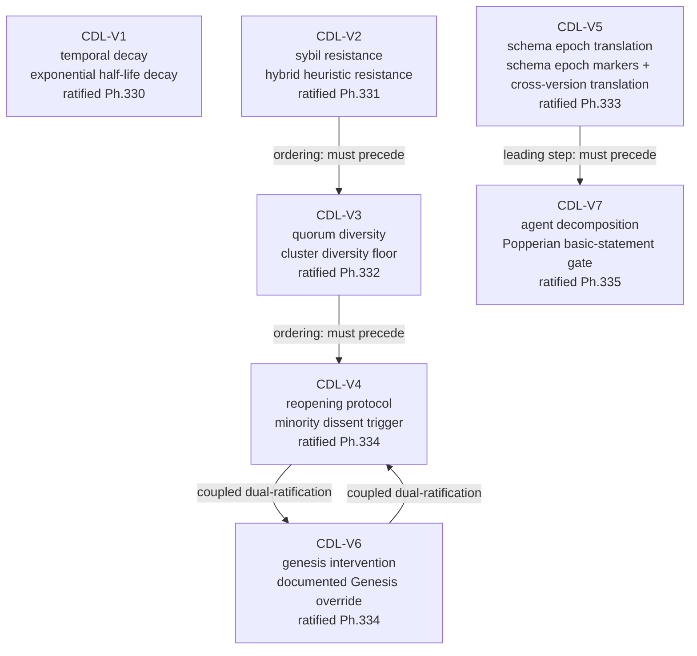
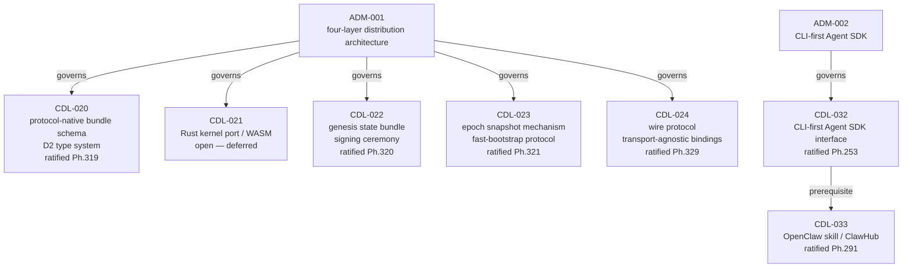
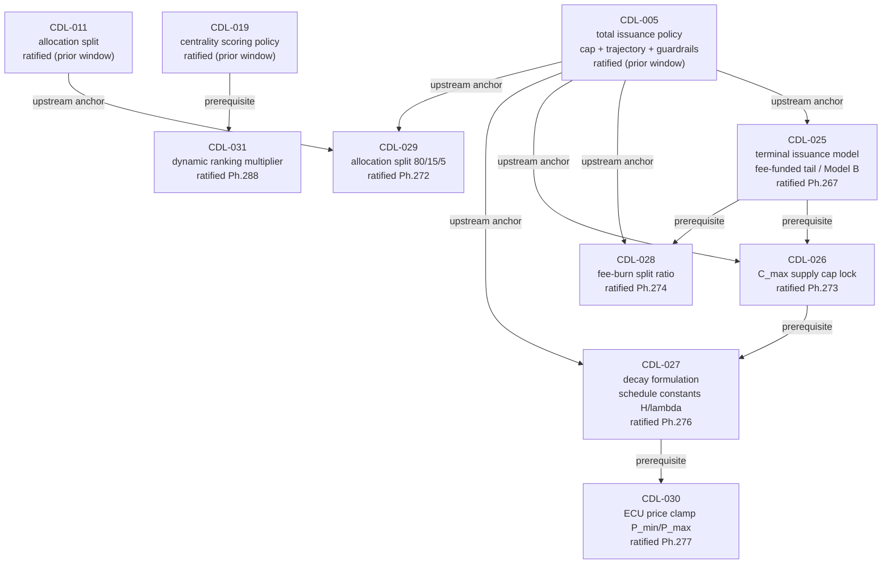
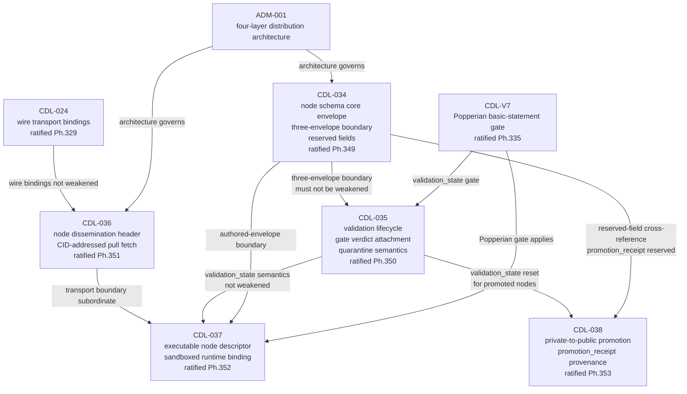
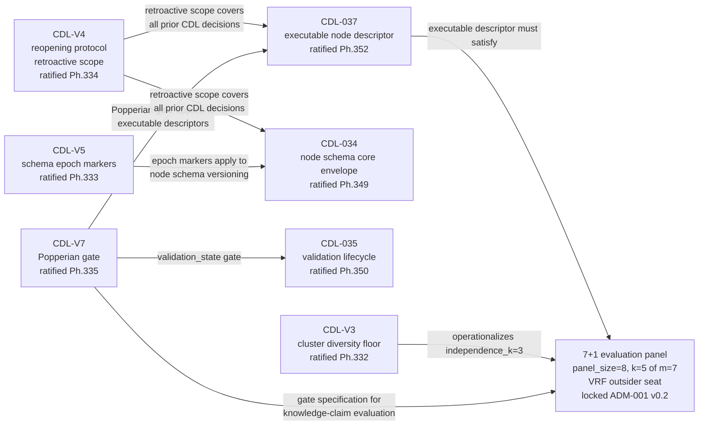

# ILC CDL Governance Dependency Graph

**Version:** v0.1
**Phase:** 353
**Status:** Living reference — update when new CDL clusters are opened or ratified

This document contains Mermaid flowcharts for the ILC constitutional decision (CDL)
dependency and ordering graph. Render in GitHub, GitLab, or VS Code with Markdown
Preview Enhanced.

---

## 1. V-Series Constitutional CDLs — Ordering Constraints

Sequencing constraints are locked in Phase 326. CDL-V1 carries no ordering constraint.
CDL-V4 and CDL-V6 were ratified together in a coupled dual-ratification (Phase 334).

**Invariants:**
- CDL-V4 applies retroactively to all previously ratified CDL decisions
- CDL-V6 may not be used to bypass CDL-V4 ordinary reopening
- CDL-V3 cluster diversity floor operationalizes `independence_k=3` in the 7+1 evaluation panel
- CDL-V7 Popperian gate is the test specification; 7+1 panel is the testing mechanism

---

## 2. D2 / ADM Infrastructure CDLs

The D2 cluster (CDL-020 through CDL-024) implements the ADM-001 four-layer distribution
architecture at the protocol level.

---

## 3. Economic Parameters CDLs

The economic cluster resolves issuance model constants. CDL-005 (total issuance policy)
is the upstream anchor; CDL-025 forward resolves specific parameter choices.

---

## 4. Node Schema CDLs — Carry-Forward Dependencies

CDL-034 establishes the three-envelope boundary. All subsequent node-schema CDLs carry
forward its constraints. CDL-035 and CDL-037 both depend on CDL-V7.

**Key invariants:**
- CDL-034: three-envelope split (Authored Payload / Protocol Interpretation / Transport) — must not be weakened downstream
- CDL-035: `validation_state` machine — bounded operational relevance, no unbounded recursive verdicts
- CDL-036: ILC leans pull, not push — `header-first dissemination` with `CID-addressed pull fetch`
- CDL-037: nodes recommend logic; they do not self-authorize execution
- CDL-038: promotion is a one-way visibility transition; no automatic reputation carry-forward

---

## 5. Cross-Cluster V-Series → Node Schema Couplings

---

## 6. Phase 328–357 Ratification Sequence

Linear phase sequence across two windows. Each ratification phase historicalizes the
corresponding prelock test and patches cross-CDL live-status dependencies in the
next prelock (if one exists in the window).

```mermaid
graph LR
    P328["Ph.328<br/>seq lock"]
    P329["Ph.329<br/>CDL-024 ratified"]
    P330["Ph.330<br/>CDL-V1 ratified"]
    P331["Ph.331<br/>CDL-V2 ratified"]
    P332["Ph.332<br/>CDL-V3 ratified"]
    P333["Ph.333<br/>CDL-V5 ratified"]
    P334["Ph.334<br/>CDL-V4 + CDL-V6 ratified"]
    P335["Ph.335<br/>CDL-V7 ratified"]
    P336["Ph.336<br/>coherence + capsule v0.8"]
    P337["Ph.337<br/>Window 328–337 closure"]

    P338["Ph.338<br/>seq lock"]
    P339["Ph.339<br/>node schema synthesis"]
    P340["Ph.340<br/>CDL-034 prelock"]
    P341["Ph.341<br/>CDL-035 prelock"]
    P342["Ph.342<br/>CDL-036 prelock"]
    P343["Ph.343<br/>CDL-037 prelock"]
    P344["Ph.344<br/>CDL-038 prelock"]
    P345["Ph.345<br/>reputation adjoint contract"]
    P346["Ph.346<br/>coherence + capsule v0.9"]
    P347["Ph.347<br/>Window 338–347 closure"]

    P348["Ph.348<br/>seq lock"]
    P349["Ph.349<br/>CDL-034 ratified"]
    P350["Ph.350<br/>CDL-035 ratified"]
    P351["Ph.351<br/>CDL-036 ratified"]
    P352["Ph.352<br/>CDL-037 ratified"]
    P353["Ph.353<br/>CDL-038 ratified"]
    P354["Ph.354<br/>TBD"]
    P357["Ph.357<br/>Window 348–357 closure"]

    P328 --> P329 --> P330 --> P331 --> P332 --> P333 --> P334 --> P335 --> P336 --> P337
    P338 --> P339 --> P340 --> P341 --> P342 --> P343 --> P344 --> P345 --> P346 --> P347
    P348 --> P349 --> P350 --> P351 --> P352 --> P353 --> P354 --> P357
```

---

## 7. CDL Ratification Status Reference

| CDL | Topic | Ratified Phase | Notes |
|---|---|---|---|
| CDL-001 | participant identity and signing | prior window | |
| CDL-005 | total issuance policy | prior window | upstream anchor for CDL-025–030 |
| CDL-011 | allocation split policy | prior window | |
| CDL-015 | (see CDL) | prior window | |
| CDL-019 | centrality scoring policy | prior window | |
| CDL-020 | protocol-native bundle schema | 319 | |
| CDL-021 | Rust kernel port / WASM | open — deferred | |
| CDL-022 | genesis state bundle + signing ceremony | 320 | |
| CDL-023 | epoch snapshot mechanism | 321 | |
| CDL-024 | wire protocol and transport bindings | 329 | |
| CDL-025 | terminal issuance model | 267 | fee-funded tail |
| CDL-026 | C_max supply cap lock | 273 | |
| CDL-027 | decay formulation and schedule constants | 276 | |
| CDL-028 | fee-burn split ratio | 274 | |
| CDL-029 | allocation split 80/15/5 | 272 | |
| CDL-030 | ECU price clamp bounds | 277 | |
| CDL-031 | dynamic ranking multiplier policy | 288 | |
| CDL-032 | CLI-first Agent SDK interface | 253 | |
| CDL-033 | OpenClaw skill / ClawHub publication | 291 | |
| CDL-034 | node schema core envelope + reserved fields | 349 | three-envelope boundary |
| CDL-035 | validation lifecycle + gate verdict attachment | 350 | bounded operational relevance |
| CDL-036 | node dissemination header + fetch contract | 351 | CID-addressed pull fetch |
| CDL-037 | executable node descriptor + safety contract | 352 | sandboxed runtime binding |
| CDL-038 | private-to-public promotion + promotion_receipt | 353 | no auto reputation carry-forward |
| CDL-V1 | temporal decay | 330 | exponential half-life decay |
| CDL-V2 | sybil resistance | 331 | hybrid heuristic resistance |
| CDL-V3 | quorum diversity | 332 | cluster diversity floor |
| CDL-V4 | reopening protocol | 334 | minority dissent trigger; retroactive |
| CDL-V5 | schema epoch translation | 333 | epoch markers + cross-version translation |
| CDL-V6 | genesis intervention | 334 | documented Genesis override + audit trail |
| CDL-V7 | agent decomposition admissibility | 335 | Popperian basic-statement gate |

---

## 8. Terminology Reference

| Term | Definition |
|---|---|
| **prelock** | evidence artifact drafted before ratification vote; Section 6 is authoritative for ratification |
| **ratification** | constitutional commitment via CDL; carries-forward as constraint on downstream CDLs |
| **historicalization** | converting live-CDL status reads in test suites to commit-anchored historical reads |
| **cross-CDL hardening** | removing live open-status checks on a now-ratified CDL from a subsequent prelock test |
| **carry-forward constraint** | a ratified ruling that downstream CDLs must not contradict or weaken |
| **coupled dual-ratification** | two CDLs ratified in a single phase to close a mutually dependent governance boundary |
| **Popperian basic-statement gate** | CDL-V7: a proposed graph object must be challengeable and falsifiable before acquiring protocol effect |
| **7+1 evaluation panel** | 8 members: 7-quorum + 1 VRF-selected outsider seat; governs knowledge-claim evaluation and CDL-V7 gate testing |
| **three-envelope boundary** | CDL-034: Authored Payload Envelope / Protocol Interpretation Envelope / Transport Envelope — must not be collapsed |
| **promotion_receipt** | CDL-038: mandatory provenance record created when a private node is promoted; carries original CID, successor CID, epoch, disclosed lineage |
